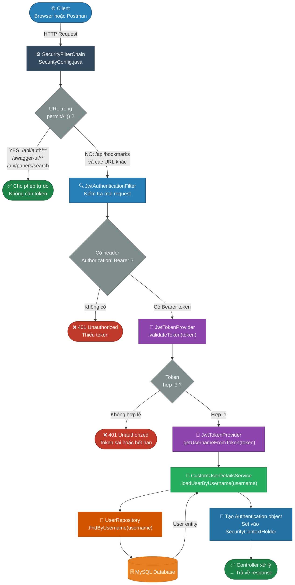
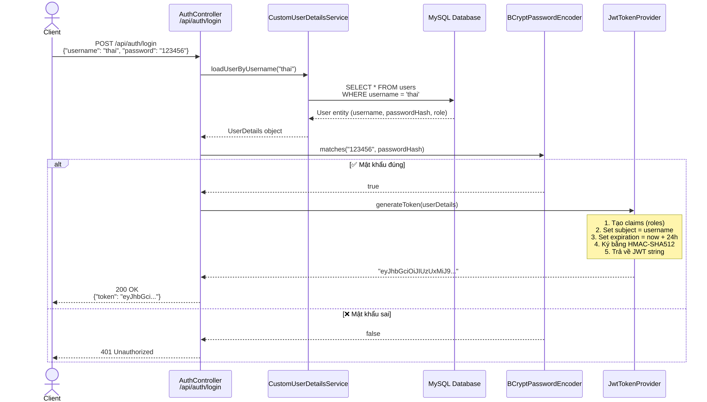
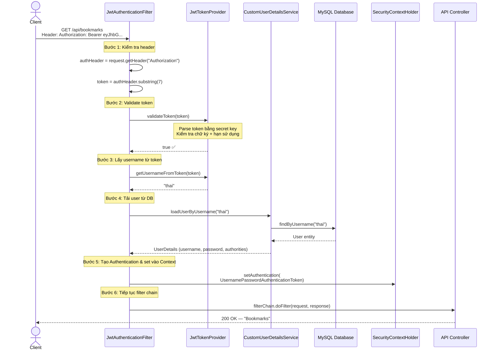
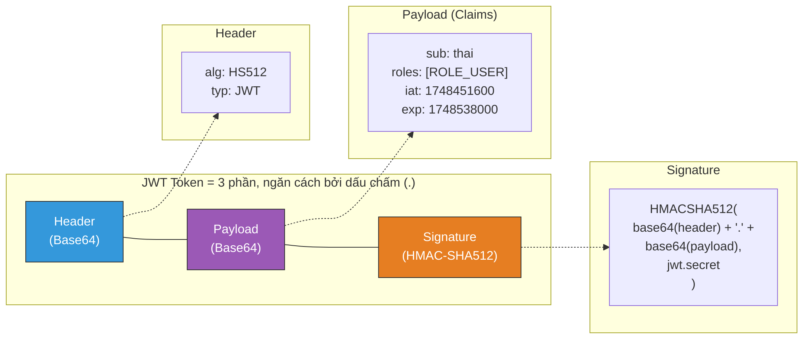
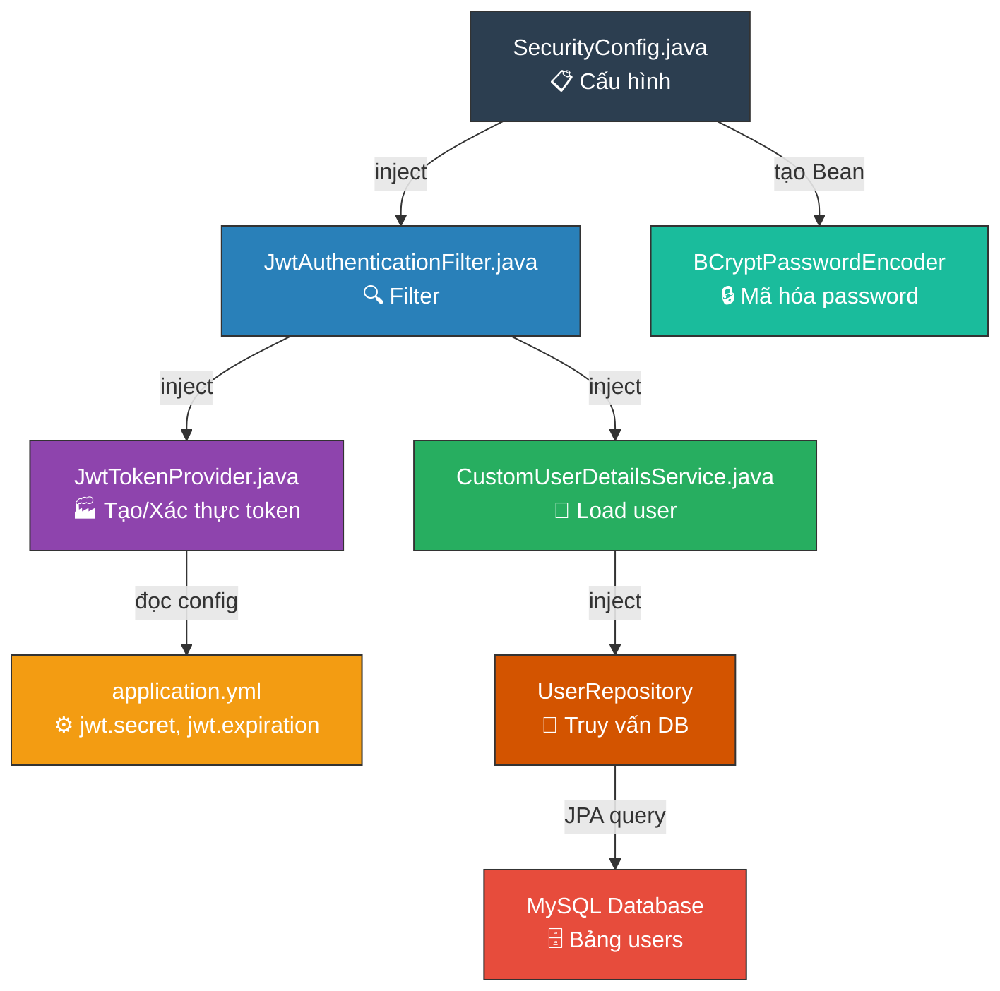

# 🔐 Phân tích luồng Spring Security + JWT

## Tổng quan các file Security

| File | Vai trò |
|---|---|
| [SecurityConfig.java](file:///d:/Document/Java/journal-trend-tracker/Scientific-Journal-Publication-Trend-Tracking-System/backend/com.journaltracker/src/main/java/com/journaltracker/config/SecurityConfig.java) | Cấu hình chính: quy tắc bảo mật, đăng ký filter, tắt CSRF/session |
| [JwtAuthenticationFilter.java](file:///d:/Document/Java/journal-trend-tracker/Scientific-Journal-Publication-Trend-Tracking-System/backend/com.journaltracker/src/main/java/com/journaltracker/security/JwtAuthenticationFilter.java) | Filter chặn mọi request, kiểm tra & xác thực JWT token |
| [JwtTokenProvider.java](file:///d:/Document/Java/journal-trend-tracker/Scientific-Journal-Publication-Trend-Tracking-System/backend/com.journaltracker/src/main/java/com/journaltracker/security/JwtTokenProvider.java) | Tạo, xác thực, và giải mã JWT token |
| [CustomUserDetailsService.java](file:///d:/Document/Java/journal-trend-tracker/Scientific-Journal-Publication-Trend-Tracking-System/backend/com.journaltracker/src/main/java/com/journaltracker/security/CustomUserDetailsService.java) | Tải thông tin user từ database |
| [application.yml](file:///d:/Document/Java/journal-trend-tracker/Scientific-Journal-Publication-Trend-Tracking-System/backend/com.journaltracker/src/main/resources/application.yml) | Cấu hình `jwt.secret` và `jwt.expiration` |

---

## 1. Sơ đồ tổng quan kiến trúc Security



---

## 2. Luồng ĐĂNG NHẬP (Login) — Tạo Token

> [!NOTE]
> Hiện tại bạn **chưa có API đăng nhập thực sự** (`/api/auth/login`). File [Controller.java](file:///d:/Document/Java/journal-trend-tracker/Scientific-Journal-Publication-Trend-Tracking-System/backend/com.journaltracker/src/main/java/com/journaltracker/Controller.java) đang tạm hardcode tạo token cho user "thai". Dưới đây là luồng đúng mà bạn cần xây dựng.



---

## 3. Luồng XÁC THỰC (Authentication) — Mỗi request kèm Token



---

## 4. Cấu trúc JWT Token



---

## 5. Vai trò chi tiết từng file

### 📄 SecurityConfig.java — "Bộ não" cấu hình
```
SecurityConfig
├── permitAll()          → Cho phép truy cập tự do: /api/auth/**, /swagger-ui/**, /api/papers/search
├── authenticated()      → Tất cả URL còn lại đều yêu cầu đăng nhập
├── csrf.disable()       → Tắt CSRF (vì dùng JWT, không dùng cookie/session)
├── STATELESS session    → Không tạo session trên server (mỗi request tự xác thực bằng token)
├── addFilterBefore()    → Chèn JwtAuthenticationFilter VÀO TRƯỚC UsernamePasswordAuthenticationFilter
├── exceptionHandling()  → Trả 401 khi chưa đăng nhập
└── passwordEncoder()    → Bean BCrypt để mã hóa/so sánh mật khẩu
```

### 📄 JwtAuthenticationFilter.java — "Người gác cổng"
```
doFilterInternal(request, response, filterChain)
├── 1. Lấy header "Authorization"
├── 2. Nếu không có hoặc không bắt đầu bằng "Bearer " → bỏ qua, đi tiếp
├── 3. Cắt lấy token (bỏ "Bearer ")
├── 4. Gọi jwtTokenProvider.validateToken(token)
├── 5. Nếu hợp lệ:
│   ├── Lấy username từ token
│   ├── Load UserDetails từ DB
│   ├── Tạo UsernamePasswordAuthenticationToken
│   └── Set vào SecurityContextHolder → Spring biết user đã xác thực
└── 6. Gọi filterChain.doFilter() → tiếp tục xử lý request
```

### 📄 JwtTokenProvider.java — "Nhà máy Token"
```
JwtTokenProvider
├── getSigningKey()         → Tạo SecretKey từ chuỗi jwt.secret trong application.yml
├── generateToken()         → Tạo JWT: subject + claims(roles) + issuedAt + expiration + sign
├── validateToken()         → Parse & kiểm tra token (hết hạn? sai key? format sai?)
└── getUsernameFromToken()  → Giải mã token → lấy ra username (subject)
```

### 📄 CustomUserDetailsService.java — "Cầu nối tới Database"
```
CustomUserDetailsService implements UserDetailsService
└── loadUserByUsername(username)
    ├── Gọi userRepository.findByUsername(username)
    ├── Nếu không tìm thấy → throw UsernameNotFoundException
    └── Nếu tìm thấy → trả về Spring Security UserDetails (username, passwordHash, authorities)
```

---

## 6. Đánh giá code & Các vấn đề cần khắc phục

### ✅ Những điểm tốt
- Kiến trúc đúng pattern chuẩn của Spring Security + JWT
- Sử dụng `STATELESS` session → phù hợp cho REST API
- Tắt CSRF đúng (vì dùng token, không phải session/cookie)
- Dùng `BCryptPasswordEncoder` là thuật toán mạnh
- `OncePerRequestFilter` đảm bảo filter chỉ chạy 1 lần mỗi request
- Dùng `HS512` là thuật toán ký mạnh

### ⚠️ Các vấn đề cần sửa

#### 1. 🔴 Chưa có AuthController thực sự

File [Controller.java](file:///d:/Document/Java/journal-trend-tracker/Scientific-Journal-Publication-Trend-Tracking-System/backend/com.journaltracker/src/main/java/com/journaltracker/Controller.java) đang **hardcode** user để tạo token — đây chỉ là code test, không phải luồng đăng nhập thực.

Bạn cần tạo `AuthController` với các endpoint:
- `POST /api/auth/register` — đăng ký
- `POST /api/auth/login` — đăng nhập → trả về JWT token

#### 2. 🔴 Thiếu AuthenticationManager Bean

Để xác thực username/password khi đăng nhập, bạn cần khai báo `AuthenticationManager` trong `SecurityConfig`:

```java
@Bean
public AuthenticationManager authenticationManager(
        AuthenticationConfiguration config) throws Exception {
    return config.getAuthenticationManager();
}
```

#### 3. 🟡 JwtAuthenticationFilter gọi DB mỗi request

Hiện tại, **mỗi request** đều gọi `loadUserByUsername()` → truy vấn DB. Đây là điểm có thể gây chậm. Bạn có thể cải thiện bằng cách:
- Kiểm tra `SecurityContextHolder.getContext().getAuthentication() == null` trước khi load lại user
- Hoặc cache thông tin user

#### 4. 🟡 Thứ tự `.claims()` và `.subject()` trong generateToken

Trong [JwtTokenProvider.java dòng 34-40](file:///d:/Document/Java/journal-trend-tracker/Scientific-Journal-Publication-Trend-Tracking-System/backend/com.journaltracker/src/main/java/com/journaltracker/security/JwtTokenProvider.java#L34-L40):

```java
Jwts.builder()
    .subject(userDetails.getUsername())  // set subject TRƯỚC
    .expiration(expiryDate)
    .claims(claims)                      // .claims() GHI ĐÈ subject!
    .issuedAt(now)
    .signWith(getSigningKey(), Jwts.SIG.HS512)
    .compact();
```

> [!WARNING]
> Gọi `.claims(claims)` **SAU** `.subject()` sẽ **ghi đè toàn bộ claims trước đó**, bao gồm cả `subject`. Điều này có thể khiến `getUsernameFromToken()` trả về `null`.
> 
> **Sửa lại**: đặt `.claims(claims)` **TRƯỚC** `.subject()`, hoặc dùng `.claim("roles", ...)` thay vì `.claims(map)`.

```java
// ✅ Cách sửa đúng
Jwts.builder()
    .claims(claims)                      // set claims TRƯỚC
    .subject(userDetails.getUsername())   // subject sẽ ghi đè lên key "sub" trong claims
    .issuedAt(now)
    .expiration(expiryDate)
    .signWith(getSigningKey(), Jwts.SIG.HS512)
    .compact();
```

#### 5. 🟡 JWT Secret quá ngắn và để trực tiếp trong code

Secret hiện tại chỉ là 1 chuỗi text thường, nên dùng biến môi trường:

```yaml
jwt:
  secret: ${JWT_SECRET:defaultDevSecretKeyThatIsAtLeast64BytesLongForHmacSha512Algorithm!!!}
```

---

## 7. Sơ đồ quan hệ giữa các file


