# 📊 Sơ đồ hoạt động hệ thống — Scientific Journal Trend Tracker

> Tổng hợp từ tài liệu: [implementation_plan.md](file:///d:/Document/Java/journal-trend-tracker/Scientific-Journal-Publication-Trend-Tracking-System/docs/implementation_plan.md), [database_schema.md](file:///d:/Document/Java/journal-trend-tracker/Scientific-Journal-Publication-Trend-Tracking-System/docs/database_schema.md), [security_flow_analysis.md](file:///d:/Document/Java/journal-trend-tracker/Scientific-Journal-Publication-Trend-Tracking-System/docs/security_flow_analysis.md)

---

## 1. 🏗️ Sơ đồ kiến trúc tổng quan hệ thống

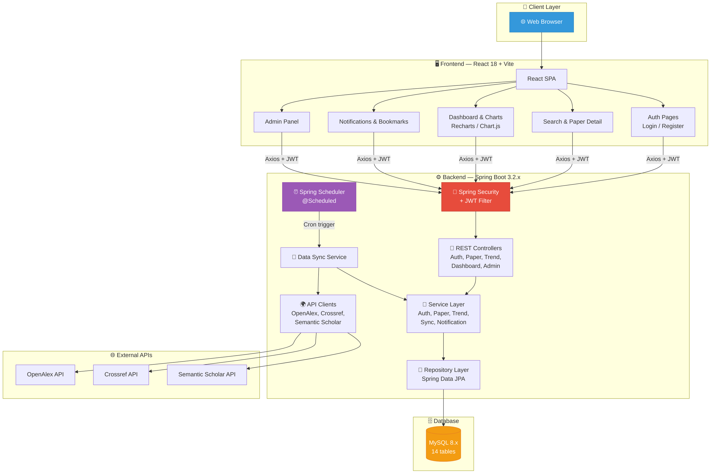

---

## 2. 🔐 Sơ đồ hoạt động — Luồng Xác thực (Authentication Flow)

### 2.1 Đăng ký tài khoản (Register)

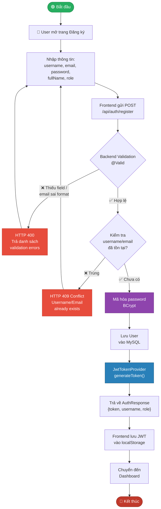

### 2.2 Đăng nhập (Login)

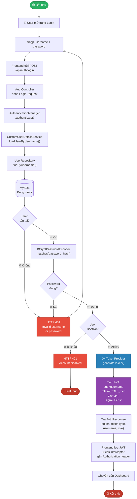

### 2.3 Xác thực mỗi Request (JWT Filter)

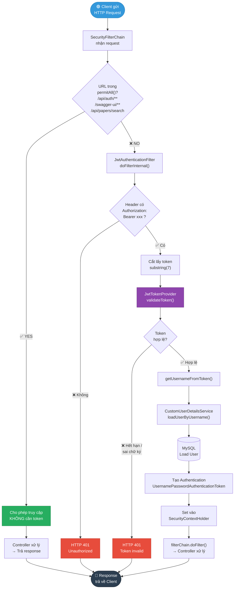

---

## 3. 🔍 Sơ đồ hoạt động — Luồng Tìm kiếm & Quản lý bài báo

### 3.1 Tìm kiếm bài báo (Search Papers)

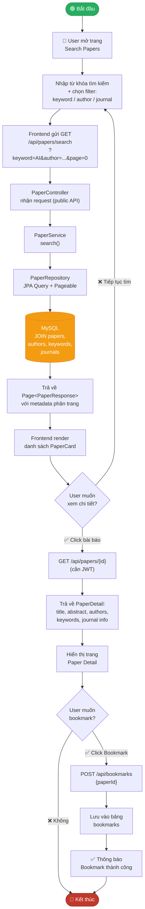

### 3.2 Quản lý Bookmark & Follow

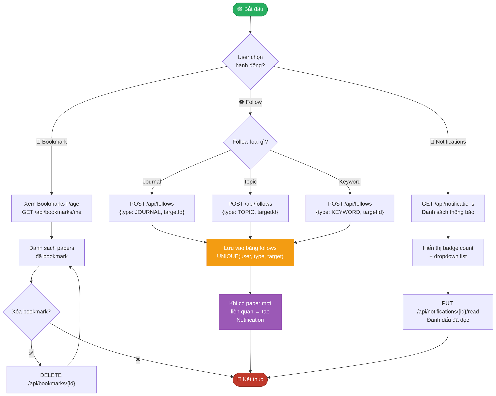

---

## 4. 🔄 Sơ đồ hoạt động — Luồng Đồng bộ dữ liệu (Data Sync)

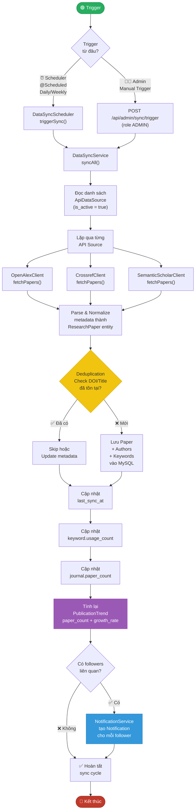

---

## 5. 📈 Sơ đồ hoạt động — Luồng Phân tích xu hướng (Trend Analysis)

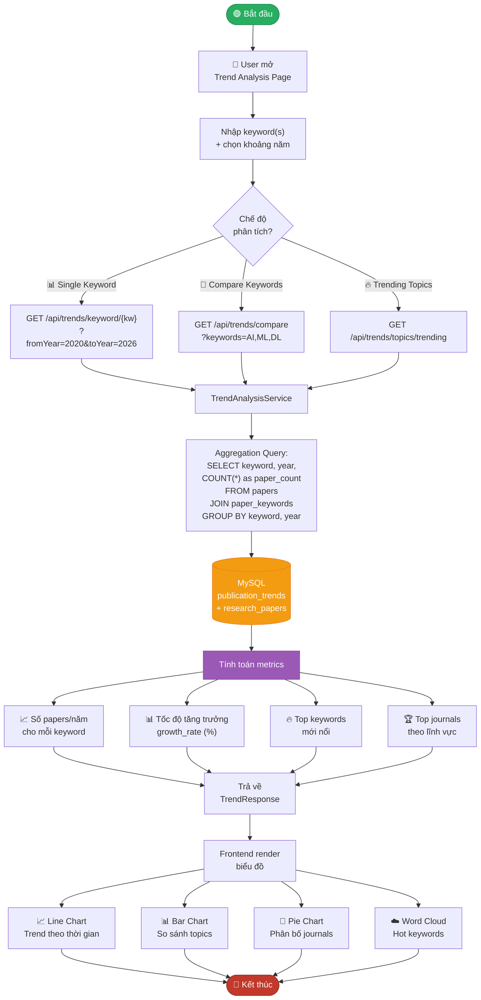

---

## 6. 🖥️ Sơ đồ hoạt động — Dashboard tổng quan

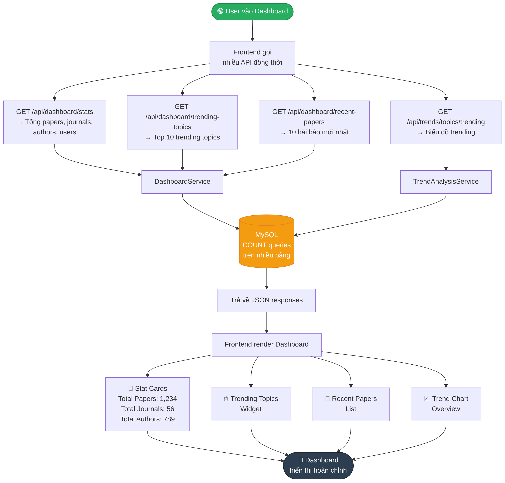

---

## 7. ⚙️ Sơ đồ hoạt động — Quản trị hệ thống (Admin)

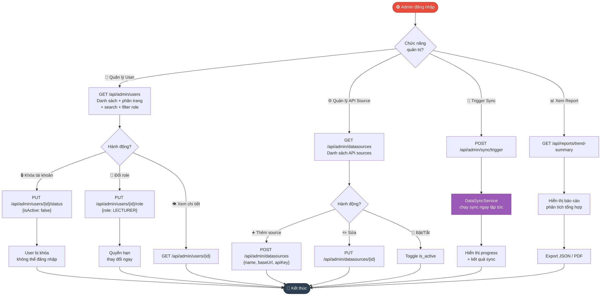

---

## 8. 🔁 Sơ đồ tổng hợp — Vòng đời dữ liệu trong hệ thống

> Sơ đồ này mô tả toàn bộ hành trình dữ liệu từ khi thu thập đến khi hiển thị cho user.

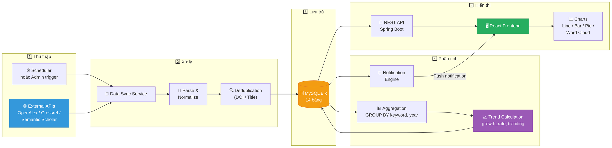

---

## 9. 🗃️ Sơ đồ quan hệ giữa các Entity (ERD tóm tắt)

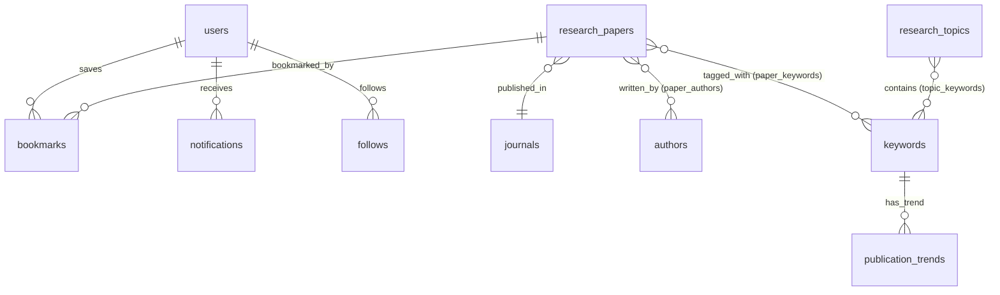

---

## 10. 🔀 Sơ đồ Sequence — Luồng hoạt động End-to-End điển hình

> User đăng nhập → tìm bài báo → bookmark → xem trend

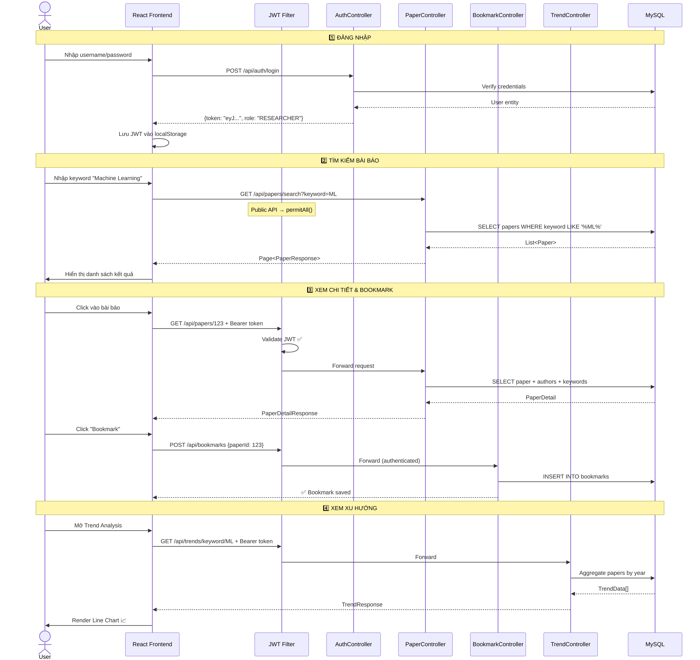

---

## 11. 📋 Tóm tắt các luồng hoạt động chính

| # | Luồng | Mô tả | API chính |
|---|-------|-------|-----------|
| 1 | **Đăng ký** | User tạo tài khoản mới → nhận JWT | `POST /api/auth/register` |
| 2 | **Đăng nhập** | Xác thực credentials → nhận JWT | `POST /api/auth/login` |
| 3 | **JWT Filter** | Mỗi request kèm token → xác thực | Mọi protected API |
| 4 | **Tìm kiếm** | Tìm bài báo theo keyword/author/journal | `GET /api/papers/search` |
| 5 | **Xem chi tiết** | Xem đầy đủ thông tin bài báo | `GET /api/papers/{id}` |
| 6 | **Bookmark** | Lưu/xóa bài báo yêu thích | `POST/DELETE /api/bookmarks` |
| 7 | **Follow** | Theo dõi journal/topic/keyword | `POST/DELETE /api/follows` |
| 8 | **Notification** | Nhận thông báo bài mới | `GET /api/notifications` |
| 9 | **Data Sync** | Thu thập dữ liệu từ API ngoài | Internal scheduler |
| 10 | **Trend Analysis** | Phân tích xu hướng nghiên cứu | `GET /api/trends/*` |
| 11 | **Dashboard** | Thống kê tổng quan hệ thống | `GET /api/dashboard/*` |
| 12 | **Admin** | Quản lý user, API source, sync | `GET/PUT /api/admin/*` |
| 13 | **Report** | Xuất báo cáo phân tích | `GET /api/reports/*` |
