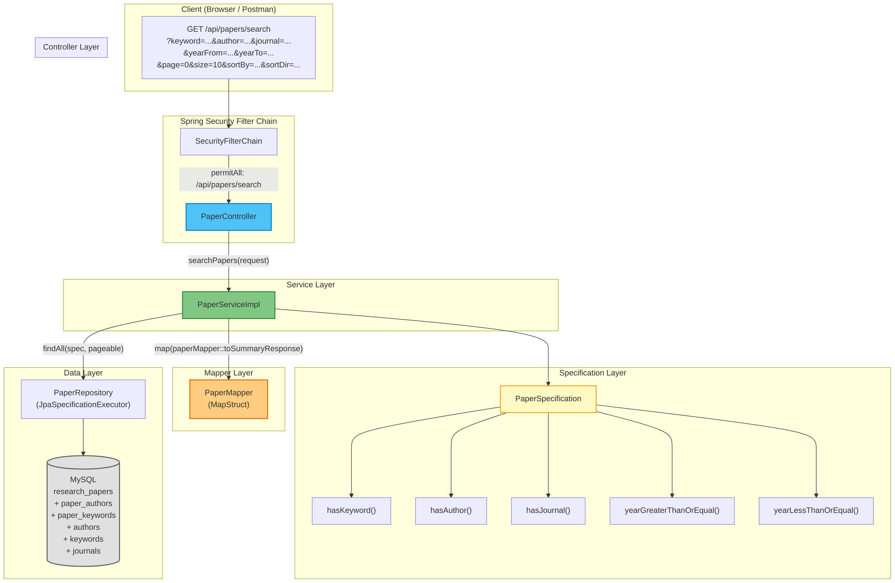
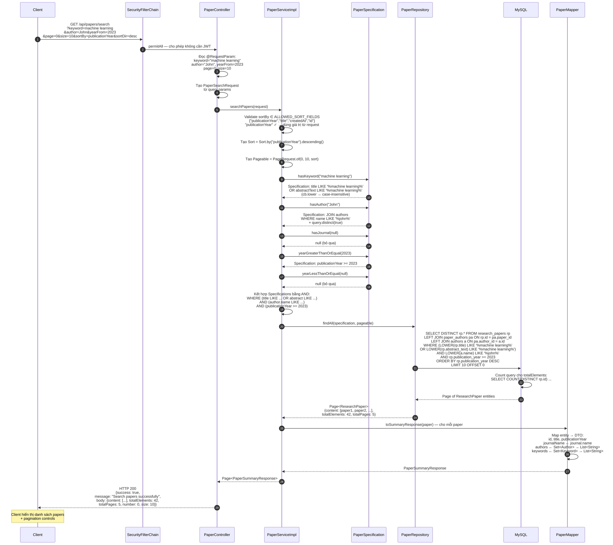
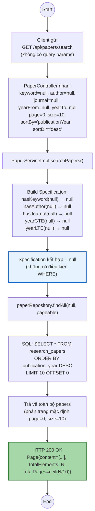
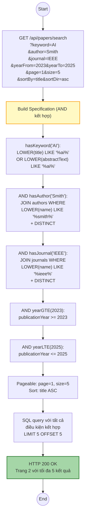
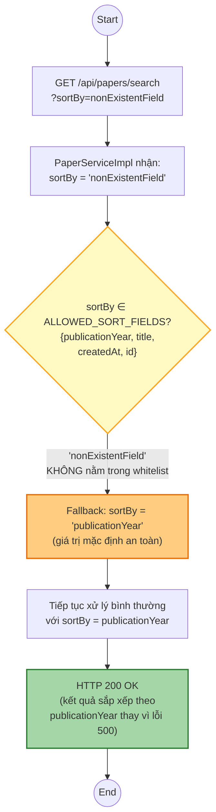
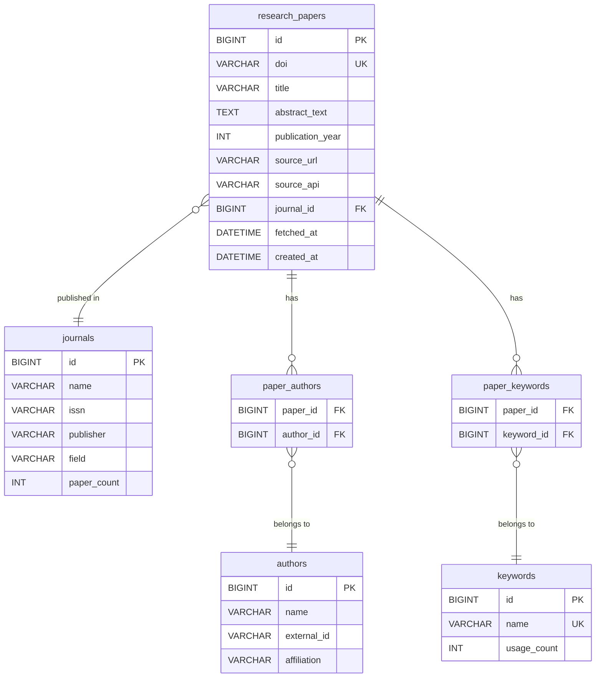

# Sơ Đồ Hoạt Động Chi Tiết — JP-18: API Tìm Kiếm Bài Báo

> Tất cả sơ đồ được vẽ dựa trên phân tích trực tiếp source code hiện tại của hệ thống.

**Source code tham chiếu:**
- [PaperController.java](file:///d:/Document/Java/journal-trend-tracker/Scientific-Journal-Publication-Trend-Tracking-System/backend/com.journaltracker/src/main/java/com/journaltracker/controller/PaperController.java)
- [PaperServiceImpl.java](file:///d:/Document/Java/journal-trend-tracker/Scientific-Journal-Publication-Trend-Tracking-System/backend/com.journaltracker/src/main/java/com/journaltracker/service/impl/PaperServiceImpl.java)
- [PaperSpecification.java](file:///d:/Document/Java/journal-trend-tracker/Scientific-Journal-Publication-Trend-Tracking-System/backend/com.journaltracker/src/main/java/com/journaltracker/specification/PaperSpecification.java)
- [PaperMapper.java](file:///d:/Document/Java/journal-trend-tracker/Scientific-Journal-Publication-Trend-Tracking-System/backend/com.journaltracker/src/main/java/com/journaltracker/mapper/PaperMapper.java)
- [PaperSearchRequest.java](file:///d:/Document/Java/journal-trend-tracker/Scientific-Journal-Publication-Trend-Tracking-System/backend/com.journaltracker/src/main/java/com/journaltracker/dto/request/PaperSearchRequest.java)
- [PaperSummaryResponse.java](file:///d:/Document/Java/journal-trend-tracker/Scientific-Journal-Publication-Trend-Tracking-System/backend/com.journaltracker/src/main/java/com/journaltracker/dto/response/PaperSummaryResponse.java)
- [SecurityConfig.java](file:///d:/Document/Java/journal-trend-tracker/Scientific-Journal-Publication-Trend-Tracking-System/backend/com.journaltracker/src/main/java/com/journaltracker/config/SecurityConfig.java)

---

## 1. Sơ đồ tổng quan — Kiến trúc Paper Search Module



---

## 2. Activity Diagram — Luồng chính

```mermaid
%%{init: { 'sequence': {'useMaxWidth': false}, 'flowchart': {'useMaxWidth': false} }}%%
flowchart TD
    START(("Start")) --> A["Client gửi<br>GET /api/papers/search<br>với query params"]

    A --> SEC{"SecurityFilterChain<br>kiểm tra endpoint"}
    SEC -->|"permitAll:<br>/api/papers/search"| B["Cho phép KHÔNG cần JWT<br>(API Public)"]

    B --> C["PaperController.searchPapers()<br>nhận @RequestParam"]

    C --> D["Đọc query params:<br>keyword, author, journal,<br>yearFrom, yearTo,<br>page (default=0), size (default=10),<br>sortBy (default=publicationYear),<br>sortDir (default=desc)"]

    D --> E["Tạo PaperSearchRequest<br>từ query params"]

    E --> F["PaperServiceImpl<br>.searchPapers(request)"]

    F --> G{"Validate sortBy<br>có nằm trong<br>ALLOWED_SORT_FIELDS?"}

    G -- "sortBy hợp lệ<br>(publicationYear, title,<br>createdAt, id)" --> H["Dùng sortBy từ request"]
    G -- "sortBy KHÔNG hợp lệ<br>hoặc null" --> I["Fallback: sortBy = publicationYear"]

    H --> J["Tạo Sort object"]
    I --> J

    J --> K{"sortDir = 'asc'?"}
    K -- "Có" --> L["Sort.by(sortBy).ascending()"]
    K -- "Không (default: desc)" --> M["Sort.by(sortBy).descending()"]

    L --> N["Tạo Pageable<br>PageRequest.of(page, size, sort)"]
    M --> N

    N --> O["Build JPA Specification<br>bằng PaperSpecification"]

    O --> P{"keyword != null<br>&& !blank?"}
    P -- "Có" --> P1["hasKeyword(keyword):<br>title LIKE %keyword%<br>OR abstractText LIKE %keyword%<br>(case-insensitive: cb.lower())"]
    P -- "Không" --> P2["Bỏ qua điều kiện keyword"]

    P1 --> Q{"author != null<br>&& !blank?"}
    P2 --> Q

    Q -- "Có" --> Q1["hasAuthor(author):<br>JOIN paper_authors + authors<br>WHERE name LIKE %author%<br>(case-insensitive)<br>+ query.distinct(true)"]
    Q -- "Không" --> Q2["Bỏ qua điều kiện author"]

    Q1 --> R{"journal != null<br>&& !blank?"}
    Q2 --> R

    R -- "Có" --> R1["hasJournal(journal):<br>JOIN journals<br>WHERE name LIKE %journal%<br>(case-insensitive)<br>+ query.distinct(true)"]
    R -- "Không" --> R2["Bỏ qua điều kiện journal"]

    R1 --> S{"yearFrom != null?"}
    R2 --> S

    S -- "Có" --> S1["yearGreaterThanOrEqual:<br>publicationYear >= yearFrom"]
    S -- "Không" --> S2["Bỏ qua điều kiện yearFrom"]

    S1 --> T{"yearTo != null?"}
    S2 --> T

    T -- "Có" --> T1["yearLessThanOrEqual:<br>publicationYear <= yearTo"]
    T -- "Không" --> T2["Bỏ qua điều kiện yearTo"]

    T1 --> U["Kết hợp tất cả Specifications<br>bằng AND"]
    T2 --> U

    U --> V["paperRepository.findAll<br>(specification, pageable)"]

    V --> W["Hibernate sinh SQL query<br>SELECT DISTINCT rp.* FROM research_papers rp<br>LEFT JOIN paper_authors pa ...<br>LEFT JOIN authors a ...<br>LEFT JOIN journals j ...<br>WHERE (conditions)<br>ORDER BY ... LIMIT ... OFFSET ..."]

    W --> X["DB trả về Page of ResearchPaper"]

    X --> Y["paperPage.map(<br>paperMapper::toSummaryResponse)"]

    Y --> Z["PaperMapper (MapStruct):<br>- id, title, publicationYear<br>- journalName ← journal.name<br>- authors ← Set of Author → List of String<br>- keywords ← Set of Keyword → List of String"]

    Z --> AA["Trả về Page of PaperSummaryResponse"]

    AA --> AB["PaperController wrap kết quả:<br>ApiResponse(true,<br>'Search papers successfully',<br>Page result)"]

    AB --> AC["HTTP 200 OK<br>ApiResponse with pagination"]

    AC --> END(("End"))

    style SEC fill:#e3f2fd,stroke:#1565c0,stroke-width:2px
    style G fill:#fff9c4,stroke:#f9a825,stroke-width:2px
    style K fill:#fff9c4,stroke:#f9a825,stroke-width:2px
    style P fill:#fff9c4,stroke:#f9a825,stroke-width:2px
    style Q fill:#fff9c4,stroke:#f9a825,stroke-width:2px
    style R fill:#fff9c4,stroke:#f9a825,stroke-width:2px
    style S fill:#fff9c4,stroke:#f9a825,stroke-width:2px
    style T fill:#fff9c4,stroke:#f9a825,stroke-width:2px
    style AC fill:#a5d6a7,stroke:#2e7d32,stroke-width:2px
    style V fill:#bbdefb,stroke:#1565c0,stroke-width:2px
    style Y fill:#ffcc80,stroke:#ef6c00,stroke-width:2px
```



---

## 3. Sequence Diagram — Tương tác giữa các component



---

## 4. Activity Diagram — Các scenario đặc biệt

### 4.1 Scenario: Không truyền tham số nào (Default search)



### 4.2 Scenario: Kết hợp nhiều điều kiện lọc



### 4.3 Scenario: sortBy không hợp lệ (Fallback validation)



---

## 5. Chi tiết các Query Params

| Param | Bắt buộc | Default | Mô tả | Ví dụ |
|-------|----------|---------|-------|-------|
| `keyword` | Không | `null` | Tìm trong title + abstractText (case-insensitive) | `machine learning` |
| `author` | Không | `null` | Tìm theo tên tác giả (case-insensitive, LIKE) | `John` |
| `journal` | Không | `null` | Tìm theo tên journal (case-insensitive, LIKE) | `IEEE` |
| `yearFrom` | Không | `null` | Lọc papers từ năm (>=) | `2023` |
| `yearTo` | Không | `null` | Lọc papers đến năm (<=) | `2025` |
| `page` | Không | `0` | Trang hiện tại (0-indexed) | `0` |
| `size` | Không | `10` | Số kết quả mỗi trang | `10` |
| `sortBy` | Không | `publicationYear` | Trường sắp xếp (whitelist validated) | `publicationYear` |
| `sortDir` | Không | `desc` | Thứ tự: `asc` hoặc `desc` | `desc` |

---

## 6. Chi tiết PaperSummaryResponse (DTO trả về)

```json
{
  "id": 1,
  "title": "Deep Learning for NLP: A Comprehensive Survey",
  "publicationYear": 2024,
  "journalName": "IEEE Transactions on Neural Networks",
  "authors": ["John Smith", "Jane Doe"],
  "keywords": ["deep learning", "NLP", "transformer"]
}
```

**Mapping (PaperMapper — MapStruct):**

| Response Field | Entity Field | Logic |
|---------------|-------------|-------|
| `id` | `ResearchPaper.id` | Trực tiếp |
| `title` | `ResearchPaper.title` | Trực tiếp |
| `publicationYear` | `ResearchPaper.publicationYear` | Trực tiếp |
| `journalName` | `ResearchPaper.journal.name` | `@Mapping(source = "journal.name")` |
| `authors` | `ResearchPaper.authors` | `Set<Author>` → `stream().map(Author::getName)` → `List<String>` |
| `keywords` | `ResearchPaper.keywords` | `Set<Keyword>` → `stream().map(Keyword::getName)` → `List<String>` |

---

## 7. Chi tiết Pagination Response

API trả về `Page<PaperSummaryResponse>` bọc trong `ApiResponse`:

```json
{
  "success": true,
  "message": "Search papers successfully",
  "body": {
    "content": [
      { "id": 1, "title": "...", "publicationYear": 2024, "journalName": "...", "authors": [...], "keywords": [...] },
      { "id": 2, "title": "...", "publicationYear": 2023, "journalName": "...", "authors": [...], "keywords": [...] }
    ],
    "pageable": {
      "pageNumber": 0,
      "pageSize": 10,
      "sort": { "sorted": true, "direction": "DESC", "property": "publicationYear" }
    },
    "totalElements": 42,
    "totalPages": 5,
    "number": 0,
    "size": 10,
    "first": true,
    "last": false,
    "numberOfElements": 10,
    "empty": false
  }
}
```

---

## 8. Sơ đồ SQL — Các bảng tham gia JOIN



---

## 9. Acceptance Criteria — Traceability Matrix

| # | Acceptance Criteria | Code xử lý | Kết quả |
|---|-----|------|---------|
| 1 | `?keyword=machine learning` → tìm trong title OR abstract | [PaperSpecification.hasKeyword()](file:///d:/Document/Java/journal-trend-tracker/Scientific-Journal-Publication-Trend-Tracking-System/backend/com.journaltracker/src/main/java/com/journaltracker/specification/PaperSpecification.java#L15-L28) — `cb.or(cb.like(title), cb.like(abstractText))` | ✅ |
| 2 | `?author=John` → tìm papers có author tên chứa "John" | [PaperSpecification.hasAuthor()](file:///d:/Document/Java/journal-trend-tracker/Scientific-Journal-Publication-Trend-Tracking-System/backend/com.journaltracker/src/main/java/com/journaltracker/specification/PaperSpecification.java#L34-L51) — `JOIN authors WHERE name LIKE %author%` | ✅ |
| 3 | `?journal=IEEE` → tìm papers thuộc journal chứa "IEEE" | [PaperSpecification.hasJournal()](file:///d:/Document/Java/journal-trend-tracker/Scientific-Journal-Publication-Trend-Tracking-System/backend/com.journaltracker/src/main/java/com/journaltracker/specification/PaperSpecification.java#L57-L74) — `JOIN journals WHERE name LIKE %journal%` | ✅ |
| 4 | `?keyword=AI&yearFrom=2023&yearTo=2025` → lọc khoảng năm | [yearGreaterThanOrEqual](file:///d:/Document/Java/journal-trend-tracker/Scientific-Journal-Publication-Trend-Tracking-System/backend/com.journaltracker/src/main/java/com/journaltracker/specification/PaperSpecification.java#L79-L90) + [yearLessThanOrEqual](file:///d:/Document/Java/journal-trend-tracker/Scientific-Journal-Publication-Trend-Tracking-System/backend/com.journaltracker/src/main/java/com/journaltracker/specification/PaperSpecification.java#L95-L106) | ✅ |
| 5 | Phân trang đúng (totalElements, totalPages) | `PaperRepository extends JpaSpecificationExecutor` → `findAll(spec, pageable)` trả `Page<>` | ✅ |
| 6 | Không truyền param → trả toàn bộ (phân trang default) | Tất cả `@RequestParam(required = false)` + Specification trả `null` khi param trống | ✅ |
| 7 | API KHÔNG yêu cầu JWT (public) | [SecurityConfig](file:///d:/Document/Java/journal-trend-tracker/Scientific-Journal-Publication-Trend-Tracking-System/backend/com.journaltracker/src/main/java/com/journaltracker/config/SecurityConfig.java#L36) — `"/api/papers/search"` trong `permitAll()` | ✅ |
| 8 | Case-insensitive search | `cb.lower(root.get(...))` + `keyword.toLowerCase()` trong tất cả Specifications | ✅ |

---

## 10. Tổng hợp — Các file liên quan đến JP-18

| Layer | File | Vai trò |
|-------|------|---------|
| **Controller** | `PaperController.java` | Nhận HTTP request, đọc query params, gọi service |
| **DTO Request** | `PaperSearchRequest.java` | Đóng gói tham số tìm kiếm |
| **DTO Response** | `PaperSummaryResponse.java` | Đóng gói kết quả trả về (không có abstract) |
| **Service** | `PaperService.java` (interface) | Contract |
| **Service Impl** | `PaperServiceImpl.java` | Xử lý logic: validate sort, build spec, query, map |
| **Specification** | `PaperSpecification.java` | Build dynamic JPA query conditions |
| **Mapper** | `PaperMapper.java` | MapStruct: Entity → DTO mapping |
| **Repository** | `PaperRepository.java` | `JpaSpecificationExecutor` — execute spec queries |
| **Entity** | `ResearchPaper.java` | JPA Entity mapping database |
| **Security** | `SecurityConfig.java` | Cấu hình `/api/papers/search` là public |
| **Response Wrapper** | `ApiResponse.java` | Wrapper chung cho tất cả API responses |
