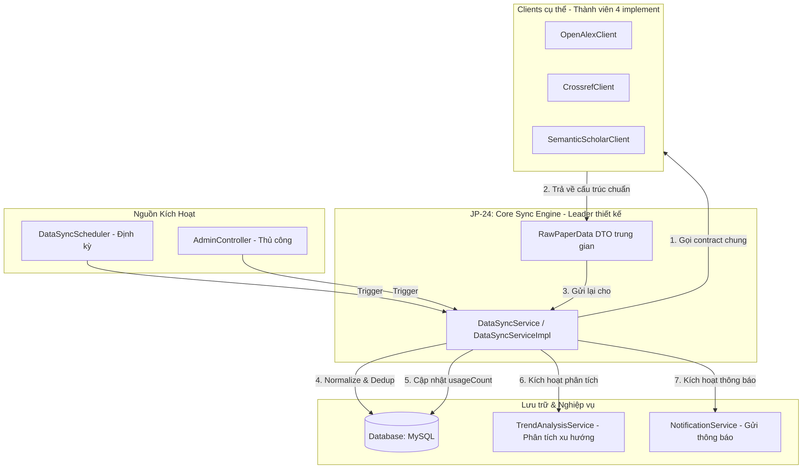
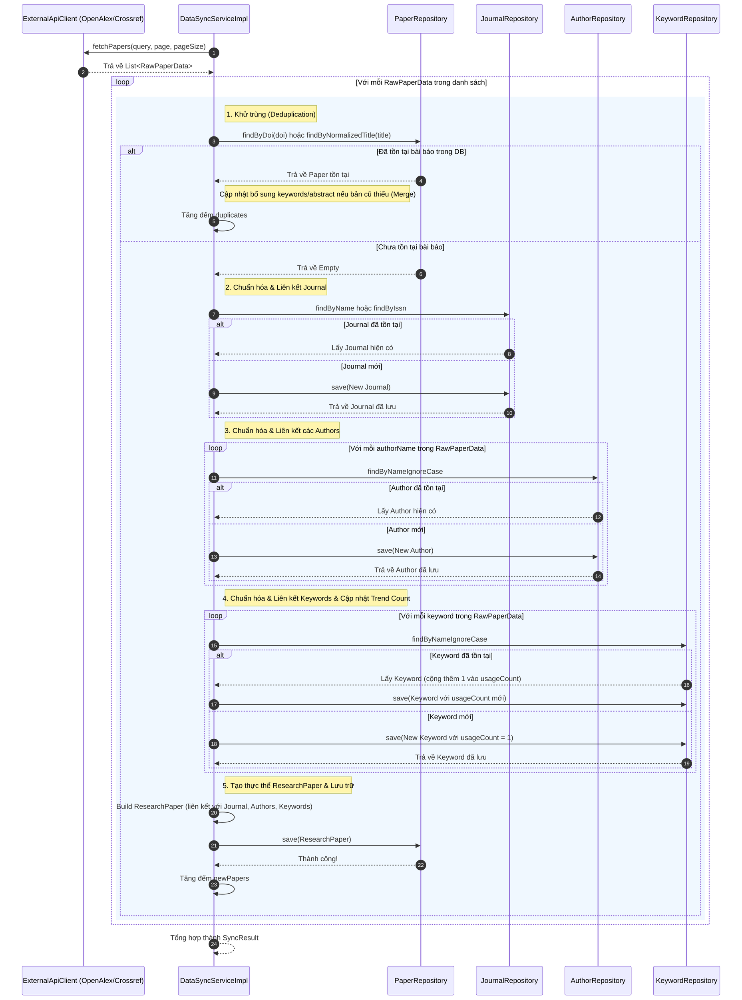

# 📑 Tài liệu Kiến trúc & Luồng hoạt động: JP-24 Core Sync Service Interface

Tài liệu này giải thích chi tiết về vị trí, vai trò, luồng hoạt động và chức năng của từng thành phần trong task **JP-24: Core Sync Service Interface** của hệ thống **Scientific Journal Publication Trend Tracking**.

---

## 1. Vị trí và Vai trò của JP-24 trong Hệ thống

Hệ thống của chúng ta là một nền tảng theo dõi xu hướng công bố khoa học. Để có dữ liệu phân tích xu hướng, hệ thống cần thu thập bài báo từ nhiều nguồn học thuật lớn trên thế giới như **OpenAlex**, **Crossref**, và **Semantic Scholar**.

Task **JP-24** đóng vai trò **xương sống kiến trúc (Architecture Backbone)** cho toàn bộ phân hệ thu thập dữ liệu (Data Sync Engine):



### Tại sao Kiến trúc này lại quan trọng?
1. **Tính độc lập (Decoupling):** Các logic nghiệp vụ chính (Lưu trữ, chuẩn hóa dữ liệu, loại bỏ trùng lặp, tính toán xu hướng) hoàn toàn độc lập với các API bên ngoài.
2. **Nguyên lý Open/Closed (OCP) trong SOLID:** Khi muốn tích hợp thêm một nguồn API mới (ví dụ: Scopus), ta chỉ cần viết thêm một class client mới implement `ExternalApiClient` mà **không cần chỉnh sửa một dòng code nào** trong logic xử lý chính (`DataSyncServiceImpl`).
3. **Phân chia công việc rõ ràng:** Architect định nghĩa sẵn Contract (Interfaces và DTO trung gian), các developer khác chỉ cần tập trung vào việc viết client gọi API và parse dữ liệu về đúng DTO.

---

## 2. Giải thích chi tiết chức năng từng Thành phần

### A. `ExternalApiClient` (Interface)
Đây là **Interface chuẩn (Contract)** cho mọi Client kết nối với các nguồn API bên ngoài.

```java
public interface ExternalApiClient {
    String getSourceName();
    List<RawPaperData> fetchPapers(String query, int page, int pageSize);
    List<RawPaperData> fetchRecentPapers(LocalDate fromDate, int page, int pageSize);
    boolean isAvailable();
}
```

*   **`getSourceName()`**: Trả về tên nguồn dữ liệu (ví dụ: `"OpenAlex"`, `"Crossref"`, `"SemanticScholar"`). Tên này dùng để định danh nguồn dữ liệu trong DB (`source_api` trong bảng `research_papers`) và dùng để chọn client tương ứng khi đồng bộ từ một nguồn cụ thể.
*   **`fetchPapers(String query, int page, int pageSize)`**: Lấy danh sách bài báo theo một từ khóa tìm kiếm (`query`) phục vụ cho việc thu gom dữ liệu diện rộng hoặc theo chủ đề cụ thể. Trả về danh sách DTO chuẩn `RawPaperData`.
*   **`fetchRecentPapers(LocalDate fromDate, int page, int pageSize)`**: Chỉ lấy các bài báo mới xuất bản từ sau một mốc ngày cụ thể (`fromDate`). Phương thức này cực kỳ quan trọng cho tác vụ **Scheduler tự động đồng bộ hàng ngày** để giảm tải lưu lượng API và tối ưu hóa hiệu năng.
*   **`isAvailable()`**: Thực hiện một lệnh gọi nhẹ (ping/health check) tới API đích để kiểm tra xem server đó có đang hoạt động ổn định hay không, giúp hệ thống cảnh báo sớm hoặc bỏ qua nguồn đó nếu đang sập.

---

### B. `RawPaperData` (DTO trung gian)
Mỗi nguồn API (OpenAlex, Crossref, Semantic Scholar) trả về cấu trúc JSON rất khác nhau (ví dụ: OpenAlex dùng Inverted Index cho abstract, Crossref trả về mảng tác giả kèm cả thông tin họ/tên lót tách biệt, v.v.).

`RawPaperData` đóng vai trò **Cầu nối chuẩn hóa cấu trúc dữ liệu thô (Data Normalization Bridge)**. Tất cả các Client cụ thể đều bắt buộc phải parse dữ liệu thô của họ về cấu trúc phẳng của `RawPaperData` trước khi gửi về cho Service chính xử lý.

| Thuộc tính trong `RawPaperData` | Ý nghĩa | Lưu ý Nghiệp vụ |
| :--- | :--- | :--- |
| `externalId` | ID của bài báo trên hệ thống API đó | Dùng để truy vết nguồn gốc thô |
| `doi` | Mã định danh số duy nhất (Digital Object Identifier) | **Khóa chính để Deduplicate (khử trùng)** |
| `title` | Tiêu đề bài báo | Phải chuẩn hóa để so khớp dự phòng (nếu không có DOI) |
| `abstractText` | Tóm tắt bài báo | Dạng Plain Text (đã giải nén Inverted Index hoặc strip XML tags) |
| `publicationYear`| Năm xuất bản bài báo | Phục vụ phân tích xu hướng theo dòng thời gian |
| `sourceUrl` | Link gốc tới bài báo | Dẫn link cho người dùng đọc thêm |
| `journalName` | Tên tạp chí khoa học chứa bài báo | Sẽ ánh xạ vào thực thể `Journal` |
| `journalIssn` | Mã số tiêu chuẩn quốc tế của tạp chí | Sẽ ánh xạ vào thực thể `Journal` để định danh duy nhất |
| `authorNames` | Danh sách tên các tác giả (`List<String>`) | Sẽ ánh xạ thành các thực thể `Author` |
| `keywords` | Danh sách từ khóa (`List<String>`) | Sẽ ánh xạ thành các thực thể `Keyword` |

---

### C. `DataSyncService` (Interface) & `DataSyncServiceImpl` (Class)
Đây là **Trái tim điều hướng (The Orchestrator)** của hệ thống đồng bộ dữ liệu. Nó điều phối việc lấy dữ liệu từ các API Client, xử lý chuẩn hóa, khử trùng, và lưu trữ vào database.

```java
public interface DataSyncService {
    SyncResult syncFromSource(String sourceName, String query);
    SyncResult syncRecentPapers(String sourceName, LocalDate fromDate);
    SyncResult syncAllSources(String query);
}
```

*   **`syncFromSource`**: Gọi client cụ thể dựa trên `sourceName`, lấy dữ liệu theo `query`, rồi lưu vào DB.
*   **`syncRecentPapers`**: Gọi client cụ thể để lấy bài báo mới từ một mốc thời gian (thường dùng bởi Scheduler định kỳ).
*   **`syncAllSources`**: Lặp qua tất cả các client đang có trong hệ thống và gọi đồng bộ dữ liệu song song hoặc tuần tự cho từ khóa đó.

---

### D. `SyncResult` (DTO kết quả)
Trả về thông tin tóm tắt sau một đợt đồng bộ để ghi log hoặc hiển thị trên Dashboard của Admin:
*   `sourceName`: Tên API nguồn (ví dụ: `"OpenAlex"`).
*   `totalFetched`: Tổng số bài báo lấy về được từ API.
*   `newPapers`: Số bài báo mới thực tế được chèn thêm vào database.
*   `duplicates`: Số bài báo bị bỏ qua do trùng DOI hoặc trùng tiêu đề đã có trong DB.
*   `errors`: Số lượng lỗi phát sinh khi xử lý các bài báo thô.
*   `syncedAt`: Thời gian hoàn tất đồng bộ.

---

## 3. Luồng xử lý chi tiết (Sequence Flow) của `DataSyncServiceImpl`

Khi Service gọi phương thức đồng bộ, quy trình xử lý nội bộ cho từng `RawPaperData` sẽ diễn ra theo trình tự nghiêm ngặt sau:



---

## 4. Các giải pháp kỹ thuật cần lưu ý khi lập trình

### 1. Cơ chế Tự Động Inject Client của Spring (Spring Dependency Injection)
Trong `DataSyncServiceImpl`, thay vì gọi cụ thể một class client, chúng ta inject toàn bộ các implementation của `ExternalApiClient` đang có trong Context:
```java
@Autowired
private List<ExternalApiClient> apiClients;
```
Khi cần chạy đồng bộ một nguồn cụ thể:
```java
ExternalApiClient client = apiClients.stream()
    .filter(c -> c.getSourceName().equalsIgnoreCase(sourceName))
    .findFirst()
    .orElseThrow(() -> new IllegalArgumentException("Không tìm thấy client cho nguồn: " + sourceName));
```

### 2. Quản lý Giao dịch (`@Transactional`)
Đồng bộ dữ liệu liên quan đến ghi nhiều bảng (`research_papers`, `journals`, `authors`, `keywords`, `paper_authors`, `paper_keywords`). Cần sử dụng `@Transactional` ở mức **phương thức xử lý từng bài báo** hoặc toàn bộ đợt đồng bộ.
*   **Đề xuất tốt nhất:** Đánh dấu `@Transactional` ở mức phương thức xử lý **chèn một bài báo đơn lẻ** thay vì toàn bộ batch. Điều này đảm bảo: Nếu bài báo thứ 50 bị lỗi dữ liệu, 49 bài báo trước đó đã được lưu thành công vào cơ sở dữ liệu thay vì rollback toàn bộ đợt sync gây mất mát dữ liệu.

### 3. Tối ưu hóa Truy vấn (Tránh N+1 Query)
Khi xử lý hàng loạt bài báo (batch size 100):
*   Nếu với mỗi tác giả hoặc từ khóa ta lại bắn một câu lệnh `SELECT` riêng lẻ xuống DB, hiệu năng sẽ giảm nghiêm trọng.
*   **Giải pháp nâng cao:** Trước khi xử lý batch, có thể tải trước (preload) các thực thể Journal, Author, Keyword phổ biến vào một `Map<String, Entity>` trong bộ nhớ đệm (Cache) tạm thời để đối chiếu nhanh, sau đó chỉ ghi xuống DB một lần ở cuối quy trình.

---

## 5. Kết luận
Task **JP-24** đóng vai trò thiết lập **Móng nhà (Foundation)** cho luồng dữ liệu của hệ thống. Nhờ định nghĩa interface chuẩn này, Leader có thể giao việc viết các client cụ thể (OpenAlex, Crossref) cho các thành viên khác thực hiện song song (mỗi người làm một client riêng biệt) mà không sợ xung đột code hoặc ảnh hưởng đến nghiệp vụ lưu trữ chính ở backend.
