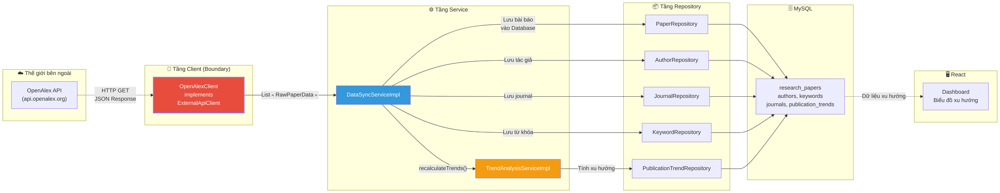
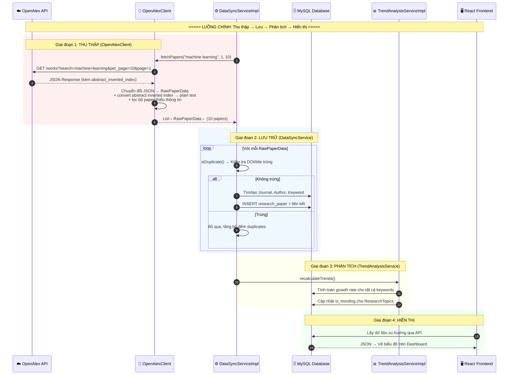
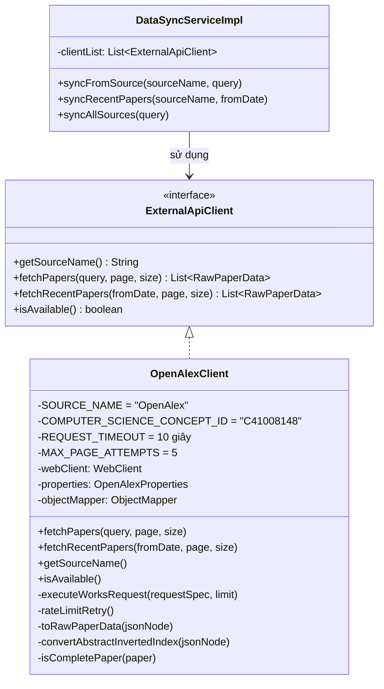
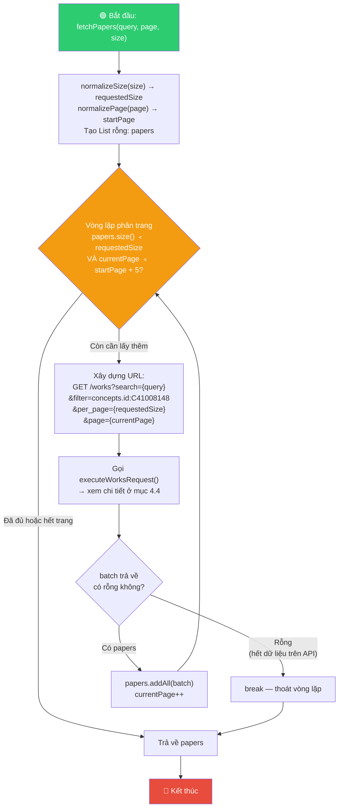
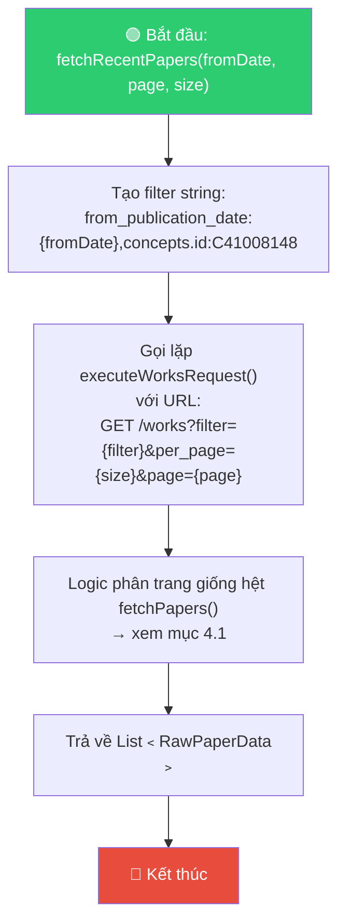
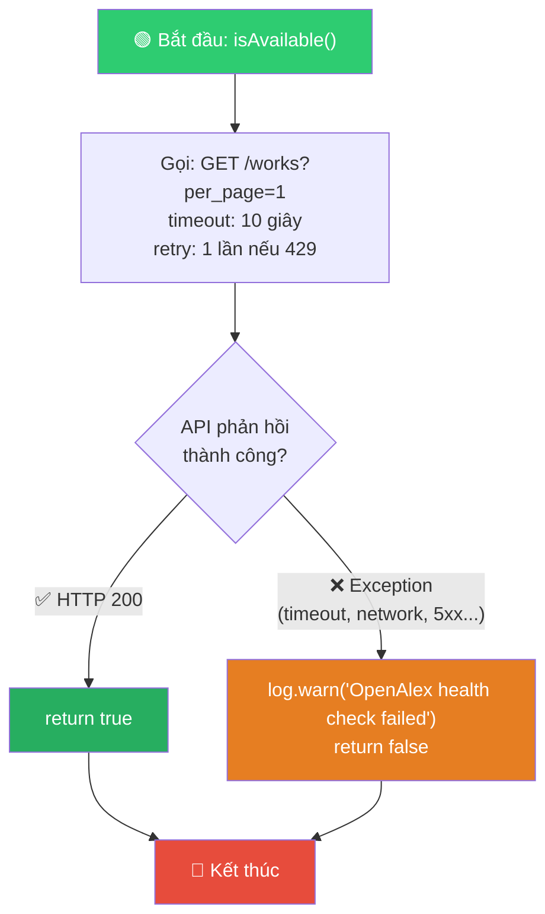
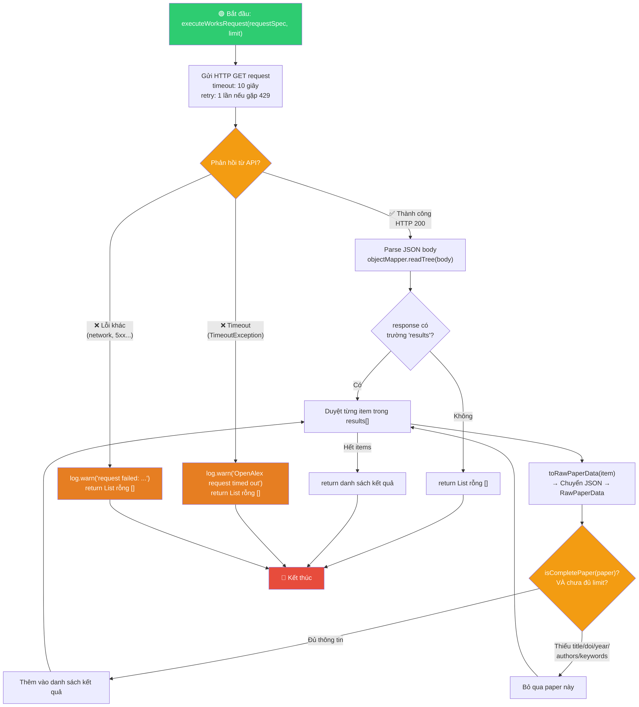
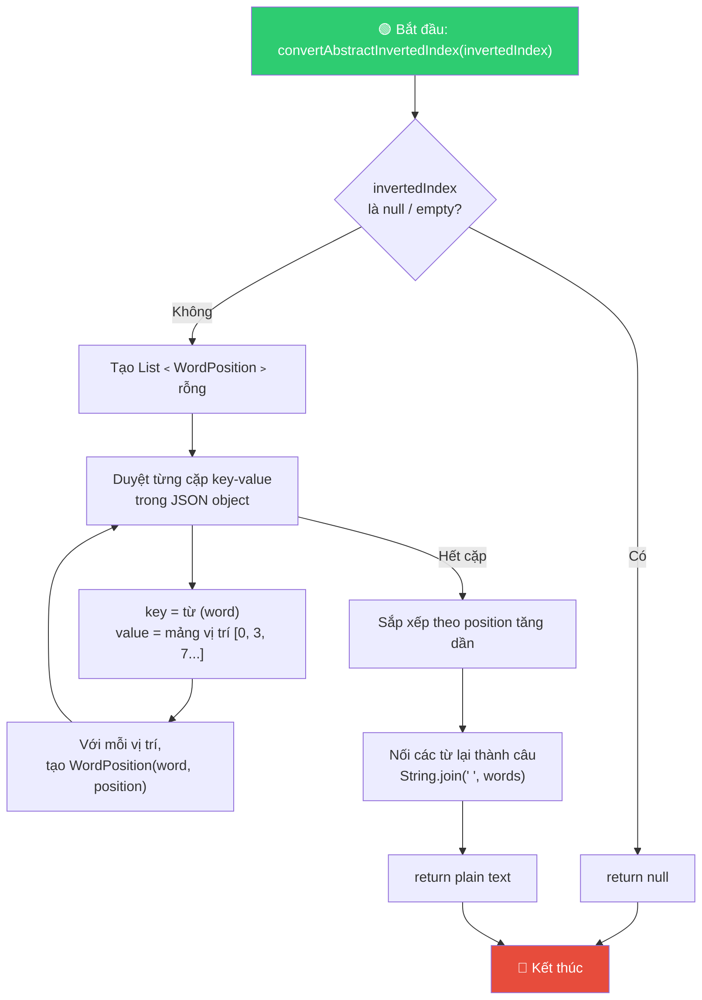
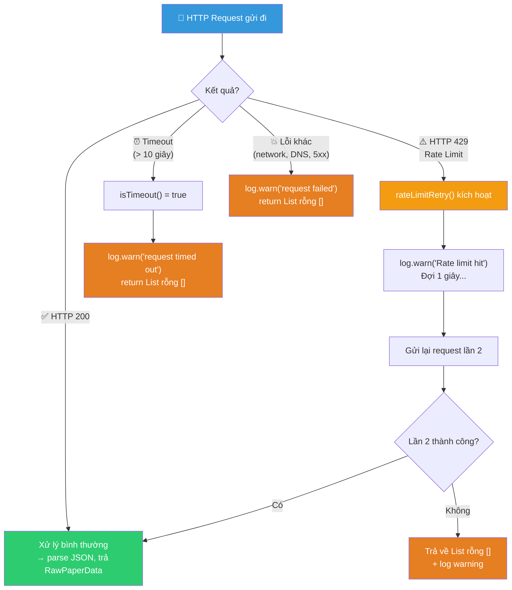
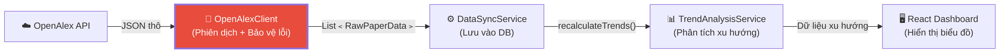

# 🌐 Sơ đồ Hoạt động: OpenAlexClient

> Tài liệu mô tả chi tiết luồng hoạt động của [OpenAlexClient.java](file:///d:/Document/Java/journal-trend-tracker/Scientific-Journal-Publication-Trend-Tracking-System/backend/com.journaltracker/src/main/java/com/journaltracker/external/OpenAlexClient.java) — **cầu nối duy nhất** giữa hệ thống và API bên ngoài OpenAlex.

---

## 1. Vị trí của OpenAlexClient trong Kiến trúc Tổng thể

`OpenAlexClient` nằm ở **rìa ngoài cùng** (boundary) của hệ thống, đóng vai trò như một **"người phiên dịch"** — nhận dữ liệu JSON thô từ OpenAlex API, chuyển đổi thành `RawPaperData` mà phần còn lại của hệ thống có thể hiểu được.



> [!IMPORTANT]
> **OpenAlexClient là mắt xích ĐẦU TIÊN** trong toàn bộ pipeline xử lý dữ liệu. Không có nó, hệ thống không có dữ liệu → `DataSyncService` không có gì để lưu → `TrendAnalysisService` không có gì để phân tích → Dashboard hiển thị trắng.

---

## 2. Luồng End-to-End: Từ OpenAlex API đến Dashboard



---

## 3. Cấu trúc bên trong OpenAlexClient

### 3.1. Interface và Implementation



> [!NOTE]
> `OpenAlexClient` implement interface `ExternalApiClient`. Nhờ đó, `DataSyncServiceImpl` không biết và **không cần biết** nó đang gọi OpenAlex hay Crossref — nó chỉ cần gọi `fetchPapers()` là đủ. Đây là nguyên tắc **Dependency Inversion** (chữ D trong SOLID).

---

## 4. Sơ đồ Hoạt động Chi tiết Từng Method

### 4.1. `fetchPapers(query, page, size)` — Tìm kiếm bài báo theo từ khóa

> **Tác dụng**: Gọi OpenAlex API để tìm bài báo theo từ khóa trong lĩnh vực Computer Science. Có cơ chế **phân trang tự động** nếu một trang không đủ dữ liệu.



> [!TIP]
> **`MAX_PAGE_ATTEMPTS = 5`** là cơ chế bảo vệ — nếu API luôn trả về papers nhưng không bao giờ đủ `requestedSize` (vì filter `isCompletePaper` loại bỏ quá nhiều), vòng lặp sẽ dừng lại sau 5 lần gọi API để tránh treo vô hạn.

---

### 4.2. `fetchRecentPapers(fromDate, page, size)` — Lấy bài báo gần đây

> **Tác dụng**: Giống `fetchPapers`, nhưng thay vì tìm theo từ khóa, nó lọc theo **ngày xuất bản** (`from_publication_date`). Dùng cho việc sync bài báo mới hàng ngày/tuần.



**So sánh `fetchPapers` vs `fetchRecentPapers`:**

| Tiêu chí | `fetchPapers` | `fetchRecentPapers` |
|:---------|:-------------|:-------------------|
| Filter chính | `search={query}` | `from_publication_date:{fromDate}` |
| Filter phụ | `concepts.id:C41008148` | `concepts.id:C41008148` |
| Mục đích | Tìm bài theo chủ đề | Lấy bài mới nhất |
| Khi nào gọi | `syncFromSource()` | `syncRecentPapers()` |

---

### 4.3. `isAvailable()` — Health Check API

> **Tác dụng**: Kiểm tra xem OpenAlex API có đang hoạt động không. Được gọi bởi `DataSyncServiceImpl.syncAllSources()` trước khi bắt đầu sync từ một nguồn.



**Cách `isAvailable()` được dùng trong luồng chính:**

```java
// Trong DataSyncServiceImpl.syncAllSources()
for (ExternalApiClient client : clientList) {
    if (!client.isAvailable()) {           // ← Gọi isAvailable() ở đây
        log.warn("Nguồn '{}' không khả dụng, bỏ qua.", client.getSourceName());
        continue;                          // ← Bỏ qua nguồn bị lỗi
    }
    SyncResult r = syncFromSource(client.getSourceName(), query);
}
```

---

### 4.4. `executeWorksRequest()` — Trung tâm xử lý mọi HTTP request

> **Tác dụng**: Đây là **method TRUNG TÂM** — tất cả `fetchPapers`, `fetchRecentPapers`, `isAvailable` đều gọi đến nó. Nó chịu trách nhiệm: gửi HTTP request, xử lý lỗi, parse JSON, chuyển đổi sang `RawPaperData`.



> [!WARNING]
> Method này **KHÔNG BAO GIỜ throw exception** ra ngoài. Mọi lỗi đều được catch và trả về `List.of()` (danh sách rỗng). Đây là thiết kế có chủ đích — vì nếu API lỗi mà throw exception, toàn bộ quá trình sync sẽ bị dừng lại thay vì tiếp tục với các trang tiếp theo.

---

### 4.5. `convertAbstractInvertedIndex()` — Giải mã Abstract

> **Tác dụng**: OpenAlex lưu abstract dưới dạng "inverted index" (đảo ngược) chứ không phải plain text. Method này chuyển đổi ngược lại.



**Ví dụ minh họa cụ thể:**

```
📥 Input (JSON từ OpenAlex):
{
  "Machine": [0],
  "learning": [1, 5],
  "is": [2],
  "a": [3],
  "branch": [4],
  "of": [6],
  "AI": [7]
}

🔄 Bước 1 — Tạo danh sách WordPosition:
(Machine, 0), (learning, 1), (is, 2), (a, 3), (branch, 4), (learning, 5), (of, 6), (AI, 7)

🔄 Bước 2 — Sắp xếp theo position:
(Machine, 0), (learning, 1), (is, 2), (a, 3), (branch, 4), (learning, 5), (of, 6), (AI, 7)

📤 Output (plain text):
"Machine learning is a branch learning of AI"
```

---

### 4.6. Cơ chế xử lý lỗi 3 tầng — `rateLimitRetry()`

> **Tác dụng**: Đây là bộ lọc lỗi tự động, xử lý 3 loại lỗi khác nhau với 3 chiến lược khác nhau.



**Bảng tóm tắt cơ chế xử lý lỗi:**

| Loại lỗi | Nguyên nhân | Hành xử | Retry? | Exception? |
|:---------|:-----------|:--------|:-------|:-----------|
| **HTTP 429** | Gọi API quá nhiều | Đợi 1 giây → thử lại 1 lần | ✅ 1 lần | ❌ Không |
| **Timeout** | API phản hồi quá 10 giây | Trả về `[]` + log warning | ❌ Không | ❌ Không |
| **Network Error** | Mất mạng, DNS fail, 5xx | Trả về `[]` + log warning | ❌ Không | ❌ Không |

> [!IMPORTANT]
> Thiết kế **"fail gracefully"** (lỗi nhẹ nhàng) — không bao giờ throw exception ra ngoài. Điều này đảm bảo:
> - Nếu trang 3 timeout → hệ thống vẫn giữ được papers từ trang 1 & 2
> - Nếu OpenAlex sập → `syncAllSources()` vẫn tiếp tục sync từ các nguồn khác (Crossref, Semantic Scholar...)

---

## 5. Ví dụ Minh họa End-to-End

### Kịch bản: Admin gọi `syncFromSource("OpenAlex", "machine learning")`

**Bước 1 — `DataSyncServiceImpl.syncFromSource()` gọi `OpenAlexClient.fetchPapers()`:**

```
📡 Request: GET https://api.openalex.org/works
     ?search=machine+learning
     &filter=concepts.id:C41008148
     &per_page=10
     &page=1
```

**Bước 2 — OpenAlex API trả về JSON:**

```json
{
  "results": [
    {
      "doi": "https://doi.org/10.1000/ml-paper-01",
      "title": "Deep Learning for Natural Language Processing",
      "abstract_inverted_index": {
        "This": [0], "paper": [1], "explores": [2], "deep": [3], "learning": [4]
      },
      "publication_year": 2025,
      "primary_location": {
        "source": { "display_name": "Journal of AI Research" }
      },
      "authorships": [
        { "author": { "display_name": "Ada Lovelace" } },
        { "author": { "display_name": "Alan Turing" } }
      ],
      "concepts": [
        { "display_name": "Deep Learning" },
        { "display_name": "Natural Language Processing" },
        { "display_name": "Artificial Intelligence" }
      ]
    }
  ]
}
```

**Bước 3 — `OpenAlexClient` chuyển đổi thành `RawPaperData`:**

| Trường | Giá trị |
|:-------|:--------|
| `doi` | `https://doi.org/10.1000/ml-paper-01` |
| `title` | `Deep Learning for Natural Language Processing` |
| `abstractText` | `This paper explores deep learning` ← *đã convert từ inverted index* |
| `publicationYear` | `2025` |
| `journalName` | `Journal of AI Research` |
| `authorNames` | `["Ada Lovelace", "Alan Turing"]` |
| `keywords` | `["Deep Learning", "Natural Language Processing", "Artificial Intelligence"]` |

**Bước 4 — `isCompletePaper()` kiểm tra:**
- ✅ `title` có giá trị → OK
- ✅ `doi` có giá trị → OK
- ✅ `publicationYear` có giá trị → OK
- ✅ `authorNames` không rỗng → OK
- ✅ `keywords` không rỗng → OK
- **→ Paper này PASS, được thêm vào kết quả trả về**

**Bước 5 — `DataSyncServiceImpl` nhận và xử lý:**
- Kiểm tra DOI trùng → không trùng
- Tìm/tạo Journal "Journal of AI Research"
- Tìm/tạo Author "Ada Lovelace", "Alan Turing"
- Tìm/tạo Keyword "Deep Learning", "NLP", "AI"
- Lưu `ResearchPaper` vào database

---

## 6. Tóm tắt: Vai trò của OpenAlexClient trong Pipeline



| Method | Loại | Ai gọi? | Tác dụng | Output |
|:-------|:-----|:--------|:---------|:-------|
| `fetchPapers()` | READ API | `DataSyncService.syncFromSource()` | Tìm bài báo theo từ khóa | `List﹤RawPaperData﹥` |
| `fetchRecentPapers()` | READ API | `DataSyncService.syncRecentPapers()` | Lấy bài báo từ một ngày nhất định | `List﹤RawPaperData﹥` |
| `isAvailable()` | HEALTH CHECK | `DataSyncService.syncAllSources()` | Kiểm tra API có hoạt động không | `boolean` |
| `getSourceName()` | METADATA | `DataSyncService.findExternalApiClient()` | Trả về tên nguồn `"OpenAlex"` | `String` |

> [!TIP]
> **Mối liên hệ giữa 3 Service lớn trong hệ thống:**
>
> `OpenAlexClient` → **THU THẬP** dữ liệu thô từ API bên ngoài
>
> `DataSyncService` → **LƯU TRỮ** dữ liệu vào Database + orchestrate toàn bộ pipeline
>
> `TrendAnalysisService` → **PHÂN TÍCH** dữ liệu đã lưu và tính xu hướng
>
> Ba module này hoạt động tuần tự như một **dây chuyền nhà máy**: nguyên liệu thô (OpenAlex JSON) → chế biến (DataSync lưu DB) → thành phẩm (TrendAnalysis tính xu hướng) → giao hàng (Dashboard hiển thị).
