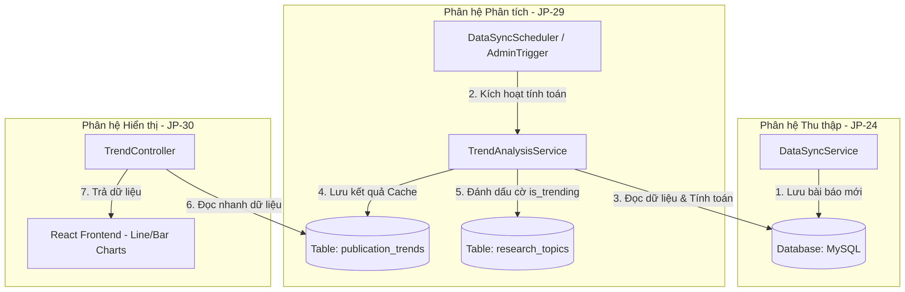
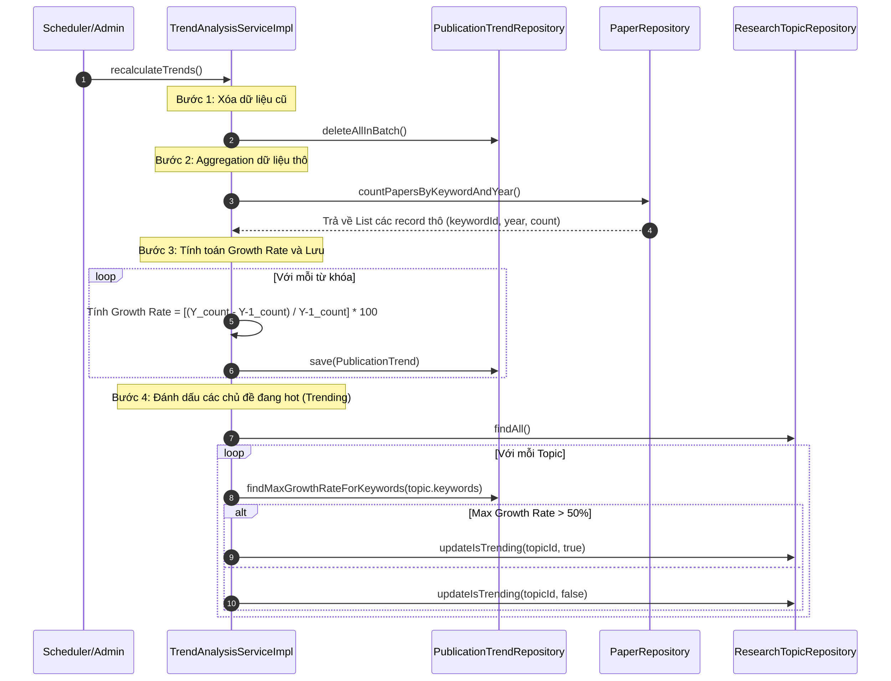
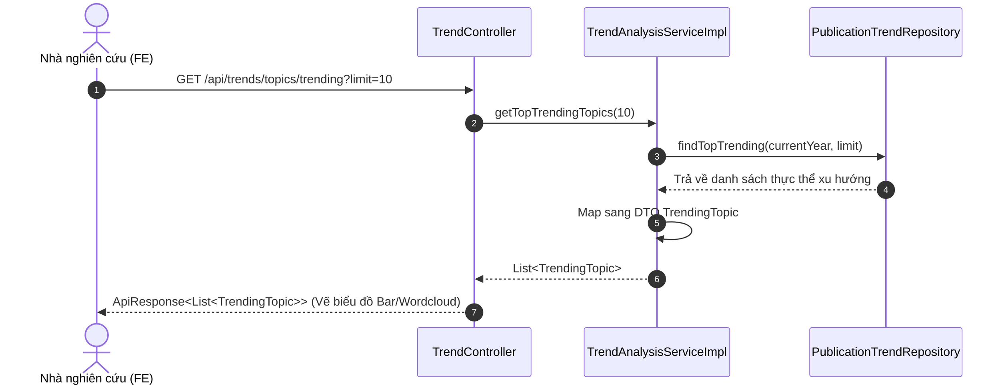

# 📑 Tài liệu Kiến trúc & Luồng hoạt động: JP-29 Core Trend Analysis Logic

Tài liệu này giải thích chi tiết về vị trí, vai trò, luồng hoạt động và giải thuật xử lý của phần **JP-29: Core Trend Analysis Logic** trong hệ thống **Scientific Journal Publication Trend Tracking**.


## 1. Vị trí và Vai trò của JP-29 trong Hệ thống

Phân hệ phân tích xu hướng (**Trend Analysis Engine**) đóng vai trò chuyển hóa dữ liệu bài báo khoa học thô được thu thập từ các API nguồn thành các chỉ số trực quan có ích cho nhà nghiên cứu. 

Trong hệ thống, JP-29 đóng vai trò kết nối trực tiếp sau khi luồng dữ liệu **JP-24 (Core Sync Engine)** hoàn tất:



---

## 2. Thiết kế Cấu trúc các Thành phần trong JP-29

### A. Interface `TrendAnalysisService`
Định nghĩa contract chính cho việc tính toán và truy vấn dữ liệu xu hướng:

```java
public interface TrendAnalysisService {
    // Lấy dữ liệu xu hướng của một từ khóa qua các năm
    List<TrendDataPoint> getTrendByKeyword(String keyword, int yearFrom, int yearTo);
    
    // So sánh dữ liệu xu hướng của nhiều từ khóa cùng lúc
    List<TrendComparison> compareTrends(List<String> keywords, int yearFrom, int yearTo);
    
    // Lấy danh sách các từ khóa đang thịnh hành nhất
    List<TrendingTopic> getTopTrendingTopics(int limit);
    
    // Tính toán lại toàn bộ dữ liệu xu hướng (gọi sau khi sync dữ liệu hoàn tất)
    void recalculateTrends();
}
```

### B. Các DTOs Trao đổi Dữ liệu

| DTO | Cấu trúc thuộc tính | Mục đích sử dụng |
| :--- | :--- | :--- |
| `TrendDataPoint` | `int year`<br>`int paperCount` | Biểu diễn số lượng bài viết của một từ khóa trong một năm cụ thể. |
| `TrendComparison` | `String keyword`<br>`List<TrendDataPoint> dataPoints` | Phục vụ so sánh nhiều đường biểu đồ (multi-series line chart) ở frontend. |
| `TrendingTopic` | `String keyword`<br>`int currentYearCount`<br>`int previousYearCount`<br>`double growthRate` | Biểu diễn một từ khóa thịnh hành kèm tỉ lệ phần trăm tăng trưởng. |

### C. Database Entity `PublicationTrend`
Để tránh việc chạy các câu lệnh truy vấn gom nhóm (`GROUP BY` và `COUNT`) trên hàng triệu dòng dữ liệu bài báo mỗi khi người dùng gọi API, hệ thống sử dụng bảng cache **`publication_trends`** để lưu trữ các dữ liệu đã được tổng hợp sẵn:

```java
@Entity
@Table(name = "publication_trends")
@Getter
@Setter
@NoArgsConstructor
@AllArgsConstructor
@Builder
public class PublicationTrend {
    @Id
    @GeneratedValue(strategy = GenerationType.IDENTITY)
    private Long id;

    @Column(name = "keyword_id", nullable = false)
    private Long keywordId;

    @ManyToOne(fetch = FetchType.LAZY)
    @JoinColumn(name = "keyword_id", insertable = false, updatable = false)
    private Keyword keyword;

    @Column(nullable = false)
    private Integer year;

    @Column(name = "paper_count", nullable = false)
    private Integer paperCount;

    @Column(name = "growth_rate")
    private Double growthRate; // Tốc độ tăng trưởng so với năm trước (%)
}
```

---

## 3. Sơ đồ hoạt động chi tiết (Activity & Sequence Flow)

Quy trình hoạt động của phân hệ gồm 2 luồng độc lập dưới đây:

### Luồng 1: Tính toán lại dữ liệu xu hướng (`recalculateTrends`)
Tiến trình này chạy ngầm ngay sau khi đồng bộ dữ liệu để cập nhật lại các chỉ số thống kê.



### Luồng 2: Phục vụ Truy vấn API từ Client
Xử lý các yêu cầu lấy thông tin của người dùng từ giao diện Dashboard.



---

## 4. Công thức toán học và Thuật toán Core

### A. Công thức tính Tỷ lệ Tăng trưởng (Growth Rate)

Tỷ lệ tăng trưởng của một từ khóa $K$ tại năm $Y$ so với năm trước đó $Y-1$ được tính bằng công thức:

$$\text{Growth Rate (\%)} = \frac{\text{PaperCount}_{Y} - \text{PaperCount}_{Y-1}}{\text{PaperCount}_{Y-1}} \times 100$$

*   **Xử lý biên (Edge cases):**
    *   Nếu $\text{PaperCount}_{Y-1} = 0$ và $\text{PaperCount}_{Y} > 0$: Đặt mặc định $\text{Growth Rate} = 100.0\%$.
    *   Nếu cả hai năm đều bằng $0$: Đặt $\text{Growth Rate} = 0.0\%$.

### B. Giải thuật xác định Topic thịnh hành (Trending Detection)

Một **Chủ đề nghiên cứu (Research Topic)** lớn (ví dụ: *Trí tuệ nhân tạo*) sẽ liên kết với một nhóm các **Từ khóa (Keywords)** cụ thể (ví dụ: *deep learning, neural network, NLP*). 

Chủ đề đó được đánh dấu là `is_trending = true` khi:
1. Có ít nhất một từ khóa trực thuộc đạt tỷ lệ tăng trưởng trong năm hiện tại vượt quá ngưỡng quy định (mặc định là **50.0%**).
2. Tổng số lượng bài viết của chủ đề trong năm hiện tại đạt một số lượng tối thiểu nhất định (để tránh trường hợp số lượng bài viết tăng từ 1 bài lên 2 bài - dù tăng 100% nhưng không đủ làm xu hướng).

---

## 5. Các giải pháp tối ưu hóa hiệu năng cần lưu ý

1. **Sử dụng Native Query hoặc JPQL Projection:**
   Khi thực hiện câu lệnh tính tổng hợp (Aggregation), tránh tải toàn bộ entity bài báo lên bộ nhớ RAM. Nên viết câu truy vấn trả về cấu trúc DTO nhỏ gọn trực tiếp từ tầng cơ sở dữ liệu:
   ```sql
   SELECT pk.keyword_id, p.publication_year, COUNT(p.id)
   FROM research_papers p
   JOIN paper_keywords pk ON p.id = pk.paper_id
   GROUP BY pk.keyword_id, p.publication_year
   ```

2. **Batch Insert/Update:**
   Hàm `recalculateTrends()` ghi số lượng bản ghi lớn vào database cùng lúc. Cần cấu hình:
   ```yaml
   spring:
     jpa:
       properties:
         hibernate:
           jdbc:
             batch_size: 50
             order_inserts: true
   ```
   và gọi `saveAll()` thay vì lưu lẻ tẻ từng bản ghi để giảm thiểu Round-trip network đến MySQL.

3. **Cơ chế Cache:**
   Dữ liệu xu hướng là dữ liệu lịch sử ít biến động trong ngày. Cần cấu hình Spring Cache (`@Cacheable`) cho các API `/api/trends/*` và xóa sạch cache này (`@CacheEvict`) sau khi tiến trình `recalculateTrends()` hoàn tất.
