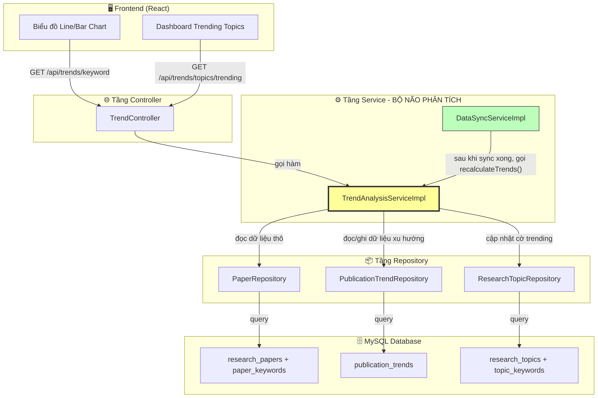
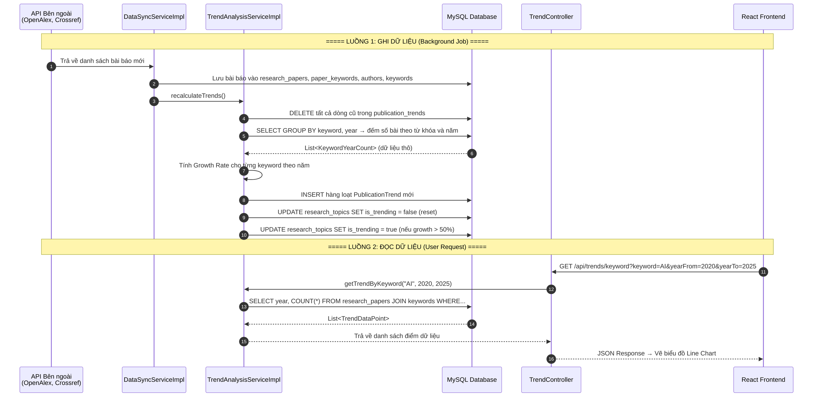
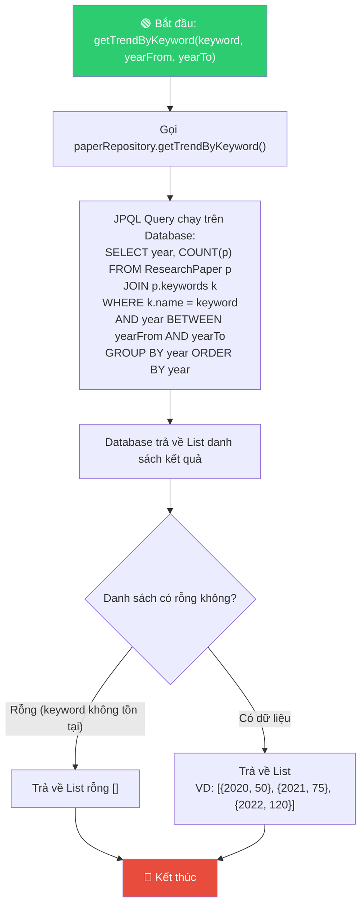
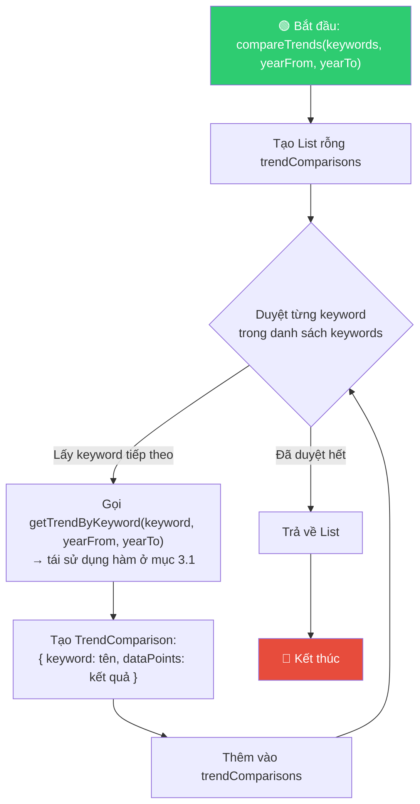
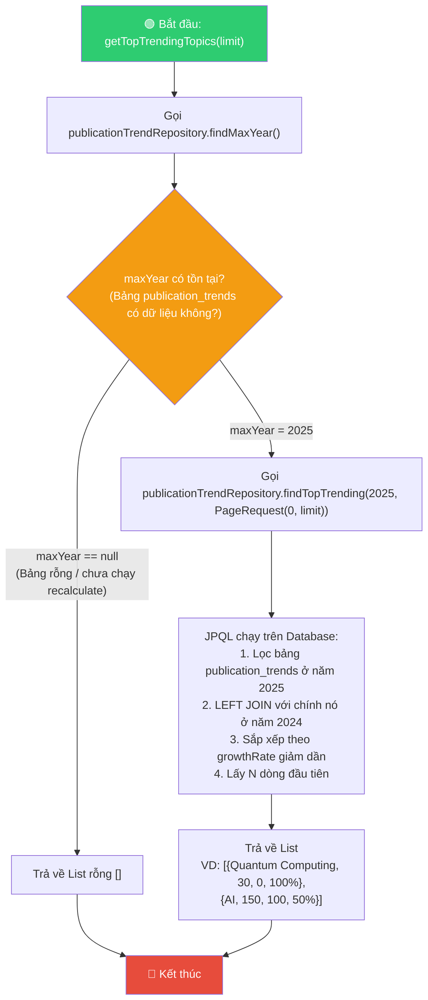
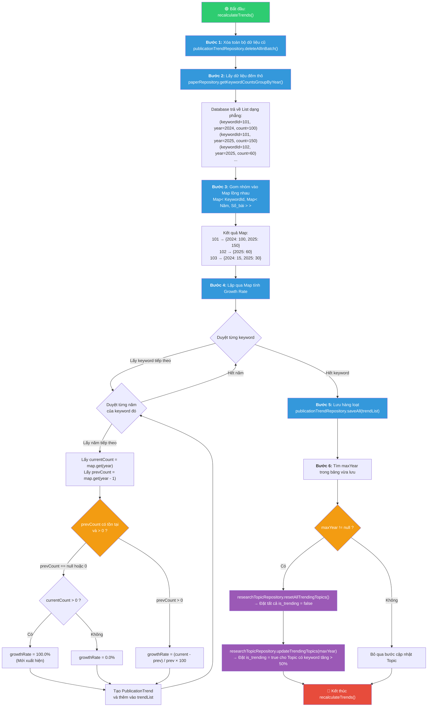

# 📊 Sơ đồ Hoạt động: TrendAnalysisServiceImpl

> Tài liệu mô tả chi tiết luồng hoạt động của từng phương thức trong [TrendAnalysisServiceImpl.java](file:///d:/Document/Java/journal-trend-tracker/Scientific-Journal-Publication-Trend-Tracking-System/backend/com.journaltracker/src/main/java/com/journaltracker/service/impl/TrendAnalysisServiceImpl.java) và vai trò của nó trong luồng chính của hệ thống.

---

## 1. Vị trí của TrendAnalysisService trong Kiến trúc Tổng thể

`TrendAnalysisServiceImpl` là **bộ não phân tích xu hướng** của toàn bộ hệ thống. Nó nằm ở tầng Service (Business Logic Layer), kết nối giữa tầng Controller (nhận request từ người dùng) và tầng Repository (truy vấn database).



> [!IMPORTANT]
> `TrendAnalysisServiceImpl` phục vụ **2 luồng hoạt động hoàn toàn khác nhau**:
> - **Luồng WRITE (Ghi)**: Được gọi bởi `DataSyncService` sau khi đồng bộ dữ liệu → chạy `recalculateTrends()` để tính toán và lưu xu hướng.
> - **Luồng READ (Đọc)**: Được gọi bởi `TrendController` khi người dùng xem biểu đồ → chạy `getTrendByKeyword()`, `compareTrends()`, `getTopTrendingTopics()`.

---

## 2. Luồng End-to-End: Từ Thu thập Dữ liệu đến Hiển thị Biểu đồ



---

## 3. Sơ đồ Hoạt động Chi tiết Từng Phương thức

### 3.1. `getTrendByKeyword(keyword, yearFrom, yearTo)`

> **Tác dụng**: Trả về số lượng bài báo của một từ khóa cụ thể qua từng năm trong khoảng thời gian chỉ định. Dùng để vẽ **biểu đồ đường (Line Chart)** trên Dashboard.



> **Ví dụ đầu vào/đầu ra:**
> - Input: `getTrendByKeyword("machine learning", 2020, 2025)`
> - Output: `[{2020, 45}, {2021, 67}, {2022, 89}, {2023, 112}, {2024, 150}, {2025, 198}]`

---

### 3.2. `compareTrends(keywords, yearFrom, yearTo)`

> **Tác dụng**: So sánh xu hướng của nhiều từ khóa cùng lúc. Dùng để vẽ **biểu đồ đường nhiều series (Multi-series Line Chart)**, mỗi từ khóa là một đường riêng.



> **Ví dụ đầu vào/đầu ra:**
> - Input: `compareTrends(["AI", "blockchain"], 2022, 2025)`
> - Output:
>   ```
>   [
>     { keyword: "AI",         dataPoints: [{2022, 100}, {2023, 130}, {2024, 160}, {2025, 200}] },
>     { keyword: "blockchain", dataPoints: [{2022, 80},  {2023, 60},  {2024, 45},  {2025, 30}] }
>   ]
>   ```

---

### 3.3. `getTopTrendingTopics(limit)`

> **Tác dụng**: Trả về danh sách N từ khóa có tốc độ tăng trưởng cao nhất. Dùng để hiển thị **bảng xếp hạng Trending Keywords** hoặc **biểu đồ cột (Bar Chart)** trên Dashboard.



---

### 3.4. `recalculateTrends()` — Phương thức QUAN TRỌNG NHẤT

> **Tác dụng**: Tính toán lại TOÀN BỘ dữ liệu xu hướng và lưu vào bảng cache `publication_trends`. Đây là phương thức **"máy bơm dữ liệu"** — không có nó, 3 phương thức đọc ở trên sẽ không có dữ liệu để trả về.



---

## 4. Ví dụ Minh họa Cụ thể: recalculateTrends() với Dữ liệu Thật

### Dữ liệu đầu vào (từ bảng `research_papers` + `paper_keywords`):

| Bài báo | Năm | Từ khóa |
|:--------|:----|:--------|
| Paper A | 2024 | AI |
| Paper B | 2024 | AI |
| Paper C | 2025 | AI |
| Paper D | 2025 | AI |
| Paper E | 2025 | AI |
| Paper F | 2025 | Blockchain |

### Bước 2 — Kết quả `getKeywordCountsGroupByYear()`:

| keywordId | year | paperCount |
|:----------|:-----|:-----------|
| 101 (AI) | 2024 | 2 |
| 101 (AI) | 2025 | 3 |
| 102 (Blockchain) | 2025 | 1 |

### Bước 3 — Map lồng nhau:

```
101 (AI)         → {2024: 2, 2025: 3}
102 (Blockchain) → {2025: 1}
```

### Bước 4 — Tính Growth Rate:

| Keyword | Năm | currentCount | prevCount | Công thức | growthRate |
|:--------|:----|:-------------|:----------|:----------|:-----------|
| AI | 2024 | 2 | null (2023 không tồn tại) | Mới xuất hiện → 100% | **100.00%** |
| AI | 2025 | 3 | 2 | (3-2)/2 × 100 | **50.00%** |
| Blockchain | 2025 | 1 | null (2024 không tồn tại) | Mới xuất hiện → 100% | **100.00%** |

### Bước 5 — Dữ liệu được lưu vào bảng `publication_trends`:

| id | keyword_id | year | paper_count | growth_rate |
|:---|:-----------|:-----|:------------|:------------|
| 1 | 101 | 2024 | 2 | 100.00 |
| 2 | 101 | 2025 | 3 | 50.00 |
| 3 | 102 | 2025 | 1 | 100.00 |

### Bước 6 — Cập nhật `research_topics`:
- `maxYear = 2025`
- Reset tất cả `is_trending = false`
- Tìm các Topic có keyword với `growth_rate > 50%` ở năm 2025:
  - AI (50%) → **Không đạt** (phải > 50%, không phải >=)
  - Blockchain (100%) → **Đạt** ✅
- Kết quả: Topic nào chứa từ khóa "Blockchain" sẽ được `is_trending = true`

---

## 5. Tóm tắt Vai trò của Từng Phương thức

| Phương thức | Loại | Ai gọi? | Tác dụng | Output |
|:-----------|:-----|:--------|:---------|:-------|
| `getTrendByKeyword()` | READ | TrendController | Lấy xu hướng 1 từ khóa qua các năm | `List<TrendDataPoint>` |
| `compareTrends()` | READ | TrendController | So sánh nhiều từ khóa cùng lúc | `List<TrendComparison>` |
| `getTopTrendingTopics()` | READ | TrendController | Lấy top N từ khóa hot nhất | `List<TrendingTopic>` |
| `recalculateTrends()` | WRITE | DataSyncService / Scheduler | **Máy bơm dữ liệu**: tính toán và lưu xu hướng | `void` |

> [!TIP]
> `recalculateTrends()` là **nền tảng** cho `getTopTrendingTopics()`. Nếu không chạy `recalculateTrends()`, bảng `publication_trends` sẽ rỗng → `getTopTrendingTopics()` luôn trả về danh sách rỗng.
> Ngược lại, `getTrendByKeyword()` và `compareTrends()` **không phụ thuộc** vào `recalculateTrends()` vì chúng truy vấn trực tiếp từ bảng dữ liệu thô `research_papers`.
