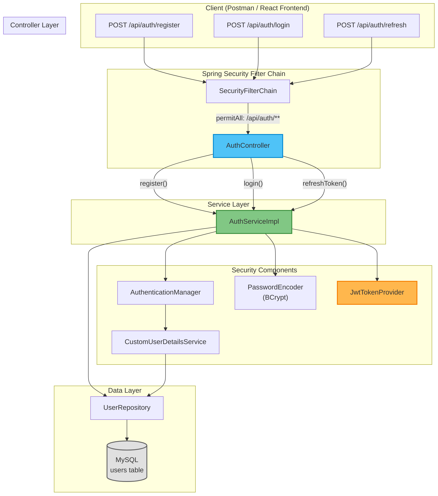
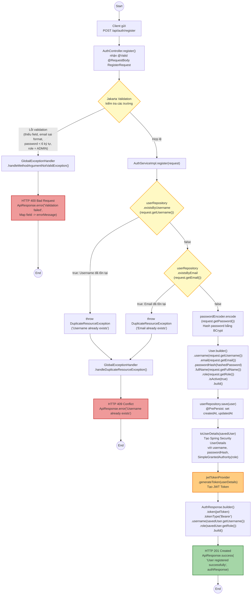
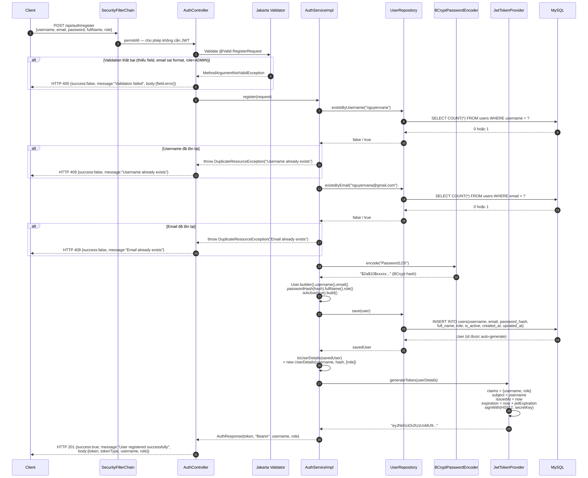
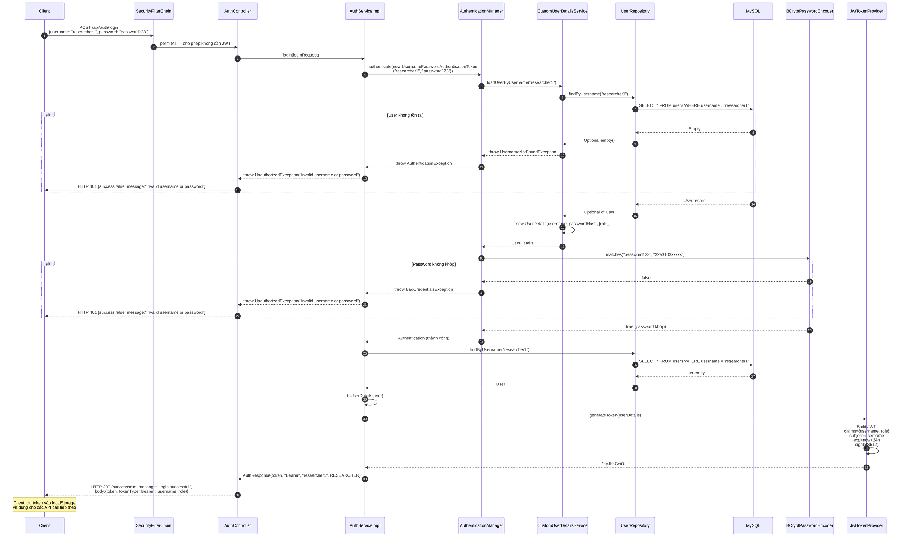
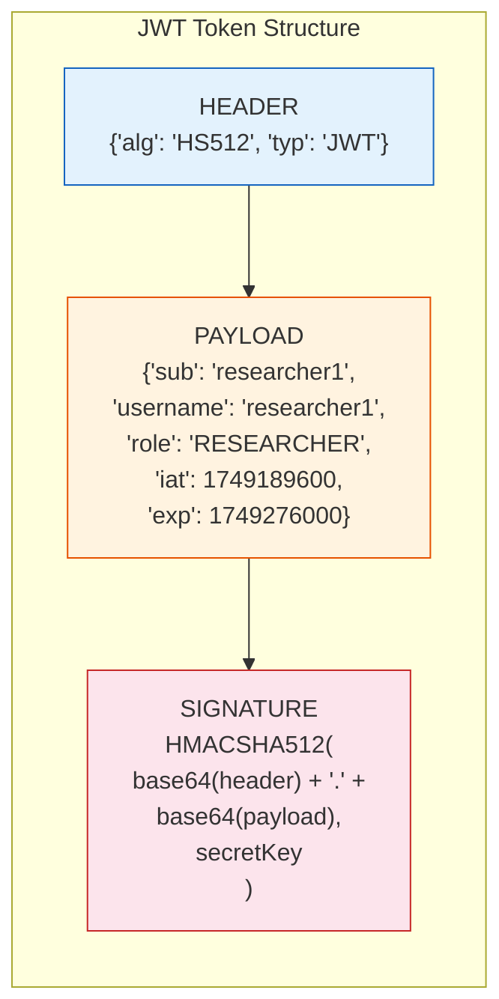
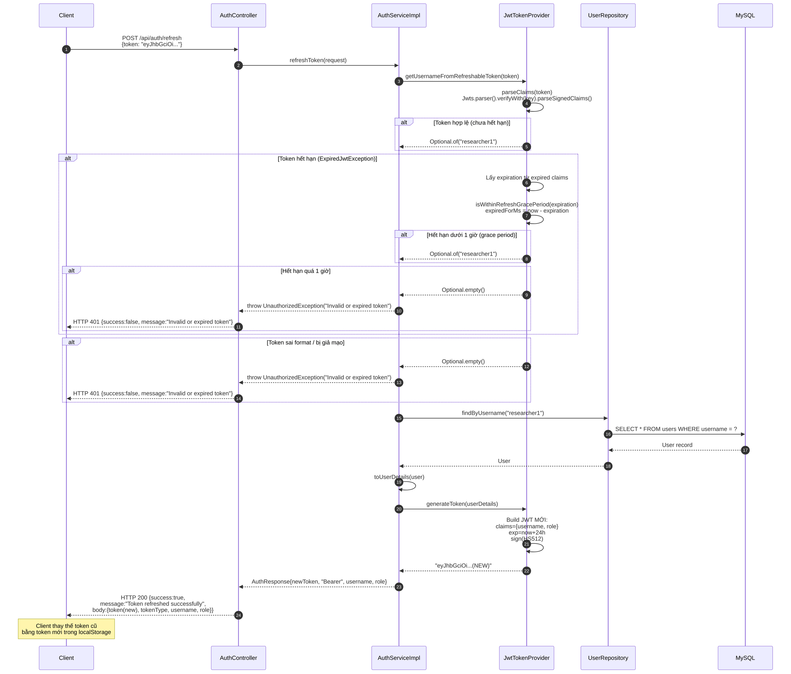
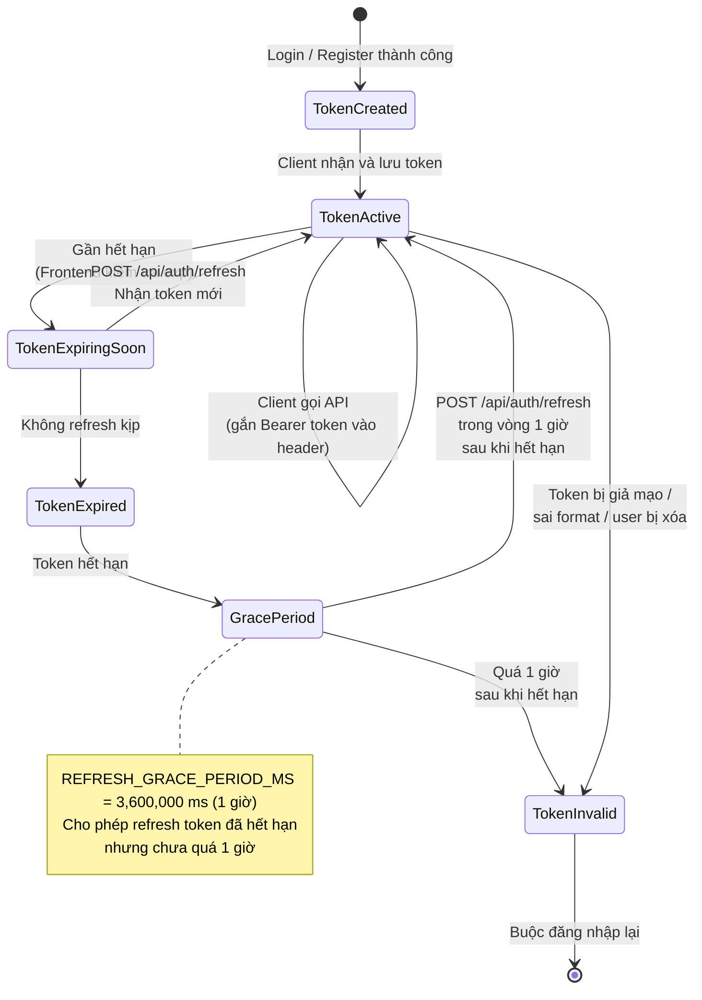
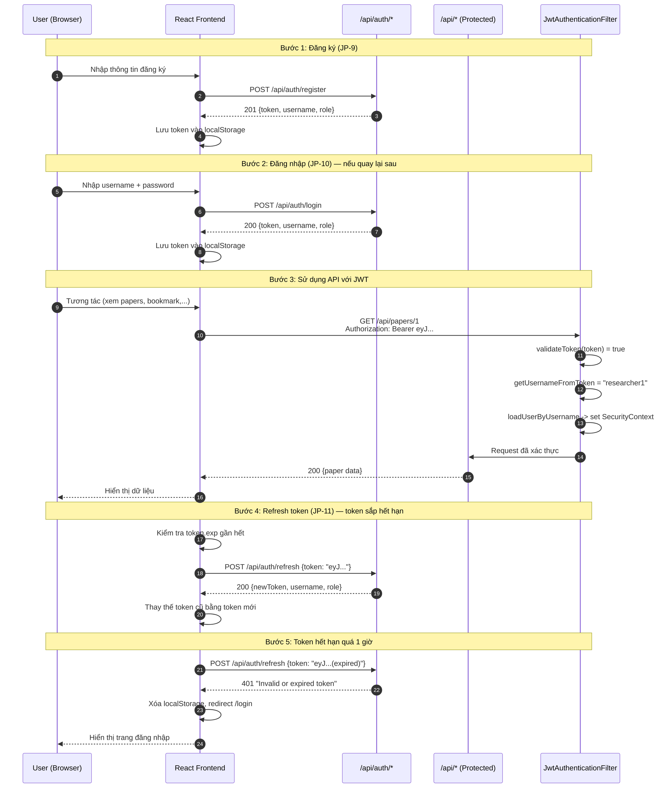

# Sơ Đồ Hoạt Động Chi Tiết — JP-9, JP-10, JP-11 (Authentication)

> Tất cả sơ đồ được vẽ dựa trên phân tích trực tiếp source code hiện tại của hệ thống.

**Source code tham chiếu:**
- [AuthController.java](file:///d:/Document/Java/journal-trend-tracker/Scientific-Journal-Publication-Trend-Tracking-System/backend/com.journaltracker/src/main/java/com/journaltracker/controller/AuthController.java)
- [AuthServiceImpl.java](file:///d:/Document/Java/journal-trend-tracker/Scientific-Journal-Publication-Trend-Tracking-System/backend/com.journaltracker/src/main/java/com/journaltracker/service/impl/AuthServiceImpl.java)
- [JwtTokenProvider.java](file:///d:/Document/Java/journal-trend-tracker/Scientific-Journal-Publication-Trend-Tracking-System/backend/com.journaltracker/src/main/java/com/journaltracker/security/JwtTokenProvider.java)
- [CustomUserDetailsService.java](file:///d:/Document/Java/journal-trend-tracker/Scientific-Journal-Publication-Trend-Tracking-System/backend/com.journaltracker/src/main/java/com/journaltracker/security/CustomUserDetailsService.java)
- [GlobalExceptionHandler.java](file:///d:/Document/Java/journal-trend-tracker/Scientific-Journal-Publication-Trend-Tracking-System/backend/com.journaltracker/src/main/java/com/journaltracker/exception/GlobalExceptionHandler.java)
- [RegisterRequest.java](file:///d:/Document/Java/journal-trend-tracker/Scientific-Journal-Publication-Trend-Tracking-System/backend/com.journaltracker/src/main/java/com/journaltracker/dto/request/RegisterRequest.java)

---

## 1. Sơ đồ tổng quan — Kiến trúc Authentication Module

---

## 2. JP-9: Đăng Ký Tài Khoản (Register)

### 2.1 Activity Diagram — Luồng chính

### 2.2 Sequence Diagram — Tương tác giữa các component

### 2.3 Bảng Validation Rules — RegisterRequest

| Trường | Annotation | Quy tắc | Lỗi trả về |
|--------|-----------|---------|-------------|
| `username` | `@NotBlank`, `@Size(min=3, max=50)` | Bắt buộc, 3-50 ký tự | "must not be blank" / "size must be between 3 and 50" |
| `email` | `@NotBlank`, `@Email` | Bắt buộc, đúng format email | "must not be blank" / "must be a well-formed email address" |
| `password` | `@NotBlank`, `@Size(min=6)` | Bắt buộc, tối thiểu 6 ký tự | "must not be blank" / "size must be at least 6" |
| `fullName` | `@NotBlank` | Bắt buộc | "must not be blank" |
| `role` | `@NotNull` | Bắt buộc, Enum: RESEARCHER/LECTURER/STUDENT | "must not be null" |
| *(custom)* | `@AssertTrue` trên `isAllowedRegistrationRole()` | `role != ADMIN` | "Role ADMIN is not allowed" |

---

## 3. JP-10: Đăng Nhập & JWT (Login)

### 3.1 Activity Diagram — Luồng chính

```mermaid
%%{init: { 'sequence': {'useMaxWidth': false}, 'flowchart': {'useMaxWidth': false} }}%%
flowchart TD
    START(("Start")) --> A["Client gửi<br>POST /api/auth/login"]

    A --> B["AuthController.login()<br>nhận @Valid @RequestBody LoginRequest"]

    B --> VAL{"Jakarta Validation<br>kiểm tra username, password"}

    VAL -- "Lỗi validation<br>(field trống)" --> VAL_ERR["HTTP 400 Bad Request<br>ApiResponse.error('Validation failed',<br>Map field -> errorMessage)"]
    VAL_ERR --> END1(("End"))

    VAL -- "Hợp lệ" --> C["AuthServiceImpl.login(request)"]

    C --> D["authenticationManager.authenticate(<br>new UsernamePasswordAuthenticationToken(<br>username, password))"]

    D --> E["AuthenticationManager gọi<br>CustomUserDetailsService<br>.loadUserByUsername(username)"]

    E --> F{"userRepository<br>.findByUsername<br>(username)"}

    F -- "Không tìm thấy" --> G["throw UsernameNotFoundException<br>('User not found')"]
    G --> H["AuthenticationManager bắt exception<br>-> AuthenticationException"]
    H --> I["AuthServiceImpl catch block<br>throw UnauthorizedException<br>('Invalid username or password')"]
    I --> J["GlobalExceptionHandler<br>.handleUnauthorizedException()"]
    J --> K["HTTP 401 Unauthorized<br>ApiResponse.error(<br>'Invalid username or password')"]
    K --> END2(("End"))

    F -- "Tìm thấy User" --> L["Tạo UserDetails:<br>username = user.getUsername()<br>password = user.getPasswordHash()<br>authorities = [role.name()]"]

    L --> M{"AuthenticationManager<br>so sánh password<br>(BCrypt verify)"}

    M -- "Password KHÔNG khớp" --> H

    M -- "Password khớp<br>Authentication thành công" --> N["userRepository<br>.findByUsername(username)<br>Lấy User entity"]

    N --> O["toUserDetails(user)<br>Tạo Spring Security UserDetails"]

    O --> P["jwtTokenProvider<br>.generateToken(userDetails)"]

    P --> Q["Tạo JWT Token:<br>claims = {username, role}<br>subject = username<br>issuedAt = now<br>expiration = now + jwtExpiration<br>sign HS512"]

    Q --> R["AuthResponse.builder()<br>.token(jwtToken)<br>.tokenType('Bearer')<br>.username(user.getUsername())<br>.role(user.getRole())<br>.build()"]

    R --> S["HTTP 200 OK<br>ApiResponse.success(<br>'Login successful',<br>authResponse)"]

    S --> END3(("End"))

    style VAL fill:#fff9c4,stroke:#f9a825,stroke-width:2px
    style F fill:#fff9c4,stroke:#f9a825,stroke-width:2px
    style M fill:#fff9c4,stroke:#f9a825,stroke-width:2px
    style Q fill:#ffcc80,stroke:#ef6c00,stroke-width:2px
    style S fill:#a5d6a7,stroke:#2e7d32,stroke-width:2px
    style K fill:#ef9a9a,stroke:#c62828,stroke-width:2px
    style VAL_ERR fill:#ef9a9a,stroke:#c62828,stroke-width:2px
```

### 3.2 Sequence Diagram — Tương tác giữa các component

### 3.3 Chi tiết cấu trúc JWT Token

**Giải thích các claims trong JWT:**

| Claim | Giá trị | Mô tả |
|-------|---------|-------|
| `sub` (subject) | `"researcher1"` | Username — identifier chính |
| `username` | `"researcher1"` | Username (trùng sub, thêm cho tiện) |
| `role` | `"RESEARCHER"` | Role của user — dùng cho phân quyền |
| `iat` (issued at) | timestamp | Thời điểm token được tạo |
| `exp` (expiration) | timestamp | Thời điểm token hết hạn (`iat + jwtExpiration`) |

---

## 4. JP-11: Refresh Token

### 4.1 Activity Diagram — Luồng chính

```mermaid
%%{init: { 'sequence': {'useMaxWidth': false}, 'flowchart': {'useMaxWidth': false} }}%%
flowchart TD
    START(("Start")) --> A["Client gửi<br>POST /api/auth/refresh"]

    A --> B["AuthController.refreshToken()<br>nhận @Valid @RequestBody<br>RefreshTokenRequest{token}"]

    B --> VAL{"Jakarta Validation<br>kiểm tra token không trống"}

    VAL -- "Token trống" --> VAL_ERR["HTTP 400 Bad Request"]
    VAL_ERR --> END0(("End"))

    VAL -- "Có token" --> C["AuthServiceImpl<br>.refreshToken(request)"]

    C --> D["jwtTokenProvider<br>.getUsernameFromRefreshableToken<br>(request.getToken())"]

    D --> E["parseClaims(token)<br>Jwts.parser()<br>.verifyWith(secretKey)<br>.parseSignedClaims(token)"]

    E --> F{"Token parse<br>thành công?"}

    F -- "Thành công<br>(token còn hạn)" --> G["Trả về Optional.of<br>(claims.getSubject())"]

    F -- "ExpiredJwtException<br>(token đã hết hạn)" --> H{"Kiểm tra Grace Period<br>isWithinRefreshGracePeriod<br>(expiration)"}

    H --> H1["expiredForMs =<br>now - expiration"]
    H1 --> H2{"expiredForMs <= 1 giờ<br>(REFRESH_GRACE_PERIOD_MS<br>= 3,600,000 ms)"}

    H2 -- "Hết hạn dưới 1 giờ<br>(còn trong grace period)" --> H3["Trả về Optional.of<br>(claims.getSubject())<br>từ expired token"]

    H2 -- "Hết hạn quá 1 giờ" --> H4["Log: 'JWT expired outside<br>refresh grace period'<br>Trả về Optional.empty()"]

    F -- "Exception khác<br>(token bị sửa, sai format,...)" --> H5["Log: 'JWT cannot be refreshed'<br>Trả về Optional.empty()"]

    H4 --> I["AuthServiceImpl<br>.orElseThrow()"]
    H5 --> I
    I --> J["throw UnauthorizedException<br>('Invalid or expired token')"]
    J --> K["GlobalExceptionHandler<br>.handleUnauthorizedException()"]
    K --> L["HTTP 401 Unauthorized<br>ApiResponse.error(<br>'Invalid or expired token')"]
    L --> END1(("End"))

    G --> M["Có username hợp lệ"]
    H3 --> M

    M --> N["userRepository<br>.findByUsername(username)"]

    N --> O{"User tồn tại<br>trong DB?"}

    O -- "Không" --> P["throw UnauthorizedException<br>('Invalid or expired token')"]
    P --> K

    O -- "Có" --> Q["toUserDetails(user)<br>Tạo Spring Security UserDetails"]

    Q --> R["jwtTokenProvider<br>.generateToken(userDetails)<br>Tạo JWT Token MỚI"]

    R --> S["AuthResponse.builder()<br>.token(newToken)<br>.tokenType('Bearer')<br>.username(user.getUsername())<br>.role(user.getRole())<br>.build()"]

    S --> T["HTTP 200 OK<br>ApiResponse.success(<br>'Token refreshed successfully',<br>authResponse)"]

    T --> END2(("End"))

    style VAL fill:#fff9c4,stroke:#f9a825,stroke-width:2px
    style F fill:#fff9c4,stroke:#f9a825,stroke-width:2px
    style H2 fill:#fff9c4,stroke:#f9a825,stroke-width:2px
    style O fill:#fff9c4,stroke:#f9a825,stroke-width:2px
    style R fill:#ffcc80,stroke:#ef6c00,stroke-width:2px
    style T fill:#a5d6a7,stroke:#2e7d32,stroke-width:2px
    style L fill:#ef9a9a,stroke:#c62828,stroke-width:2px
    style VAL_ERR fill:#ef9a9a,stroke:#c62828,stroke-width:2px
```

### 4.2 Sequence Diagram — Tương tác giữa các component

### 4.3 Biểu đồ trạng thái — Token Lifecycle

---

## 5. Tổng hợp — Bảng so sánh 3 API

| Tiêu chí | JP-9: Register | JP-10: Login | JP-11: Refresh |
|----------|---------------|-------------|----------------|
| **Endpoint** | `POST /api/auth/register` | `POST /api/auth/login` | `POST /api/auth/refresh` |
| **Request Body** | `RegisterRequest` (username, email, password, fullName, role) | `LoginRequest` (username, password) | `RefreshTokenRequest` (token) |
| **Auth Required** | Không (permitAll) | Không (permitAll) | Không (permitAll) |
| **Validation** | @NotBlank, @Email, @Size, @NotNull, @AssertTrue (no ADMIN) | @NotBlank | Token string |
| **Kiểm tra DB** | existsByUsername, existsByEmail | findByUsername (qua AuthenticationManager) | findByUsername |
| **Password** | BCrypt encode | BCrypt verify (qua AuthenticationManager) | Không cần |
| **Token Logic** | Tạo token mới cho user vừa đăng ký | Tạo token mới cho user đã xác thực | Parse token cũ + tạo token mới |
| **Grace Period** | N/A | N/A | 1 giờ sau khi hết hạn |
| **Success HTTP** | 201 Created | 200 OK | 200 OK |
| **Response** | `AuthResponse` (token, tokenType, username, role) | `AuthResponse` (token, tokenType, username, role) | `AuthResponse` (token, tokenType, username, role) |
| **Error Cases** | 400 (validation) 409 (duplicate) | 400 (validation) 401 (bad credentials) | 401 (invalid/expired token) |

---

## 6. Luồng End-to-End — Từ Register đến sử dụng API

