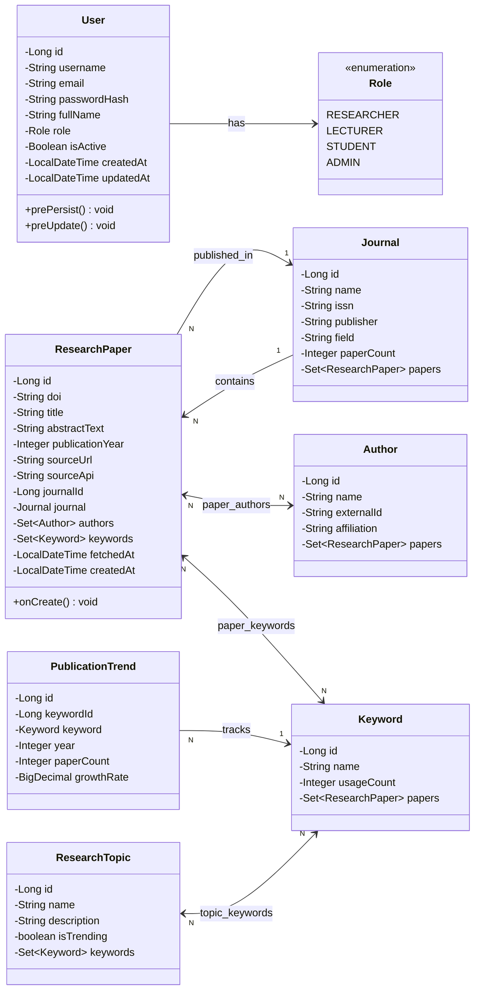
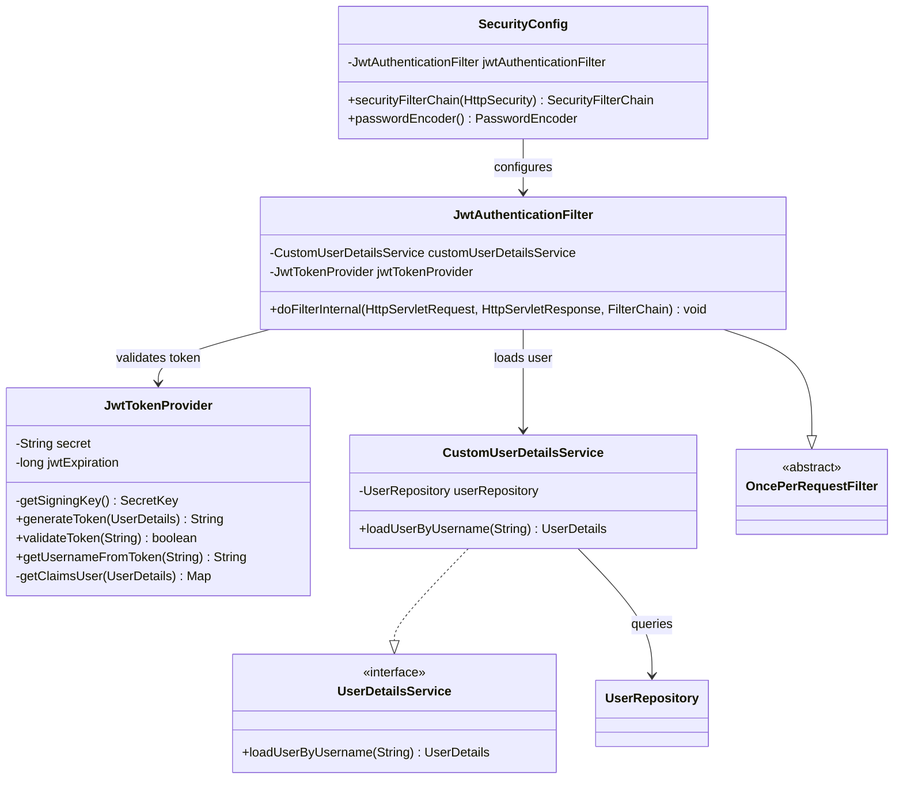
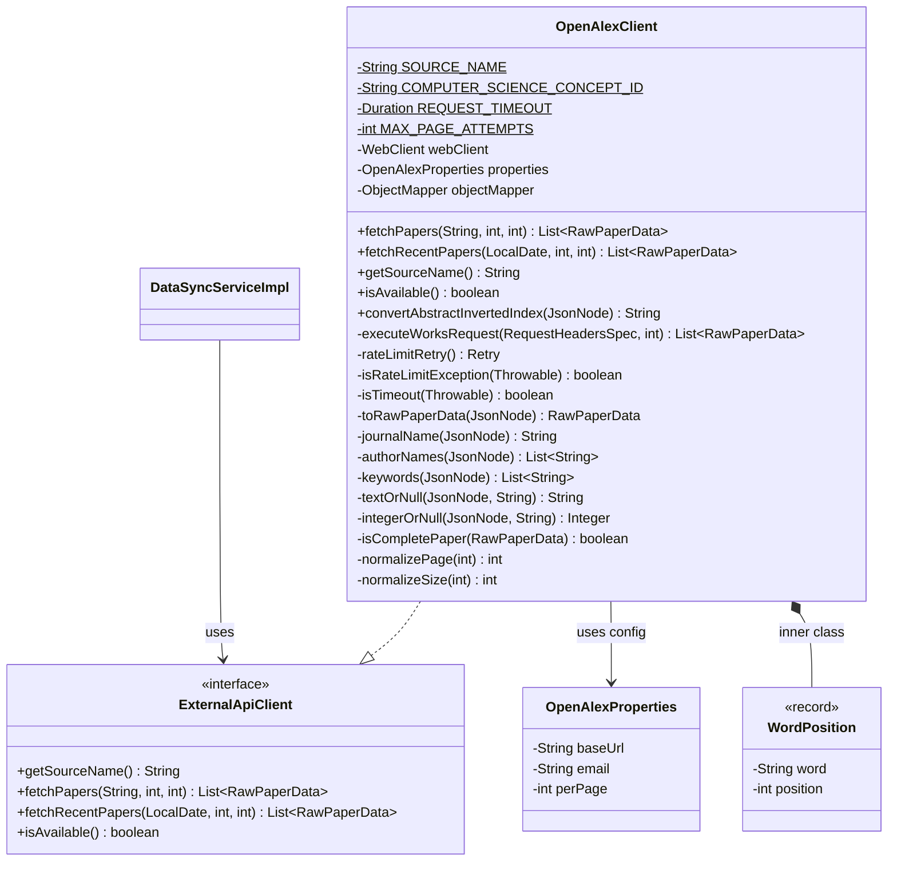
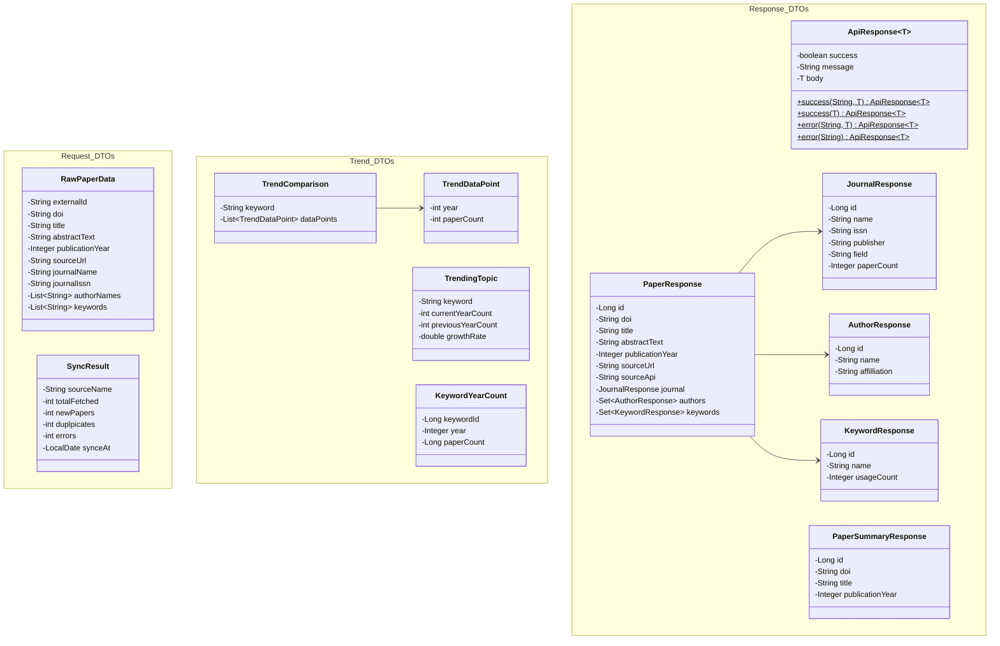
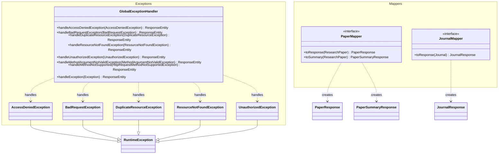
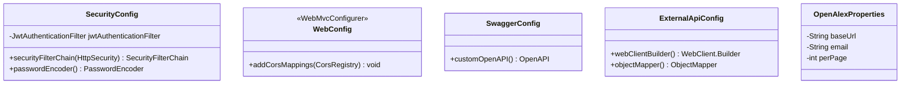
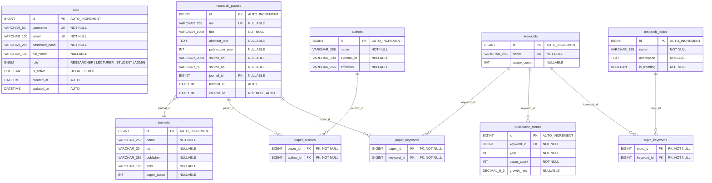
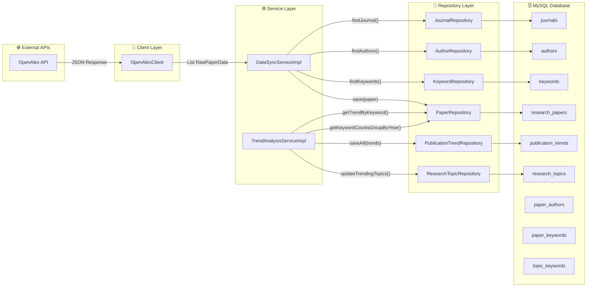

# 📐 Class Diagram & Data Design — Scientific Journal Trend Tracker

> Tài liệu này được tạo dựa trên phân tích toàn bộ source code hiện tại của hệ thống.
> Mỗi class, attribute, method đều phản ánh chính xác code đang có trong project.

---

## 1. 🏛️ Class Diagram Tổng Quan — Kiến Trúc Phân Tầng (Layered Architecture)

```mermaid
classDiagram
    direction TB

    class Application {
        +main(String[] args)
    }

    namespace Controller_Layer {
        class AuthController {
            -OpenAlexClient alexClient
            +login() String
            +register() String
            +test() List~RawPaperData~
        }
    }

    namespace Service_Layer {
        class DataSyncService {
            <<interface>>
            +syncFromSource(String, String) SyncResult
            +syncRecentPapers(String, LocalDate) SyncResult
            +syncAllSources(String) SyncResult
        }

        class TrendAnalysisService {
            <<interface>>
            +getTrendByKeyword(String, int, int) List~TrendDataPoint~
            +compareTrends(List~String~, int, int) List~TrendComparison~
            +getTopTrendingTopics(int) List~TrendingTopic~
            +recalculateTrends() void
        }

        class DataSyncServiceImpl {
            -List~ExternalApiClient~ clientList
            -PaperRepository paperRepository
            -JournalRepository journalRepository
            -AuthorRepository authorRepository
            -KeywordRepository keywordRepository
            +syncFromSource(String, String) SyncResult
            +syncRecentPapers(String, LocalDate) SyncResult
            +syncAllSources(String) SyncResult
            +processSinglePapper(RawPaperData, SyncResult, String) void
            +findKeywords(RawPaperData) Set~Keyword~
            +findAuthors(RawPaperData) Set~Author~
            +findJournal(RawPaperData) Journal
            +isDuplicate(RawPaperData) boolean
            +findExternalApiClient(String) ExternalApiClient
        }

        class TrendAnalysisServiceImpl {
            -PaperRepository paperRepository
            -KeywordRepository keywordRepository
            -PublicationTrendRepository publicationTrendRepository
            -ResearchTopicRepository researchTopicRepository
            +getTrendByKeyword(String, int, int) List~TrendDataPoint~
            +compareTrends(List~String~, int, int) List~TrendComparison~
            +getTopTrendingTopics(int) List~TrendingTopic~
            +recalculateTrends() void
        }
    }

    namespace Repository_Layer {
        class UserRepository {
            <<interface>>
            +findByUsername(String) Optional~User~
            +findByEmail(String) Optional~User~
            +existsByUsername(String) boolean
            +existsByEmail(String) boolean
        }

        class PaperRepository {
            <<interface>>
            +findByTitleContainingIgnoreCase(String, Pageable) Page~ResearchPaper~
            +findByDoi(String) Optional~ResearchPaper~
            +existsByDoi(String) boolean
            +existsByTitle(String) boolean
            +getTrendByKeyword(String, int, int) List~TrendDataPoint~
            +getKeywordCountsGroupByYear() List~KeywordYearCount~
        }

        class JournalRepository {
            <<interface>>
            +findByName(String) Optional~Journal~
        }

        class AuthorRepository {
            <<interface>>
            +findByExternalId(String) Optional~Author~
            +findByName(String) Optional~Author~
        }

        class KeywordRepository {
            <<interface>>
            +findByNameIgnoreCase(String) Optional~Keyword~
            +findTop20ByOrderByUsageCountDesc() List~Keyword~
        }

        class PublicationTrendRepository {
            <<interface>>
            +findMaxYear() Integer
            +findTopTrending(int, Pageable) List~TrendingTopic~
        }

        class ResearchTopicRepository {
            <<interface>>
            +resetAllTrendingTopics() void
            +updateTrendingTopics(int) void
        }
    }

    DataSyncServiceImpl ..|> DataSyncService
    TrendAnalysisServiceImpl ..|> TrendAnalysisService
    AuthController --> DataSyncService
    DataSyncServiceImpl --> PaperRepository
    DataSyncServiceImpl --> JournalRepository
    DataSyncServiceImpl --> AuthorRepository
    DataSyncServiceImpl --> KeywordRepository
    TrendAnalysisServiceImpl --> PaperRepository
    TrendAnalysisServiceImpl --> KeywordRepository
    TrendAnalysisServiceImpl --> PublicationTrendRepository
    TrendAnalysisServiceImpl --> ResearchTopicRepository
```



---

## 2. 📦 Class Diagram — Entity Layer (Domain Model)



---

## 3. 🔐 Class Diagram — Security Layer



---

## 4. 🌐 Class Diagram — External API Client Layer



---

## 5. 📨 Class Diagram — DTO Layer



---

## 6. 🗺️ Class Diagram — Mapper & Exception Layer



---

## 7. ⚙️ Class Diagram — Configuration Layer



---

## 8. 📊 Class Diagram Tổng Hợp — Quan Hệ Giữa Các Tầng

```mermaid
classDiagram
    direction TB

    %% Controller Layer
    class AuthController {
        +login()
        +register()
        +test()
    }

    %% Service Layer
    class DataSyncService {
        <<interface>>
    }
    class TrendAnalysisService {
        <<interface>>
    }
    class DataSyncServiceImpl
    class TrendAnalysisServiceImpl

    %% Repository Layer
    class PaperRepository {
        <<interface>>
    }
    class UserRepository {
        <<interface>>
    }
    class JournalRepository {
        <<interface>>
    }
    class AuthorRepository {
        <<interface>>
    }
    class KeywordRepository {
        <<interface>>
    }
    class PublicationTrendRepository {
        <<interface>>
    }
    class ResearchTopicRepository {
        <<interface>>
    }

    %% Entity Layer
    class User
    class ResearchPaper
    class Journal
    class Author
    class Keyword
    class PublicationTrend
    class ResearchTopic

    %% External
    class ExternalApiClient {
        <<interface>>
    }
    class OpenAlexClient

    %% Security
    class JwtAuthenticationFilter
    class JwtTokenProvider
    class CustomUserDetailsService

    %% Mapper
    class PaperMapper {
        <<interface>>
    }
    class JournalMapper {
        <<interface>>
    }

    %% === RELATIONSHIPS ===
    %% Controller -> Service
    AuthController --> OpenAlexClient

    %% Service Impl -> Interface
    DataSyncServiceImpl ..|> DataSyncService
    TrendAnalysisServiceImpl ..|> TrendAnalysisService
    OpenAlexClient ..|> ExternalApiClient

    %% Service -> Repository
    DataSyncServiceImpl --> PaperRepository
    DataSyncServiceImpl --> JournalRepository
    DataSyncServiceImpl --> AuthorRepository
    DataSyncServiceImpl --> KeywordRepository
    DataSyncServiceImpl --> ExternalApiClient

    TrendAnalysisServiceImpl --> PaperRepository
    TrendAnalysisServiceImpl --> KeywordRepository
    TrendAnalysisServiceImpl --> PublicationTrendRepository
    TrendAnalysisServiceImpl --> ResearchTopicRepository

    %% Repository -> Entity
    UserRepository --> User
    PaperRepository --> ResearchPaper
    JournalRepository --> Journal
    AuthorRepository --> Author
    KeywordRepository --> Keyword
    PublicationTrendRepository --> PublicationTrend
    ResearchTopicRepository --> ResearchTopic

    %% Security chain
    JwtAuthenticationFilter --> JwtTokenProvider
    JwtAuthenticationFilter --> CustomUserDetailsService
    CustomUserDetailsService --> UserRepository
```



---

## 9. 💾 Data Design — Thiết Kế Cơ Sở Dữ Liệu

### 9.1 ERD (Entity Relationship Diagram)



### 9.2 Mô Tả Chi Tiết Các Bảng

#### 📋 Bảng `users` — Quản lý người dùng

| Cột           | Kiểu dữ liệu | Ràng buộc           | Mô tả                                     |
|---------------|---------------|---------------------|--------------------------------------------|
| `id`          | BIGINT        | PK, AUTO_INCREMENT  | Khóa chính                                 |
| `username`    | VARCHAR(50)   | UNIQUE, NOT NULL    | Tên đăng nhập                              |
| `email`       | VARCHAR(100)  | UNIQUE, NOT NULL    | Email                                      |
| `password_hash` | VARCHAR(255) | NOT NULL           | Mật khẩu đã hash (BCrypt)                  |
| `full_name`   | VARCHAR(100)  | NULLABLE            | Họ tên đầy đủ                              |
| `role`        | ENUM          | NOT NULL            | Vai trò: RESEARCHER, LECTURER, STUDENT, ADMIN |
| `is_active`   | BOOLEAN       | NOT NULL, DEFAULT 1 | Trạng thái hoạt động                       |
| `created_at`  | DATETIME      | AUTO @PrePersist    | Thời điểm tạo                              |
| `updated_at`  | DATETIME      | AUTO @PreUpdate     | Thời điểm cập nhật                         |

#### 📋 Bảng `research_papers` — Bài báo khoa học

| Cột               | Kiểu dữ liệu  | Ràng buộc          | Mô tả                          |
|--------------------|----------------|--------------------|---------------------------------|
| `id`               | BIGINT         | PK, AUTO_INCREMENT | Khóa chính                      |
| `doi`              | VARCHAR(255)   | UNIQUE, NULLABLE   | Digital Object Identifier       |
| `title`            | VARCHAR(1000)  | NOT NULL           | Tiêu đề bài báo                |
| `abstract_text`    | TEXT           | NULLABLE           | Tóm tắt                        |
| `publication_year` | INT            | NULLABLE           | Năm xuất bản                    |
| `source_url`       | VARCHAR(2000)  | NULLABLE           | URL nguồn                       |
| `source_api`       | VARCHAR(50)    | NULLABLE           | Nguồn API (OpenAlex, Crossref…) |
| `journal_id`       | BIGINT         | FK → journals.id   | Journal đã đăng                 |
| `fetched_at`       | DATETIME       | AUTO               | Thời điểm lấy dữ liệu          |
| `created_at`       | DATETIME       | NOT NULL, AUTO     | Thời điểm tạo record           |

#### 📋 Bảng `journals` — Tạp chí khoa học

| Cột           | Kiểu dữ liệu | Ràng buộc          | Mô tả              |
|---------------|---------------|--------------------|--------------------|
| `id`          | BIGINT        | PK, AUTO_INCREMENT | Khóa chính          |
| `name`        | VARCHAR(255)  | NOT NULL           | Tên tạp chí         |
| `issn`        | VARCHAR(20)   | NULLABLE           | Mã ISSN             |
| `publisher`   | VARCHAR(255)  | NULLABLE           | Nhà xuất bản        |
| `field`       | VARCHAR(100)  | NULLABLE           | Lĩnh vực            |
| `paper_count` | INT           | NULLABLE           | Tổng số bài báo     |

#### 📋 Bảng `authors` — Tác giả

| Cột           | Kiểu dữ liệu | Ràng buộc          | Mô tả                   |
|---------------|---------------|--------------------|--------------------------| 
| `id`          | BIGINT        | PK, AUTO_INCREMENT | Khóa chính                |
| `name`        | VARCHAR(255)  | NOT NULL           | Tên tác giả              |
| `external_id` | VARCHAR(100)  | NULLABLE           | ID từ nguồn bên ngoài     |
| `affiliation` | VARCHAR(255)  | NULLABLE           | Tổ chức / trường đại học  |

#### 📋 Bảng `keywords` — Từ khóa

| Cột           | Kiểu dữ liệu | Ràng buộc          | Mô tả                |
|---------------|---------------|--------------------|-----------------------|
| `id`          | BIGINT        | PK, AUTO_INCREMENT | Khóa chính             |
| `name`        | VARCHAR(255)  | UNIQUE, NOT NULL   | Tên từ khóa            |
| `usage_count` | INT           | NULLABLE           | Số lần xuất hiện       |

#### 📋 Bảng `publication_trends` — Xu hướng xuất bản

| Cột           | Kiểu dữ liệu | Ràng buộc            | Mô tả                      |
|---------------|---------------|----------------------|-----------------------------|
| `id`          | BIGINT        | PK, AUTO_INCREMENT   | Khóa chính                   |
| `keyword_id`  | BIGINT        | FK → keywords.id, NN | Từ khóa được theo dõi        |
| `year`        | INT           | NOT NULL             | Năm                          |
| `paper_count` | INT           | NOT NULL             | Số bài báo trong năm         |
| `growth_rate` | DECIMAL(5,2)  | NULLABLE             | Tỷ lệ tăng trưởng (%)       |

#### 📋 Bảng `research_topics` — Chủ đề nghiên cứu

| Cột           | Kiểu dữ liệu | Ràng buộc          | Mô tả                 |
|---------------|---------------|--------------------|-----------------------|
| `id`          | BIGINT        | PK, AUTO_INCREMENT | Khóa chính              |
| `name`        | VARCHAR(255)  | NOT NULL           | Tên chủ đề             |
| `description` | TEXT          | NULLABLE           | Mô tả chủ đề           |
| `is_trending` | BOOLEAN       | NOT NULL           | Đang là xu hướng?       |

#### 📋 Bảng nối `paper_authors` — N-N giữa Paper và Author

| Cột         | Kiểu dữ liệu | Ràng buộc                   | Mô tả       |
|-------------|---------------|-----------------------------|--------------|
| `paper_id`  | BIGINT        | PK, FK → research_papers.id | Bài báo      |
| `author_id` | BIGINT        | PK, FK → authors.id         | Tác giả      |

#### 📋 Bảng nối `paper_keywords` — N-N giữa Paper và Keyword

| Cột          | Kiểu dữ liệu | Ràng buộc                   | Mô tả       |
|--------------|---------------|-----------------------------|--------------|
| `paper_id`   | BIGINT        | PK, FK → research_papers.id | Bài báo      |
| `keyword_id` | BIGINT        | PK, FK → keywords.id        | Từ khóa      |

#### 📋 Bảng nối `topic_keywords` — N-N giữa Topic và Keyword

| Cột          | Kiểu dữ liệu | Ràng buộc                   | Mô tả       |
|--------------|---------------|-----------------------------|--------------|
| `topic_id`   | BIGINT        | PK, FK → research_topics.id | Chủ đề       |
| `keyword_id` | BIGINT        | PK, FK → keywords.id        | Từ khóa      |

---

### 9.3 SQL Schema — DDL Script

```sql
-- =============================================
-- Scientific Journal Trend Tracker — DDL Script
-- Database: MySQL 8.x
-- =============================================

-- 1. Users
CREATE TABLE users (
    id            BIGINT AUTO_INCREMENT PRIMARY KEY,
    username      VARCHAR(50)  NOT NULL UNIQUE,
    email         VARCHAR(100) NOT NULL UNIQUE,
    password_hash VARCHAR(255) NOT NULL,
    full_name     VARCHAR(100),
    role          ENUM('RESEARCHER','ADMIN','LECTURER','STUDENT') NOT NULL,
    is_active     BOOLEAN NOT NULL DEFAULT TRUE,
    created_at    DATETIME,
    updated_at    DATETIME
);

-- 2. Journals
CREATE TABLE journals (
    id          BIGINT AUTO_INCREMENT PRIMARY KEY,
    name        VARCHAR(255) NOT NULL,
    issn        VARCHAR(20),
    publisher   VARCHAR(255),
    field       VARCHAR(100),
    paper_count INT
);

-- 3. Authors
CREATE TABLE authors (
    id          BIGINT AUTO_INCREMENT PRIMARY KEY,
    name        VARCHAR(255) NOT NULL,
    external_id VARCHAR(100),
    affiliation VARCHAR(255)
);

-- 4. Keywords
CREATE TABLE keywords (
    id          BIGINT AUTO_INCREMENT PRIMARY KEY,
    name        VARCHAR(255) NOT NULL UNIQUE,
    usage_count INT
);

-- 5. Research Papers
CREATE TABLE research_papers (
    id               BIGINT AUTO_INCREMENT PRIMARY KEY,
    doi              VARCHAR(255) UNIQUE,
    title            VARCHAR(1000) NOT NULL,
    abstract_text    TEXT,
    publication_year INT,
    source_url       VARCHAR(2000),
    source_api       VARCHAR(50),
    journal_id       BIGINT,
    fetched_at       DATETIME,
    created_at       DATETIME NOT NULL,
    CONSTRAINT fk_paper_journal FOREIGN KEY (journal_id)
        REFERENCES journals(id) ON DELETE SET NULL
);

-- 6. Paper-Author (Many-to-Many)
CREATE TABLE paper_authors (
    paper_id  BIGINT NOT NULL,
    author_id BIGINT NOT NULL,
    PRIMARY KEY (paper_id, author_id),
    CONSTRAINT fk_pa_paper  FOREIGN KEY (paper_id)  REFERENCES research_papers(id) ON DELETE CASCADE,
    CONSTRAINT fk_pa_author FOREIGN KEY (author_id) REFERENCES authors(id) ON DELETE CASCADE
);

-- 7. Paper-Keyword (Many-to-Many)
CREATE TABLE paper_keywords (
    paper_id   BIGINT NOT NULL,
    keyword_id BIGINT NOT NULL,
    PRIMARY KEY (paper_id, keyword_id),
    CONSTRAINT fk_pk_paper   FOREIGN KEY (paper_id)   REFERENCES research_papers(id) ON DELETE CASCADE,
    CONSTRAINT fk_pk_keyword FOREIGN KEY (keyword_id) REFERENCES keywords(id) ON DELETE CASCADE
);

-- 8. Publication Trends
CREATE TABLE publication_trends (
    id          BIGINT AUTO_INCREMENT PRIMARY KEY,
    keyword_id  BIGINT NOT NULL,
    year        INT    NOT NULL,
    paper_count INT    NOT NULL,
    growth_rate DECIMAL(5,2),
    CONSTRAINT fk_trend_keyword FOREIGN KEY (keyword_id)
        REFERENCES keywords(id) ON DELETE CASCADE
);

-- 9. Research Topics
CREATE TABLE research_topics (
    id          BIGINT AUTO_INCREMENT PRIMARY KEY,
    name        VARCHAR(255) NOT NULL,
    description TEXT,
    is_trending BOOLEAN NOT NULL DEFAULT FALSE
);

-- 10. Topic-Keyword (Many-to-Many)
CREATE TABLE topic_keywords (
    topic_id   BIGINT NOT NULL,
    keyword_id BIGINT NOT NULL,
    PRIMARY KEY (topic_id, keyword_id),
    CONSTRAINT fk_tk_topic   FOREIGN KEY (topic_id)   REFERENCES research_topics(id) ON DELETE CASCADE,
    CONSTRAINT fk_tk_keyword FOREIGN KEY (keyword_id) REFERENCES keywords(id) ON DELETE CASCADE
);

-- =============================================
-- INDEXES for Performance
-- =============================================

CREATE INDEX idx_paper_year      ON research_papers(publication_year);
CREATE INDEX idx_paper_journal   ON research_papers(journal_id);
CREATE INDEX idx_paper_doi       ON research_papers(doi);
CREATE INDEX idx_paper_source    ON research_papers(source_api);
CREATE INDEX idx_trend_keyword   ON publication_trends(keyword_id);
CREATE INDEX idx_trend_year      ON publication_trends(year);
CREATE INDEX idx_keyword_usage   ON keywords(usage_count DESC);
CREATE INDEX idx_user_role       ON users(role);
CREATE INDEX idx_user_active     ON users(is_active);
CREATE INDEX idx_author_ext_id   ON authors(external_id);
```

---

### 9.4 Sơ Đồ Quan Hệ Tổng Hợp (Cardinality)

| Quan hệ                         | Loại      | Bảng nối          | Mô tả                                    |
|----------------------------------|-----------|--------------------|-------------------------------------------|
| Journal → ResearchPaper          | 1 : N     | *(FK journal_id)*  | 1 journal chứa nhiều papers               |
| ResearchPaper ↔ Author           | N : N     | `paper_authors`    | 1 paper có nhiều authors và ngược lại      |
| ResearchPaper ↔ Keyword          | N : N     | `paper_keywords`   | 1 paper có nhiều keywords và ngược lại     |
| Keyword → PublicationTrend       | 1 : N     | *(FK keyword_id)*  | 1 keyword có nhiều trend records theo năm  |
| ResearchTopic ↔ Keyword          | N : N     | `topic_keywords`   | 1 topic gồm nhiều keywords và ngược lại   |

---

### 9.5 Data Flow — Luồng Dữ Liệu Trong Hệ Thống


