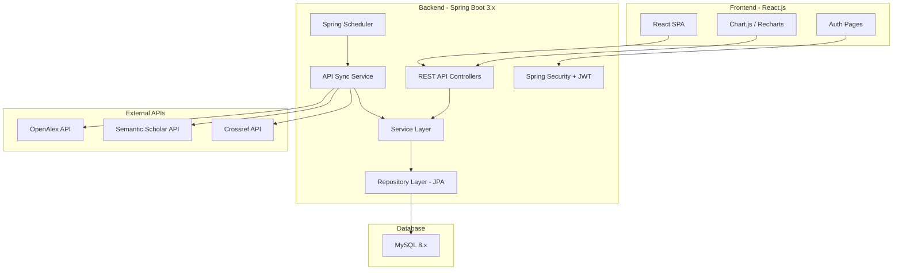
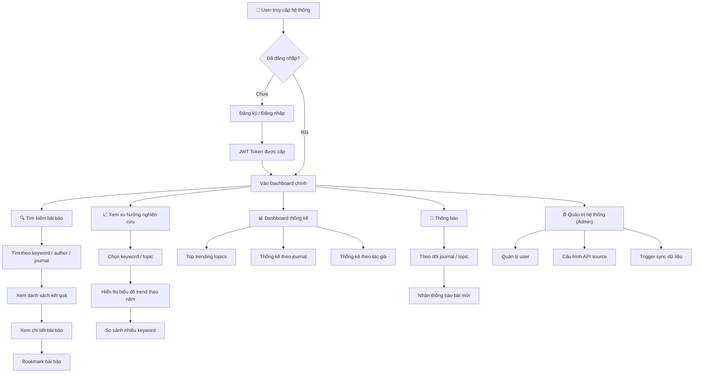
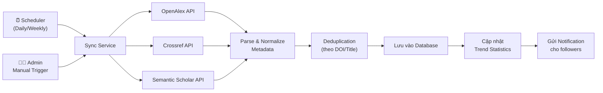
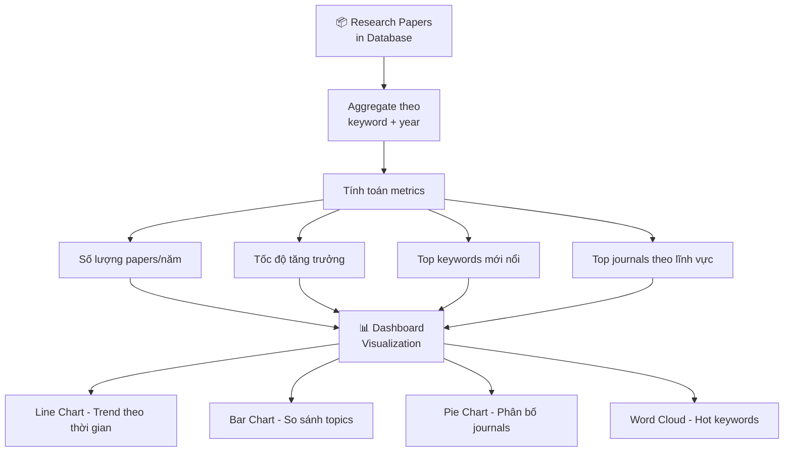
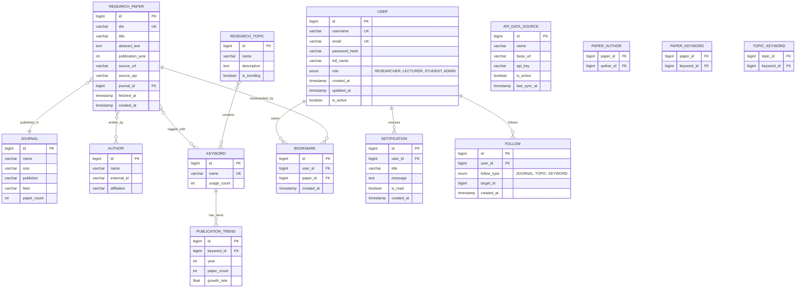
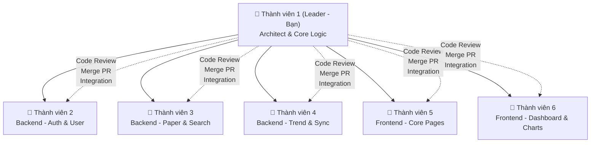
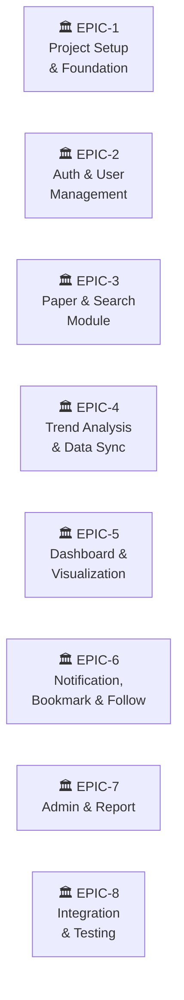
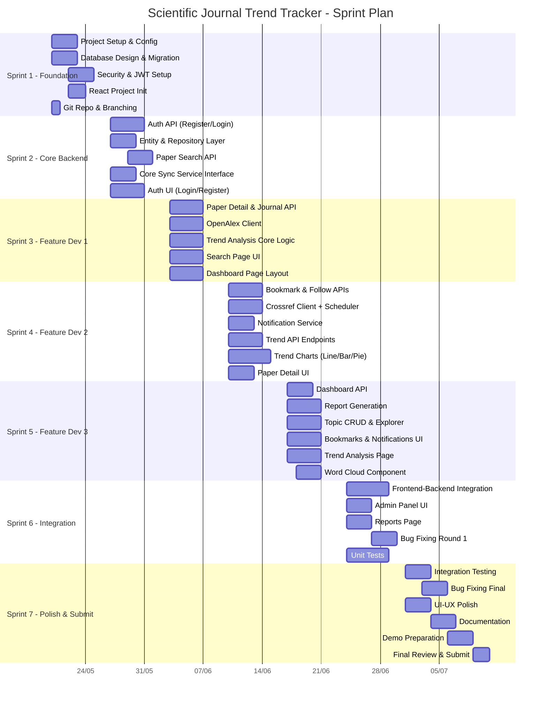
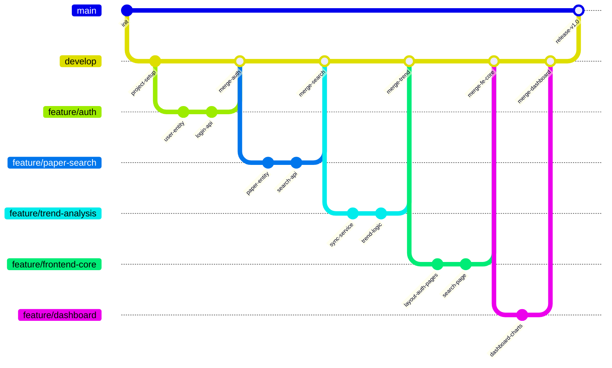

# 📘 Scientific Journal Publication Trend Tracking System

## Project Plan — Đồ án môn học Java

> **Thời gian**: 20/05/2026 → 10/07/2026 (7 tuần)  
> **Nhóm**: 6 thành viên  
> **Ngôn ngữ**: Java  
> **Phương pháp**: Agile Scrum (Sprint 1 tuần)

---

## 1. 🏗️ Kiến trúc hệ thống tổng quan



---

## 2. 🛠️ Công nghệ sử dụng (Tech Stack)

| Layer | Công nghệ | Mục đích |
|-------|-----------|----------|
| **Backend Framework** | Spring Boot 3.2.x | Framework chính, REST API |
| **Security** | Spring Security 6 + JWT (jjwt) | Xác thực & phân quyền |
| **ORM / Data** | Spring Data JPA + Hibernate | Tương tác database |
| **Database** | MySQL 8.x | Lưu trữ dữ liệu |
| **DB Migration** | Flyway | Quản lý schema migration |
| **API Client** | Spring WebClient (WebFlux) | Gọi API bên ngoài (OpenAlex, Crossref) |
| **Scheduling** | Spring Scheduler (`@Scheduled`) | Đồng bộ dữ liệu định kỳ |
| **Validation** | Jakarta Validation (Bean Validation) | Validate request data |
| **Mapping** | MapStruct | DTO ↔ Entity mapping |
| **API Documentation** | SpringDoc OpenAPI (Swagger UI) | Tài liệu API tự động |
| **Logging** | SLF4J + Logback | Logging framework |
| **Testing** | JUnit 5 + Mockito | Unit & Integration test |
| **Build Tool** | Maven | Build & dependency management |
| **Frontend** | React 18 + Vite | Giao diện người dùng |
| **UI Library** | Ant Design / MUI | Component library |
| **Charts** | Recharts / Chart.js | Trực quan hóa dữ liệu |
| **HTTP Client (FE)** | Axios | Gọi API từ frontend |
| **State Management** | React Context / Zustand | Quản lý state |

---

## 3. 📊 Sơ đồ Workflow tổng thể của hệ thống

### 3.1 Luồng chính (Main Application Flow)



### 3.2 Luồng đồng bộ dữ liệu (Data Sync Flow)



### 3.3 Luồng phân tích xu hướng (Trend Analysis Flow)



---

## 4. 📐 Entity Relationship Diagram (ERD)



---

## 5. 📁 Cấu trúc Project (Package Structure)

```
journal-trend-tracker/
├── backend/
│   ├── src/main/java/com/journaltracker/
│   │   ├── JournalTrackerApplication.java
│   │   ├── config/
│   │   │   ├── SecurityConfig.java
│   │   │   ├── WebConfig.java
│   │   │   ├── SchedulerConfig.java
│   │   │   └── SwaggerConfig.java
│   │   ├── controller/
│   │   │   ├── AuthController.java
│   │   │   ├── PaperController.java
│   │   │   ├── JournalController.java
│   │   │   ├── TrendController.java
│   │   │   ├── DashboardController.java
│   │   │   ├── BookmarkController.java
│   │   │   ├── NotificationController.java
│   │   │   ├── FollowController.java
│   │   │   ├── ReportController.java
│   │   │   └── AdminController.java
│   │   ├── dto/
│   │   │   ├── request/
│   │   │   └── response/
│   │   ├── entity/
│   │   │   ├── User.java
│   │   │   ├── ResearchPaper.java
│   │   │   ├── Journal.java
│   │   │   ├── Author.java
│   │   │   ├── Keyword.java
│   │   │   ├── ResearchTopic.java
│   │   │   ├── PublicationTrend.java
│   │   │   ├── Bookmark.java
│   │   │   ├── Notification.java
│   │   │   ├── Follow.java
│   │   │   └── ApiDataSource.java
│   │   ├── repository/
│   │   ├── service/
│   │   │   ├── impl/
│   │   │   ├── AuthService.java
│   │   │   ├── PaperService.java
│   │   │   ├── TrendAnalysisService.java
│   │   │   ├── DataSyncService.java
│   │   │   ├── NotificationService.java
│   │   │   └── ReportService.java
│   │   ├── security/
│   │   │   ├── JwtTokenProvider.java
│   │   │   ├── JwtAuthenticationFilter.java
│   │   │   └── CustomUserDetailsService.java
│   │   ├── scheduler/
│   │   │   └── DataSyncScheduler.java
│   │   ├── client/
│   │   │   ├── OpenAlexClient.java
│   │   │   ├── CrossrefClient.java
│   │   │   └── SemanticScholarClient.java
│   │   ├── mapper/
│   │   ├── exception/
│   │   │   ├── GlobalExceptionHandler.java
│   │   │   └── ...
│   │   └── util/
│   ├── src/main/resources/
│   │   ├── application.yml
│   │   ├── application-dev.yml
│   │   └── db/migration/
│   └── pom.xml
│
├── frontend/
│   ├── src/
│   │   ├── api/              # Axios instances & API calls
│   │   ├── components/       # Shared UI components
│   │   ├── pages/
│   │   │   ├── Login.jsx
│   │   │   ├── Register.jsx
│   │   │   ├── Dashboard.jsx
│   │   │   ├── SearchPapers.jsx
│   │   │   ├── PaperDetail.jsx
│   │   │   ├── TrendAnalysis.jsx
│   │   │   ├── Bookmarks.jsx
│   │   │   ├── Notifications.jsx
│   │   │   ├── AdminPanel.jsx
│   │   │   └── Reports.jsx
│   │   ├── hooks/
│   │   ├── context/
│   │   ├── utils/
│   │   ├── App.jsx
│   │   └── main.jsx
│   ├── package.json
│   └── vite.config.js
│
└── docs/
    ├── API.md
    ├── ERD.png
    └── README.md
```

---

## 6. 👥 Phân công nhiệm vụ — 6 thành viên

### Vai trò tổng quan



---

### 👑 Thành viên 1 — LEADER (Bạn)
**Vai trò**: Project Manager + Architect + Core Developer

| Trách nhiệm | Chi tiết |
|-------------|---------|
| **Khởi tạo project** | Setup Spring Boot project, cấu hình Maven, package structure |
| **Database Design** | Thiết kế ERD, tạo Flyway migration scripts |
| **Security Core** | Cấu hình Spring Security, JWT flow, SecurityConfig |
| **Core Service Layer** | Thiết kế interface Service, base classes, exception handling |
| **Data Sync Flow** | Logic chính của DataSyncService, scheduler, API client abstraction |
| **Trend Analysis Logic** | Thuật toán phân tích trend, aggregation queries |
| **Code Review** | Review & merge PR của tất cả thành viên |
| **Integration** | Ghép nối Frontend ↔ Backend, resolve conflicts |
| **Jira Management** | Tạo Epic, Story, phân task, theo dõi tiến độ |

**Modules sở hữu**:
- `config/*` — Toàn bộ configuration
- `security/*` — JWT, Auth filter
- `exception/*` — Global exception handling
- `scheduler/*` — Data sync scheduler
- `service/TrendAnalysisService.java` — Core trend logic
- `service/DataSyncService.java` — Core sync logic
- `client/*` — API client abstraction (interface + base)

---

### 👤 Thành viên 2 — Backend: Authentication & User Management
**Vai trò**: Backend Developer

| Trách nhiệm | Chi tiết |
|-------------|---------|
| **Auth API** | Đăng ký, đăng nhập, refresh token, logout |
| **User CRUD** | Profile, đổi mật khẩu, admin quản lý user |
| **Role-based Access** | Phân quyền RESEARCHER / LECTURER / STUDENT / ADMIN |
| **Notification** | NotificationService, đánh dấu đã đọc, lấy danh sách |
| **Follow** | Follow/Unfollow journal, topic, keyword |

**Modules sở hữu**:
- `controller/AuthController.java`
- `controller/AdminController.java` (phần user management)
- `controller/NotificationController.java`
- `controller/FollowController.java`
- `service/AuthService.java` + `impl/`
- `service/UserService.java` + `impl/`
- `service/NotificationService.java` + `impl/`
- `service/FollowService.java` + `impl/`
- `entity/User.java`, `Notification.java`, `Follow.java`
- `repository/UserRepository.java`, `NotificationRepository.java`, `FollowRepository.java`
- `dto/request/LoginRequest.java`, `RegisterRequest.java`, etc.
- `dto/response/AuthResponse.java`, `UserResponse.java`, etc.

---

### 👤 Thành viên 3 — Backend: Paper, Journal & Search
**Vai trò**: Backend Developer

| Trách nhiệm | Chi tiết |
|-------------|---------|
| **Paper CRUD** | Xem danh sách, chi tiết, phân trang |
| **Search API** | Tìm kiếm theo keyword, author, journal (với filters) |
| **Journal API** | Danh sách journals, chi tiết, papers theo journal |
| **Author API** | Thông tin tác giả, papers theo tác giả |
| **Bookmark** | Lưu/xóa/liệt kê bookmark papers & keywords |
| **Keyword API** | Danh sách keywords, top keywords |

**Modules sở hữu**:
- `controller/PaperController.java`
- `controller/JournalController.java`
- `controller/BookmarkController.java`
- `service/PaperService.java` + `impl/`
- `service/JournalService.java` + `impl/`
- `service/BookmarkService.java` + `impl/`
- `service/AuthorService.java` + `impl/`
- `service/KeywordService.java` + `impl/`
- `entity/ResearchPaper.java`, `Journal.java`, `Author.java`, `Keyword.java`, `Bookmark.java`
- `repository/` tương ứng
- `dto/` tương ứng

---

### 👤 Thành viên 4 — Backend: Trend Analysis, Report & External API
**Vai trò**: Backend Developer

| Trách nhiệm | Chi tiết |
|-------------|---------|
| **Trend API** | Endpoint trả trend data theo keyword/topic/year |
| **Dashboard API** | Thống kê tổng quan, top trending, aggregation data |
| **Report** | Generate báo cáo phân tích đơn giản (PDF hoặc JSON) |
| **External API Client** | Implement OpenAlexClient, CrossrefClient, SemanticScholarClient |
| **Admin Config** | Quản lý API Data Source, trigger manual sync |
| **Research Topic** | CRUD topics, gán keywords vào topics |

**Modules sở hữu**:
- `controller/TrendController.java`
- `controller/DashboardController.java`
- `controller/ReportController.java`
- `controller/AdminController.java` (phần API config & sync)
- `service/DashboardService.java` + `impl/`
- `service/ReportService.java` + `impl/`
- `service/ResearchTopicService.java` + `impl/`
- `client/OpenAlexClient.java`
- `client/CrossrefClient.java`
- `client/SemanticScholarClient.java`
- `entity/PublicationTrend.java`, `ResearchTopic.java`, `ApiDataSource.java`
- `repository/` tương ứng

> [!NOTE]
> Leader sẽ viết phần core logic (interface, abstract class) của DataSyncService và TrendAnalysisService. Thành viên 4 implement các client cụ thể và API endpoints dựa trên interface đó.

---

### 👤 Thành viên 5 — Frontend: Core Pages & Auth
**Vai trò**: Frontend Developer

| Trách nhiệm | Chi tiết |
|-------------|---------|
| **Project Setup** | Khởi tạo React + Vite, routing, Axios config |
| **Auth Pages** | Login, Register, Forgot Password UI |
| **Layout** | Sidebar, Header, Footer, responsive layout |
| **Search Page** | Trang tìm kiếm papers với filters |
| **Paper Detail** | Trang chi tiết bài báo |
| **Bookmarks Page** | Trang quản lý bookmarks |
| **Profile Page** | Trang thông tin cá nhân, đổi mật khẩu |
| **Notifications** | Trang/popup hiển thị thông báo |
| **Admin Panel** | Trang quản trị user, cấu hình hệ thống |

**Modules sở hữu**:
- `pages/Login.jsx`, `Register.jsx`
- `pages/SearchPapers.jsx`, `PaperDetail.jsx`
- `pages/Bookmarks.jsx`, `Profile.jsx`
- `pages/Notifications.jsx`
- `pages/AdminPanel.jsx`
- `components/Layout/`, `Sidebar.jsx`, `Header.jsx`
- `components/PaperCard.jsx`, `SearchBar.jsx`, `PaperList.jsx`
- `context/AuthContext.jsx`
- `api/authApi.js`, `paperApi.js`, `bookmarkApi.js`
- `hooks/useAuth.js`

---

### 👤 Thành viên 6 — Frontend: Dashboard, Charts & Trend Visualization
**Vai trò**: Frontend Developer

| Trách nhiệm | Chi tiết |
|-------------|---------|
| **Dashboard Page** | Trang dashboard chính với thống kê tổng quan |
| **Trend Charts** | Line chart, bar chart, pie chart cho trend analysis |
| **Trend Analysis Page** | Trang phân tích xu hướng theo keyword/topic |
| **Topic Explorer** | Trang khám phá research topics |
| **Word Cloud** | Component hiển thị hot keywords |
| **Report Page** | Trang xem/tải báo cáo phân tích |
| **Follow Management** | UI theo dõi journals/topics/keywords |
| **Reusable Chart Components** | Shared chart components cho toàn app |

**Modules sở hữu**:
- `pages/Dashboard.jsx`
- `pages/TrendAnalysis.jsx`
- `pages/TopicExplorer.jsx`
- `pages/Reports.jsx`
- `pages/Following.jsx`
- `components/Charts/LineChart.jsx`, `BarChart.jsx`, `PieChart.jsx`
- `components/Charts/WordCloud.jsx`
- `components/Dashboard/StatCard.jsx`, `TrendingTopics.jsx`
- `components/TopicCard.jsx`
- `api/trendApi.js`, `dashboardApi.js`, `reportApi.js`, `followApi.js`

---

## 7. 📋 Jira Task Breakdown (Epic → Story → Sub-task)

### Epic Structure



### Chi tiết từng Epic

---

#### 🏛️ EPIC-1: Project Setup & Foundation
**Assignee chính**: Leader (Bạn)

| Story ID | Story | Sub-tasks | Assignee | Priority |
|----------|-------|-----------|----------|----------|
| JP-1 | Khởi tạo Spring Boot project | - Init project với Spring Initializr<br>- Cấu hình Maven dependencies<br>- Tạo package structure<br>- Setup application.yml | Leader | 🔴 Highest |
| JP-2 | Thiết kế Database & Migration | - Thiết kế ERD hoàn chỉnh<br>- Viết Flyway migration V1<br>- Tạo sample data script | Leader | 🔴 Highest |
| JP-3 | Cấu hình Spring Security + JWT | - SecurityConfig<br>- JwtTokenProvider<br>- JwtAuthenticationFilter<br>- CustomUserDetailsService | Leader | 🔴 Highest |
| JP-4 | Setup Global Exception Handler | - GlobalExceptionHandler<br>- Custom exceptions<br>- API response wrapper (ApiResponse) | Leader | 🔴 Highest |
| JP-5 | Cấu hình Swagger & CORS | - SwaggerConfig<br>- WebConfig (CORS) | Leader | 🟡 Medium |
| JP-6 | Setup React + Vite project | - Init Vite + React<br>- Cài dependencies (Ant Design, Axios, Recharts, React Router)<br>- Setup folder structure | TV5 | 🔴 Highest |
| JP-7 | Setup Git repository & branching | - Tạo repo GitHub<br>- Setup branch strategy (main/develop/feature/*)<br>- Viết .gitignore, README | Leader | 🔴 Highest |

---

#### 🏛️ EPIC-2: Authentication & User Management
**Assignee chính**: Thành viên 2

| Story ID | Story | Sub-tasks | Assignee | Priority |
|----------|-------|-----------|----------|----------|
| JP-8 | User Entity & Repository | - User.java entity<br>- UserRepository<br>- Role enum | TV2 | 🔴 Highest |
| JP-9 | Đăng ký tài khoản | - RegisterRequest DTO<br>- AuthService.register()<br>- AuthController POST /api/auth/register | TV2 | 🔴 Highest |
| JP-10 | Đăng nhập & JWT | - LoginRequest DTO<br>- AuthService.login()<br>- AuthController POST /api/auth/login<br>- Trả JWT token | TV2 | 🔴 Highest |
| JP-11 | Refresh Token | - RefreshTokenService<br>- POST /api/auth/refresh | TV2 | 🟡 Medium |
| JP-12 | User Profile CRUD | - GET/PUT /api/users/me<br>- Change password API | TV2 | 🟡 Medium |
| JP-13 | Admin - Quản lý users | - GET /api/admin/users (list, search, filter)<br>- PUT /api/admin/users/{id}/status (activate/deactivate) | TV2 | 🟠 High |
| JP-14 | Frontend - Login Page | - Login form UI<br>- Validation<br>- Kết nối API<br>- Lưu JWT vào localStorage | TV5 | 🔴 Highest |
| JP-15 | Frontend - Register Page | - Register form UI<br>- Role selection<br>- Kết nối API | TV5 | 🔴 Highest |
| JP-16 | Frontend - Auth Context | - AuthContext/Provider<br>- useAuth hook<br>- Protected Route component<br>- Axios interceptor (attach JWT) | TV5 | 🔴 Highest |

---

#### 🏛️ EPIC-3: Paper, Journal & Search
**Assignee chính**: Thành viên 3

| Story ID | Story | Sub-tasks | Assignee | Priority |
|----------|-------|-----------|----------|----------|
| JP-17 | Paper, Journal, Author, Keyword Entities | - Tạo entities + relationships<br>- Repositories<br>- DTOs | TV3 | 🔴 Highest |
| JP-18 | Tìm kiếm bài báo | - GET /api/papers/search?keyword=&author=&journal=<br>- Phân trang (Pageable)<br>- PaperService.search() | TV3 | 🔴 Highest |
| JP-19 | Xem chi tiết bài báo | - GET /api/papers/{id}<br>- Include authors, keywords, journal info | TV3 | 🟠 High |
| JP-20 | Journal API | - GET /api/journals (list)<br>- GET /api/journals/{id}<br>- GET /api/journals/{id}/papers | TV3 | 🟠 High |
| JP-21 | Author & Keyword API | - GET /api/authors/{id}/papers<br>- GET /api/keywords/top | TV3 | 🟡 Medium |
| JP-22 | Frontend - Search Page | - Search bar + filters UI<br>- Paper list component<br>- Pagination<br>- Kết nối API | TV5 | 🟠 High |
| JP-23 | Frontend - Paper Detail Page | - Paper info display<br>- Author list<br>- Keywords tags<br>- Bookmark button | TV5 | 🟠 High |

---

#### 🏛️ EPIC-4: Trend Analysis & Data Sync
**Assignee chính**: Leader (core logic) + Thành viên 4 (implementation)

| Story ID | Story | Sub-tasks | Assignee | Priority |
|----------|-------|-----------|----------|----------|
| JP-24 | Core Sync Service Interface | - DataSyncService interface<br>- ExternalApiClient interface<br>- Paper normalization logic | **Leader** | 🔴 Highest |
| JP-25 | OpenAlex API Client | - Implement OpenAlexClient<br>- Parse response → Paper entity<br>- Pagination handling | TV4 | 🔴 Highest |
| JP-26 | Crossref API Client | - Implement CrossrefClient<br>- Parse response<br>- Error handling | TV4 | 🟠 High |
| JP-27 | Semantic Scholar Client | - Implement SemanticScholarClient | TV4 | 🟡 Medium |
| JP-28 | Data Sync Scheduler | - DataSyncScheduler<br>- Cron configuration<br>- Logging & error handling | **Leader** | 🟠 High |
| JP-29 | Core Trend Analysis Logic | - TrendAnalysisService interface<br>- Aggregation queries (paper count by keyword/year)<br>- Growth rate calculation<br>- Trending detection algorithm | **Leader** | 🔴 Highest |
| JP-30 | Trend API Endpoints | - GET /api/trends/keyword/{keyword}<br>- GET /api/trends/compare?keywords=<br>- GET /api/trends/topics/trending | TV4 | 🟠 High |
| JP-31 | Research Topic CRUD | - POST/GET/PUT/DELETE /api/topics<br>- Assign keywords to topics | TV4 | 🟡 Medium |
| JP-32 | API Data Source Management | - CRUD /api/admin/datasources<br>- POST /api/admin/sync/trigger | TV4 | 🟡 Medium |
| JP-33 | Deduplication Logic | - Check duplicate by DOI/title<br>- Merge logic cho papers từ nhiều source | **Leader** | 🟠 High |

---

#### 🏛️ EPIC-5: Dashboard & Visualization
**Assignee chính**: Thành viên 6

| Story ID | Story | Sub-tasks | Assignee | Priority |
|----------|-------|-----------|----------|----------|
| JP-34 | Dashboard API | - GET /api/dashboard/stats (tổng papers, journals, authors)<br>- GET /api/dashboard/trending-topics<br>- GET /api/dashboard/recent-papers | TV4 | 🟠 High |
| JP-35 | Frontend - Dashboard Page | - Layout dashboard<br>- Stat cards (total papers, journals, users)<br>- Recent papers list<br>- Trending topics widget | TV6 | 🔴 Highest |
| JP-36 | Frontend - Trend Line Chart | - Recharts LineChart component<br>- API kết nối /api/trends/keyword<br>- Multi-keyword comparison | TV6 | 🔴 Highest |
| JP-37 | Frontend - Bar & Pie Charts | - Bar chart: top journals by paper count<br>- Pie chart: paper distribution by field | TV6 | 🟠 High |
| JP-38 | Frontend - Trend Analysis Page | - Keyword input + year range<br>- Chart display area<br>- Compare mode UI | TV6 | 🟠 High |
| JP-39 | Frontend - Word Cloud | - react-wordcloud hoặc custom<br>- Hiển thị hot keywords | TV6 | 🟡 Medium |
| JP-40 | Frontend - Topic Explorer | - Grid/List topics<br>- Topic detail: related papers + trend | TV6 | 🟡 Medium |

---

#### 🏛️ EPIC-6: Notification, Bookmark & Follow
**Assignee chính**: Thành viên 2 (BE) + Thành viên 5 (FE)

| Story ID | Story | Sub-tasks | Assignee | Priority |
|----------|-------|-----------|----------|----------|
| JP-41 | Bookmark API | - POST/DELETE /api/bookmarks<br>- GET /api/bookmarks/me | TV3 | 🟠 High |
| JP-42 | Follow API | - POST/DELETE /api/follows<br>- GET /api/follows/me | TV2 | 🟠 High |
| JP-43 | Notification Service | - Tạo notification khi có paper mới<br>- GET /api/notifications<br>- PUT /api/notifications/{id}/read | TV2 | 🟠 High |
| JP-44 | Frontend - Bookmarks Page | - Danh sách bookmarked papers<br>- Remove bookmark | TV5 | 🟡 Medium |
| JP-45 | Frontend - Notifications | - Notification bell icon + badge count<br>- Dropdown danh sách<br>- Mark as read | TV5 | 🟡 Medium |
| JP-46 | Frontend - Following Page | - List followed journals/topics/keywords<br>- Unfollow button | TV6 | 🟡 Medium |

---

#### 🏛️ EPIC-7: Admin & Report
**Assignee chính**: Thành viên 4 (BE) + Thành viên 5/6 (FE)

| Story ID | Story | Sub-tasks | Assignee | Priority |
|----------|-------|-----------|----------|----------|
| JP-47 | Report Generation API | - GET /api/reports/trend-summary<br>- Export dạng JSON / simple PDF | TV4 | 🟡 Medium |
| JP-48 | Frontend - Admin Panel | - User management table<br>- API source config<br>- Sync trigger button | TV5 | 🟡 Medium |
| JP-49 | Frontend - Reports Page | - Report viewer<br>- Download button | TV6 | 🟡 Medium |

---

#### 🏛️ EPIC-8: Integration, Testing & Polish
**Assignee chính**: Leader + All

| Story ID | Story | Sub-tasks | Assignee | Priority |
|----------|-------|-----------|----------|----------|
| JP-50 | Integration Testing | - Test E2E: Auth flow<br>- Test E2E: Search + Bookmark flow<br>- Test E2E: Trend analysis flow | **Leader** | 🔴 Highest |
| JP-51 | Unit Tests cho Services | - AuthService tests<br>- PaperService tests<br>- TrendAnalysisService tests | All (mỗi người test phần mình) | 🟠 High |
| JP-52 | Bug fixing & polish | - Fix bugs phát sinh<br>- UI/UX polish<br>- Performance tuning | All | 🟠 High |
| JP-53 | Documentation | - README.md<br>- API documentation (Swagger)<br>- Hướng dẫn cài đặt & chạy | **Leader** + TV2 | 🟡 Medium |
| JP-54 | Demo preparation | - Chuẩn bị sample data<br>- Slide thuyết trình<br>- Demo script | All | 🔴 Highest |

---

## 8. 📅 Timeline — Sprint Plan (7 tuần)



---

### Chi tiết từng tuần

#### 🗓️ Sprint 1: Foundation (20/05 → 26/05)
**Mục tiêu**: Setup toàn bộ nền tảng, mọi người có thể bắt đầu code

| Thành viên | Tasks | Deliverable |
|-----------|-------|-------------|
| **Leader** | JP-1, JP-2, JP-3, JP-4, JP-5, JP-7 | Project chạy được, DB migration done, JWT hoạt động, Swagger UI chạy |
| **TV2** | JP-8 | User entity + repository ready |
| **TV3** | JP-17 | Paper, Journal, Author, Keyword entities ready |
| **TV4** | Nghiên cứu OpenAlex & Crossref API docs | Tài liệu API mapping, sample request/response |
| **TV5** | JP-6, JP-16 | React project chạy được, Auth context sẵn sàng |
| **TV6** | Nghiên cứu Recharts, thiết kế wireframe dashboard | Wireframe dashboard + chart components |

> [!IMPORTANT]
> **Checkpoint Sprint 1 (26/05)**: Backend project start được (`mvn spring-boot:run`), Frontend project start được (`npm run dev`), Database schema created.

---

#### 🗓️ Sprint 2: Core Backend + Auth (27/05 → 02/06)
**Mục tiêu**: Auth flow hoạt động E2E, entity layer hoàn chỉnh

| Thành viên | Tasks | Deliverable |
|-----------|-------|-------------|
| **Leader** | JP-24, JP-29 (phần interface) | DataSyncService interface, TrendAnalysis interface, base API client |
| **TV2** | JP-9, JP-10, JP-11 | Register/Login/Refresh Token API hoạt động |
| **TV3** | JP-18 | Search API hoạt động (test với Postman) |
| **TV4** | JP-25 (bắt đầu) | OpenAlex client gọi được API, parse response |
| **TV5** | JP-14, JP-15 | Login + Register page UI hoàn chỉnh, kết nối API |
| **TV6** | JP-35 (bắt đầu layout) | Dashboard page layout skeleton |

> [!IMPORTANT]
> **Checkpoint Sprint 2 (02/06)**: Đăng ký → đăng nhập → nhận JWT → gọi API protected — flow hoạt động hoàn chỉnh.

---

#### 🗓️ Sprint 3: Feature Development 1 (03/06 → 09/06)
**Mục tiêu**: Các feature chính backend hoàn thành, frontend core pages

| Thành viên | Tasks | Deliverable |
|-----------|-------|-------------|
| **Leader** | JP-29 (implementation), JP-28, JP-33 | Trend analysis logic done, scheduler chạy, dedup logic |
| **TV2** | JP-12, JP-42 | User profile CRUD, Follow API |
| **TV3** | JP-19, JP-20, JP-21 | Paper detail, Journal API, Author API done |
| **TV4** | JP-25 (hoàn thành), JP-26 | OpenAlex done, Crossref client done |
| **TV5** | JP-22, JP-23 | Search page + Paper detail page UI |
| **TV6** | JP-35 (hoàn thành), JP-36 | Dashboard done, Line chart component done |

> [!IMPORTANT]
> **Checkpoint Sprint 3 (09/06)**: Có thể search papers, xem chi tiết, xem dashboard cơ bản. Data sync từ OpenAlex hoạt động.

---

#### 🗓️ Sprint 4: Feature Development 2 (10/06 → 16/06)
**Mục tiêu**: Bookmark, Follow, Notification, Trend charts

| Thành viên | Tasks | Deliverable |
|-----------|-------|-------------|
| **Leader** | Code review, integration fixes, JP-28 fine-tuning | Scheduler stable, sync + trend pipeline E2E |
| **TV2** | JP-43, JP-13 | Notification service done, Admin user management |
| **TV3** | JP-41 | Bookmark API done |
| **TV4** | JP-30, JP-27 (optional), JP-34 | Trend endpoints done, Dashboard API done |
| **TV5** | JP-23 (polish), bắt đầu JP-44 | Paper detail polished, Bookmark page started |
| **TV6** | JP-37, JP-38 | Bar/Pie charts done, Trend analysis page |

> [!IMPORTANT]
> **Checkpoint Sprint 4 (16/06)**: Trend analysis hoạt động E2E (sync data → tính trend → hiển thị chart). Bookmark & follow API ready.

---

#### 🗓️ Sprint 5: Feature Development 3 (17/06 → 23/06)
**Mục tiêu**: Hoàn thành tất cả features

| Thành viên | Tasks | Deliverable |
|-----------|-------|-------------|
| **Leader** | Code review, integration, JP-29 optimization | All core logic optimized |
| **TV2** | JP-43 (polish), fix bugs | Notification stable |
| **TV3** | Fix bugs, unit tests cho service layer | Paper module stable |
| **TV4** | JP-31, JP-32, JP-47 | Topics CRUD, API source management, Report API |
| **TV5** | JP-44, JP-45, JP-48 | Bookmarks page, Notifications UI, Admin panel |
| **TV6** | JP-38 (polish), JP-39, JP-40, JP-46 | Trend page done, Word cloud, Topic explorer, Following page |

> [!IMPORTANT]
> **Checkpoint Sprint 5 (23/06)**: TẤT CẢ features đã có UI + API. Chưa cần hoàn hảo nhưng phải chạy được.

---

#### 🗓️ Sprint 6: Integration & Testing (24/06 → 30/06)
**Mục tiêu**: Ghép nối hoàn chỉnh, fix bugs, viết tests

| Thành viên | Tasks | Deliverable |
|-----------|-------|-------------|
| **Leader** | JP-50 (lead integration), resolve conflicts | Toàn hệ thống chạy mượt |
| **TV2** | JP-51 (auth tests), fix integration bugs | Auth module stable & tested |
| **TV3** | JP-51 (paper tests), fix integration bugs | Paper module stable & tested |
| **TV4** | JP-51 (trend tests), JP-49 backend support | Trend module stable & tested |
| **TV5** | JP-48, fix UI bugs, responsive check | Admin panel done, UI bugs fixed |
| **TV6** | JP-49, fix chart bugs, responsive check | Reports page done, charts polished |

> [!IMPORTANT]
> **Checkpoint Sprint 6 (30/06)**: Toàn bộ hệ thống chạy ổn định end-to-end. Không còn bug nghiêm trọng.

---

#### 🗓️ Sprint 7: Polish & Submit (01/07 → 10/07)
**Mục tiêu**: Hoàn thiện, documentation, chuẩn bị demo

| Thành viên | Tasks | Deliverable |
|-----------|-------|-------------|
| **Leader** | JP-50 (final E2E), JP-53, JP-54 | Final testing pass, Documentation done |
| **TV2** | JP-52 (fix remaining bugs), JP-53 (API docs) | Clean code, Swagger docs complete |
| **TV3** | JP-52 (fix remaining bugs) | Clean code |
| **TV4** | JP-52, chuẩn bị sample data đẹp | Sample data ready for demo |
| **TV5** | JP-52 (UI polish), responsive final check | UI polished |
| **TV6** | JP-52 (chart polish), JP-54 (slide) | Charts polished, Demo slide |
| **ALL** | JP-54 | Demo rehearsal (07/07 → 09/07) |

> [!CAUTION]
> **DEADLINE 10/07**: Nộp bài. Phải freeze code từ ngày **08/07** — chỉ fix critical bugs sau ngày này.

---

## 9. 🔀 Git Branching Strategy



**Quy tắc**:
- `main` — Code production, chỉ merge từ `develop` khi stable
- `develop` — Branch tích hợp, merge feature branches vào đây
- `feature/{module-name}` — Mỗi feature 1 branch, ví dụ: `feature/auth`, `feature/paper-search`
- **PR (Pull Request)**: Mọi merge vào `develop` phải qua PR, Leader review & approve
- **Commit message**: `[JP-XX] mô tả ngắn` (ví dụ: `[JP-10] Implement login API with JWT`)

---

## 10. 📊 Bảng tổng hợp phân công theo thành viên

| Thành viên | Role | Modules | Số Stories | Khối lượng |
|-----------|------|---------|-----------|-----------|
| **Leader (Bạn)** | PM + Architect + Core Dev | Config, Security, Scheduler, Core Services, Integration | ~12 | ⭐⭐⭐⭐⭐ |
| **TV2** | Backend Dev | Auth, User, Notification, Follow | ~8 | ⭐⭐⭐⭐ |
| **TV3** | Backend Dev | Paper, Journal, Author, Keyword, Bookmark, Search | ~8 | ⭐⭐⭐⭐ |
| **TV4** | Backend Dev | Trend API, API Clients, Dashboard API, Report, Topic, Admin Config | ~10 | ⭐⭐⭐⭐ |
| **TV5** | Frontend Dev | Auth UI, Layout, Search, Detail, Bookmarks, Notifications, Admin | ~10 | ⭐⭐⭐⭐ |
| **TV6** | Frontend Dev | Dashboard, Charts, Trend Analysis, Topics, Reports, Following | ~9 | ⭐⭐⭐⭐ |

---

## 11. ⚠️ Rủi ro & Giải pháp

| Rủi ro | Xác suất | Giải pháp |
|--------|---------|----------|
| API bên thứ ba bị rate limit | Cao | Cache kết quả, retry with backoff, sử dụng nhiều API source |
| Thành viên trễ deadline sprint | Trung bình | Daily standup qua Zalo/Discord, Leader theo dõi Jira board hằng ngày |
| Conflict khi merge code | Trung bình | PR nhỏ, merge thường xuyên, không để branch chênh xa develop |
| Database design thay đổi | Thấp | Dùng Flyway migration, dễ rollback/evolve schema |
| Frontend-Backend API mismatch | Trung bình | Định nghĩa API contract (Swagger) trước khi code, sử dụng DTO rõ ràng |

---

## 12. 📞 Quy trình làm việc nhóm

### Daily Standup (5-10 phút qua chat group)
Mỗi người trả lời 3 câu:
1. Hôm qua làm được gì?
2. Hôm nay làm gì?
3. Có gì bị chặn (blocked)?

### Sprint Review (cuối mỗi tuần - Chủ nhật)
- Demo những gì đã hoàn thành
- Leader review Jira board
- Điều chỉnh task cho sprint tiếp theo nếu cần

### Communication
- **Zalo/Discord group**: Trao đổi hằng ngày
- **Jira board**: Theo dõi task (To Do → In Progress → Code Review → Done)
- **GitHub PR**: Code review trước khi merge
- **Google Meet** (nếu cần): Họp khi có vấn đề phức tạp

---

## 13. 🎯 Definition of Done (DoD)

Một task được coi là **DONE** khi:
- [ ] Code hoàn thành, build thành công (không có compile error)
- [ ] Có ít nhất 1 unit test cho service/logic phức tạp
- [ ] API test qua Postman/Swagger thành công
- [ ] Code được push lên feature branch
- [ ] Pull Request được tạo và Leader đã review
- [ ] PR được merge vào `develop`
- [ ] Jira task được chuyển sang **Done**

---

> [!TIP]
> **Lời khuyên cho Leader**: 
> - Tuần đầu tiên tập trung 100% vào setup foundation — đây là bottleneck của toàn đội
> - Viết Swagger API docs sớm (tuần 1-2) để Frontend và Backend có thể làm song song
> - Tạo mock data sớm để Frontend không bị block bởi Backend
> - Review PR trong ngày, không để quá 24h
> - Dùng Jira board hàng ngày, không chỉ cuối tuần
