# 📊 Sơ Đồ Hoạt Động (Workflow) & ERD — Scientific Journal Trend Tracker

> Tất cả sơ đồ được tạo dựa trên phân tích trực tiếp source code hiện tại của hệ thống.

---

## 1. 🔄 Sơ Đồ Hoạt Động Tổng Quan Hệ Thống

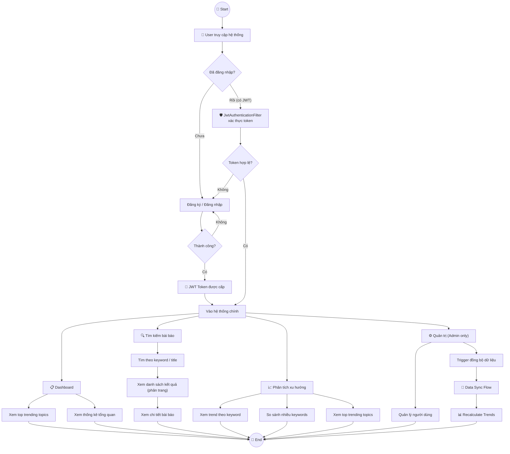

---

## 2. 🔐 Sơ Đồ Hoạt Động — Đăng Ký & Đăng Nhập (Authentication Flow)

### 2.1 Đăng Ký Tài Khoản

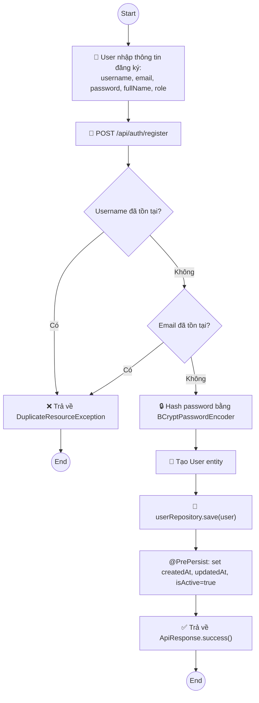

### 2.2 Đăng Nhập & JWT

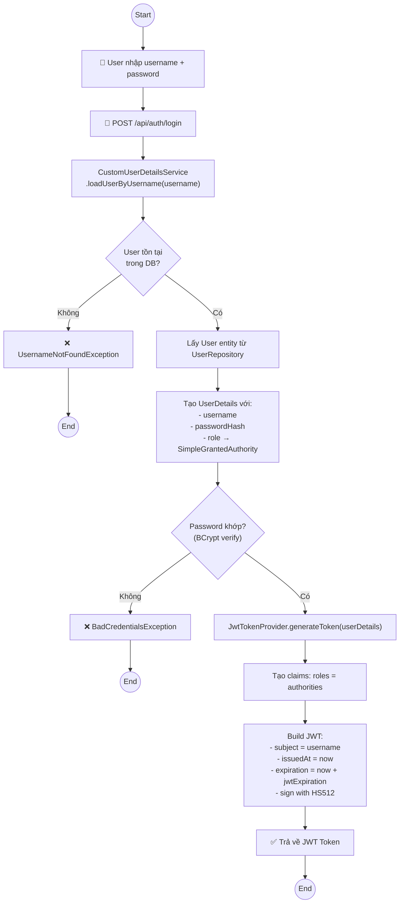

---

## 3. 🛡️ Sơ Đồ Hoạt Động — JWT Authentication Filter (Request Pipeline)

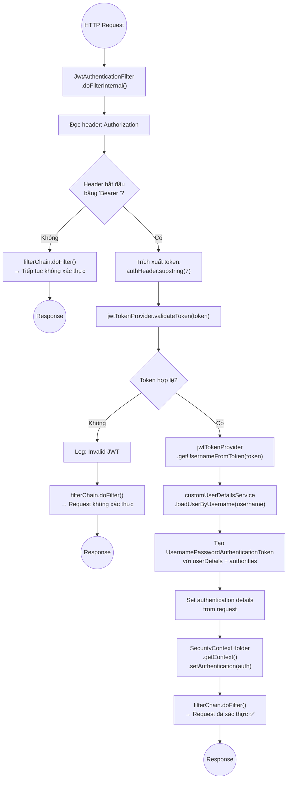

---

## 4. 🔄 Sơ Đồ Hoạt Động — Đồng Bộ Dữ Liệu (Data Sync Flow)

### 4.1 syncFromSource — Đồng bộ từ 1 nguồn

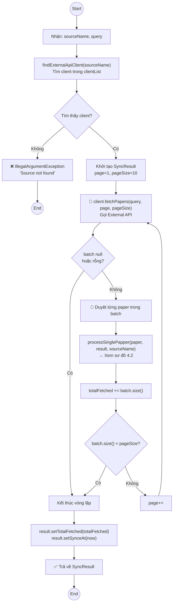

### 4.2 processSinglePapper — Xử lý từng bài báo

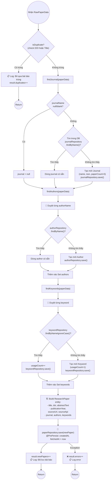

### 4.3 syncAllSources — Đồng bộ tất cả nguồn

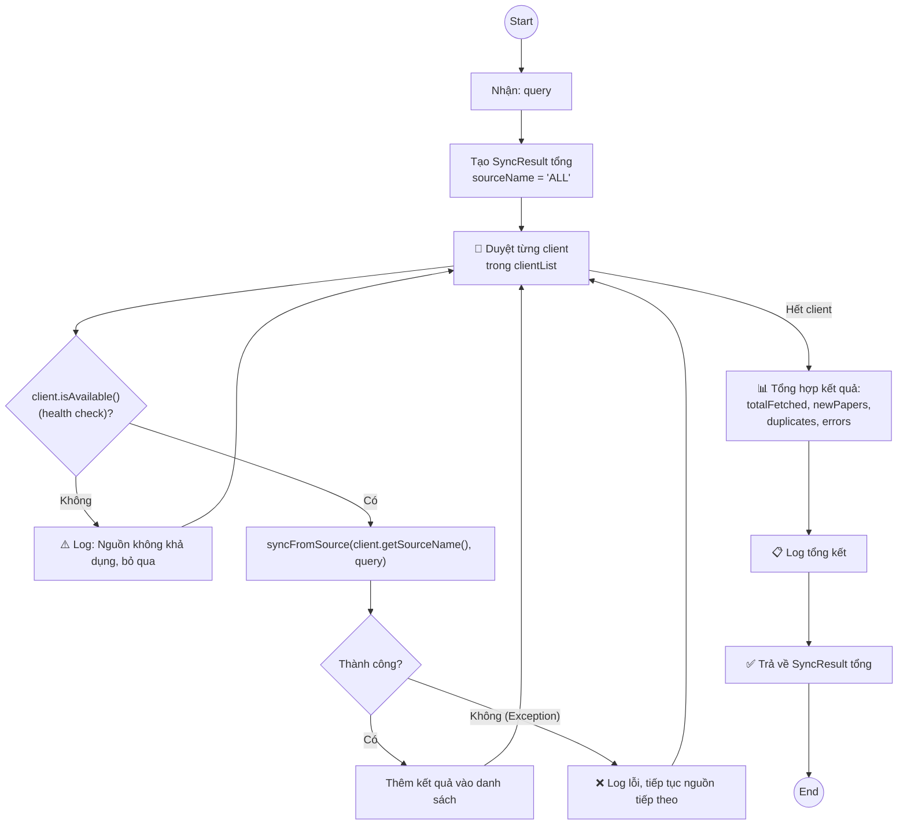

---

## 5. 📈 Sơ Đồ Hoạt Động — Phân Tích Xu Hướng (Trend Analysis)

### 5.1 recalculateTrends — Tính toán lại xu hướng

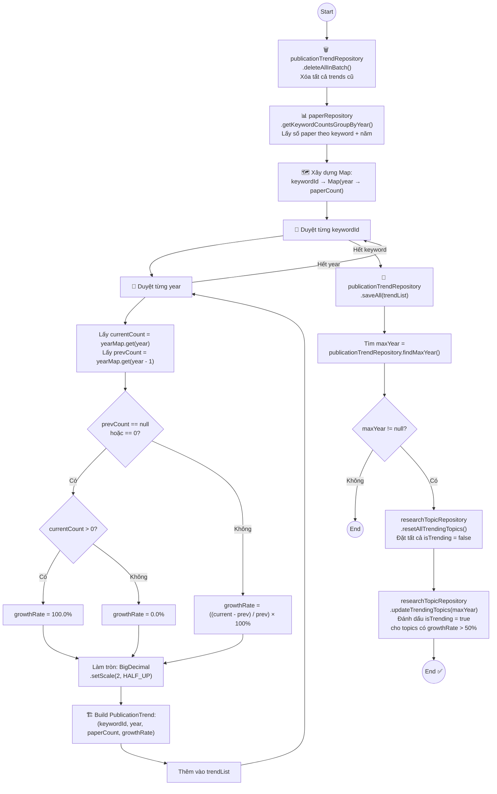

### 5.2 getTrendByKeyword — Xem trend theo keyword

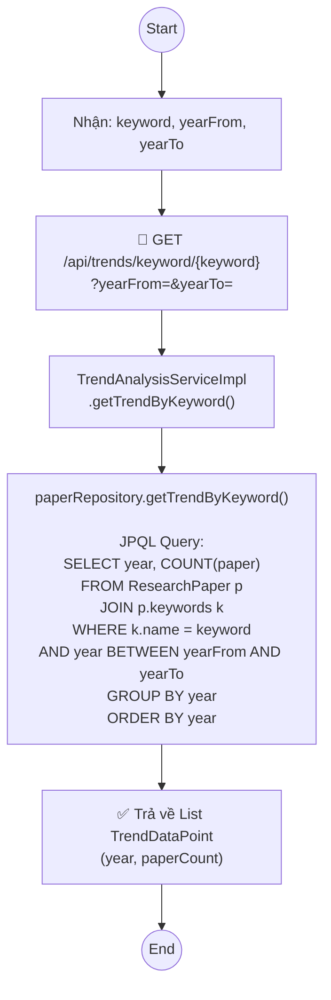

### 5.3 compareTrends — So sánh xu hướng nhiều keywords

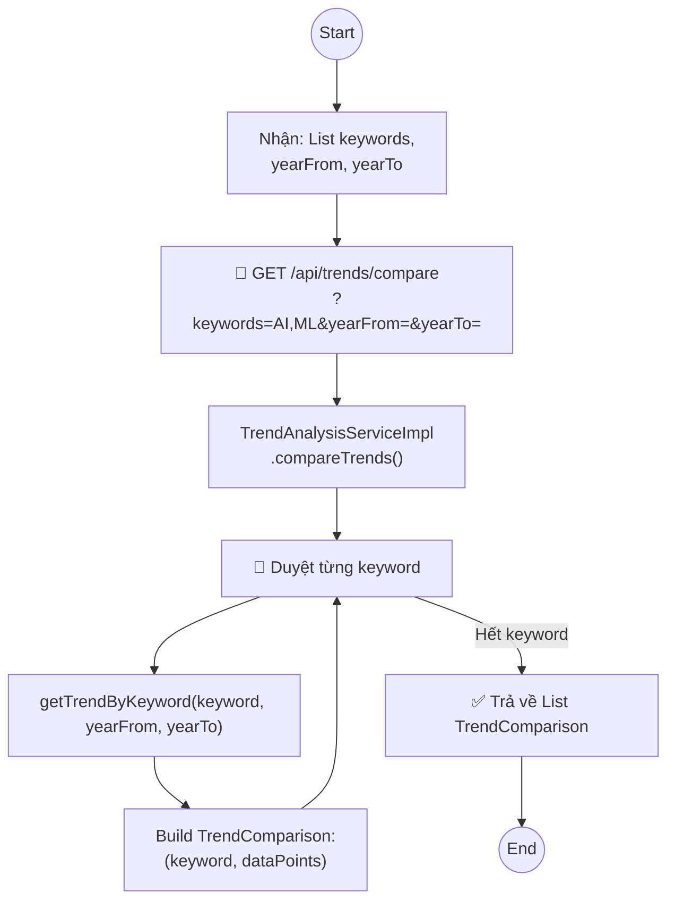

### 5.4 getTopTrendingTopics — Lấy top xu hướng

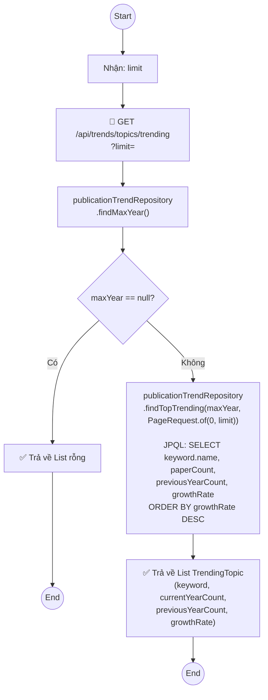

---

## 6. 🔍 Sơ Đồ Hoạt Động — Tìm Kiếm Bài Báo

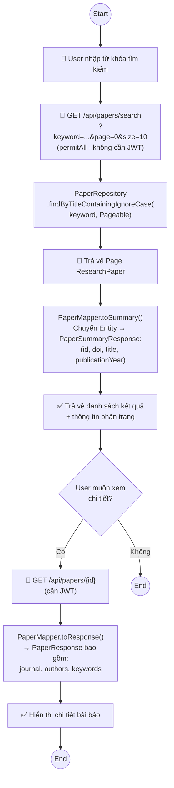

---

## 7. 🌐 Sơ Đồ Hoạt Động — OpenAlex Client (Fetch Papers)

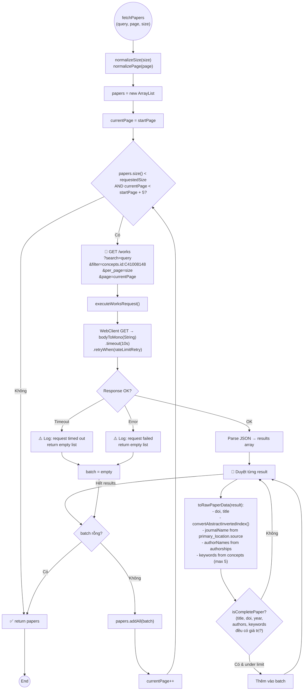

---

## 8. 📊 Sơ Đồ Hoạt Động Tổng Hợp — Luồng Dữ Liệu End-to-End

```mermaid
flowchart LR
    subgraph Trigger["🎯 Trigger"]
        ADMIN["👨‍💼 Admin\nManual Trigger"]
        SCHED["⏰ Scheduler\n@Scheduled"]
    end

    subgraph Sync["🔄 Data Sync"]
        direction TB
        S1["DataSyncServiceImpl\n.syncAllSources(query)"]
        S2["Kiểm tra isAvailable()"]
        S3["fetchPapers() từ API"]
        S4["processSinglePapper()"]
        S5["isDuplicate(DOI/Title)?"]
        S6["findJournal / findAuthors\nfindKeywords"]
        S7["paperRepository.save()"]
    end

    subgraph Analysis["📈 Trend Analysis"]
        direction TB
        T1["TrendAnalysisServiceImpl\n.recalculateTrends()"]
        T2["Xóa trends cũ"]
        T3["Aggregate:\nkeyword × year → count"]
        T4["Tính growthRate\ncho mỗi keyword/year"]
        T5["Lưu PublicationTrend"]
        T6["Update isTrending\ncho ResearchTopic"]
    end

    subgraph Display["📊 Display"]
        direction TB
        D1["GET /api/trends/keyword"]
        D2["GET /api/trends/compare"]
        D3["GET /api/trends/topics/trending"]
        D4["Frontend Charts:\nLine / Bar / Pie"]
    end

    ADMIN --> S1
    SCHED --> S1
    S1 --> S2 --> S3 --> S4 --> S5
    S5 --> S6 --> S7

    S7 --> T1
    T1 --> T2 --> T3 --> T4 --> T5 --> T6

    T6 --> D1
    T6 --> D2
    T6 --> D3
    D1 --> D4
    D2 --> D4
    D3 --> D4
```

---

## 9. 📐 ERD — Entity Relationship Diagram

### 9.1 ERD Đầy Đủ (phản ánh chính xác source code)

```mermaid
erDiagram
    users {
        BIGINT id PK "AUTO_INCREMENT"
        VARCHAR_50 username UK "NOT NULL"
        VARCHAR_100 email UK "NOT NULL"
        VARCHAR_255 password_hash "NOT NULL"
        VARCHAR_100 full_name "NULLABLE"
        ENUM role "RESEARCHER | LECTURER | STUDENT | ADMIN"
        BOOLEAN is_active "DEFAULT TRUE, NOT NULL"
        DATETIME created_at "AUTO @PrePersist"
        DATETIME updated_at "AUTO @PreUpdate"
    }

    research_papers {
        BIGINT id PK "AUTO_INCREMENT"
        VARCHAR_255 doi UK "NULLABLE"
        VARCHAR_1000 title "NOT NULL"
        TEXT abstract_text "NULLABLE"
        INT publication_year "NULLABLE"
        VARCHAR_2000 source_url "NULLABLE"
        VARCHAR_50 source_api "NULLABLE"
        BIGINT journal_id FK "NULLABLE → journals.id"
        DATETIME fetched_at "AUTO"
        DATETIME created_at "NOT NULL, AUTO @PrePersist"
    }

    journals {
        BIGINT id PK "AUTO_INCREMENT"
        VARCHAR_255 name "NOT NULL"
        VARCHAR_20 issn "NULLABLE"
        VARCHAR_255 publisher "NULLABLE"
        VARCHAR_100 field "NULLABLE"
        INT paper_count "NULLABLE"
    }

    authors {
        BIGINT id PK "AUTO_INCREMENT"
        VARCHAR_255 name "NOT NULL"
        VARCHAR_100 external_id "NULLABLE"
        VARCHAR_255 affiliation "NULLABLE"
    }

    keywords {
        BIGINT id PK "AUTO_INCREMENT"
        VARCHAR_255 name UK "NOT NULL"
        INT usage_count "NULLABLE"
    }

    publication_trends {
        BIGINT id PK "AUTO_INCREMENT"
        BIGINT keyword_id FK "NOT NULL → keywords.id"
        INT year "NOT NULL"
        INT paper_count "NOT NULL"
        DECIMAL_5_2 growth_rate "NULLABLE"
    }

    research_topics {
        BIGINT id PK "AUTO_INCREMENT"
        VARCHAR_255 name "NOT NULL"
        TEXT description "NULLABLE"
        BOOLEAN is_trending "NOT NULL"
    }

    paper_authors {
        BIGINT paper_id FK "PK → research_papers.id"
        BIGINT author_id FK "PK → authors.id"
    }

    paper_keywords {
        BIGINT paper_id FK "PK → research_papers.id"
        BIGINT keyword_id FK "PK → keywords.id"
    }

    topic_keywords {
        BIGINT topic_id FK "PK → research_topics.id"
        BIGINT keyword_id FK "PK → keywords.id"
    }

    research_papers }o--|| journals : "published_in (journal_id)"
    research_papers ||--o{ paper_authors : "paper_id"
    authors ||--o{ paper_authors : "author_id"
    research_papers ||--o{ paper_keywords : "paper_id"
    keywords ||--o{ paper_keywords : "keyword_id"
    keywords ||--o{ publication_trends : "keyword_id"
    research_topics ||--o{ topic_keywords : "topic_id"
    keywords ||--o{ topic_keywords : "keyword_id"
```

### 9.2 Bảng Tóm Tắt Quan Hệ (Cardinality)

| Quan hệ | Loại | Cơ chế | Mô tả |
|---------|------|--------|-------|
| `journals` → `research_papers` | **1 : N** | FK `journal_id` trong `research_papers` | 1 tạp chí chứa nhiều bài báo |
| `research_papers` ↔ `authors` | **N : N** | Bảng nối `paper_authors` | 1 bài báo có nhiều tác giả, 1 tác giả có nhiều bài báo |
| `research_papers` ↔ `keywords` | **N : N** | Bảng nối `paper_keywords` | 1 bài báo gắn nhiều từ khóa, 1 từ khóa thuộc nhiều bài báo |
| `keywords` → `publication_trends` | **1 : N** | FK `keyword_id` trong `publication_trends` | 1 từ khóa có nhiều bản ghi trend theo từng năm |
| `research_topics` ↔ `keywords` | **N : N** | Bảng nối `topic_keywords` | 1 chủ đề gồm nhiều từ khóa, 1 từ khóa thuộc nhiều chủ đề |
| `users` | **Độc lập** | Không FK | Quản lý riêng, liên kết qua JWT token |

### 9.3 JPA Mapping — Entity ↔ Table

| Entity | Table | Quan hệ JPA | Annotation |
|--------|-------|-------------|-----------|
| [ResearchPaper](file:///d:/Document/Java/journal-trend-tracker/Scientific-Journal-Publication-Trend-Tracking-System/backend/com.journaltracker/src/main/java/com/journaltracker/entity/ResearchPaper.java) → Journal | N:1 | `@ManyToOne(fetch=LAZY)` | `@JoinColumn(name="journal_id", insertable=false, updatable=false)` |
| [ResearchPaper](file:///d:/Document/Java/journal-trend-tracker/Scientific-Journal-Publication-Trend-Tracking-System/backend/com.journaltracker/src/main/java/com/journaltracker/entity/ResearchPaper.java) ↔ Author | N:N | `@ManyToMany` + `@JoinTable` | Bảng nối `paper_authors(paper_id, author_id)` |
| [ResearchPaper](file:///d:/Document/Java/journal-trend-tracker/Scientific-Journal-Publication-Trend-Tracking-System/backend/com.journaltracker/src/main/java/com/journaltracker/entity/ResearchPaper.java) ↔ Keyword | N:N | `@ManyToMany` + `@JoinTable` | Bảng nối `paper_keywords(paper_id, keyword_id)` |
| [Journal](file:///d:/Document/Java/journal-trend-tracker/Scientific-Journal-Publication-Trend-Tracking-System/backend/com.journaltracker/src/main/java/com/journaltracker/entity/Journal.java) → ResearchPaper | 1:N | `@OneToMany(mappedBy="journal", fetch=LAZY)` | Owning side ở ResearchPaper |
| [Author](file:///d:/Document/Java/journal-trend-tracker/Scientific-Journal-Publication-Trend-Tracking-System/backend/com.journaltracker/src/main/java/com/journaltracker/entity/Author.java) ↔ ResearchPaper | N:N | `@ManyToMany(mappedBy="authors")` | Inverse side |
| [Keyword](file:///d:/Document/Java/journal-trend-tracker/Scientific-Journal-Publication-Trend-Tracking-System/backend/com.journaltracker/src/main/java/com/journaltracker/entity/Keyword.java) ↔ ResearchPaper | N:N | `@ManyToMany(mappedBy="keywords")` | Inverse side |
| [PublicationTrend](file:///d:/Document/Java/journal-trend-tracker/Scientific-Journal-Publication-Trend-Tracking-System/backend/com.journaltracker/src/main/java/com/journaltracker/entity/PublicationTrend.java) → Keyword | N:1 | `@ManyToOne(fetch=LAZY)` | `@JoinColumn(name="keyword_id", insertable=false, updatable=false)` |
| [ResearchTopic](file:///d:/Document/Java/journal-trend-tracker/Scientific-Journal-Publication-Trend-Tracking-System/backend/com.journaltracker/src/main/java/com/journaltracker/entity/ResearchTopic.java) ↔ Keyword | N:N | `@ManyToMany(fetch=LAZY)` + `@JoinTable` | Bảng nối `topic_keywords(topic_id, keyword_id)` |
